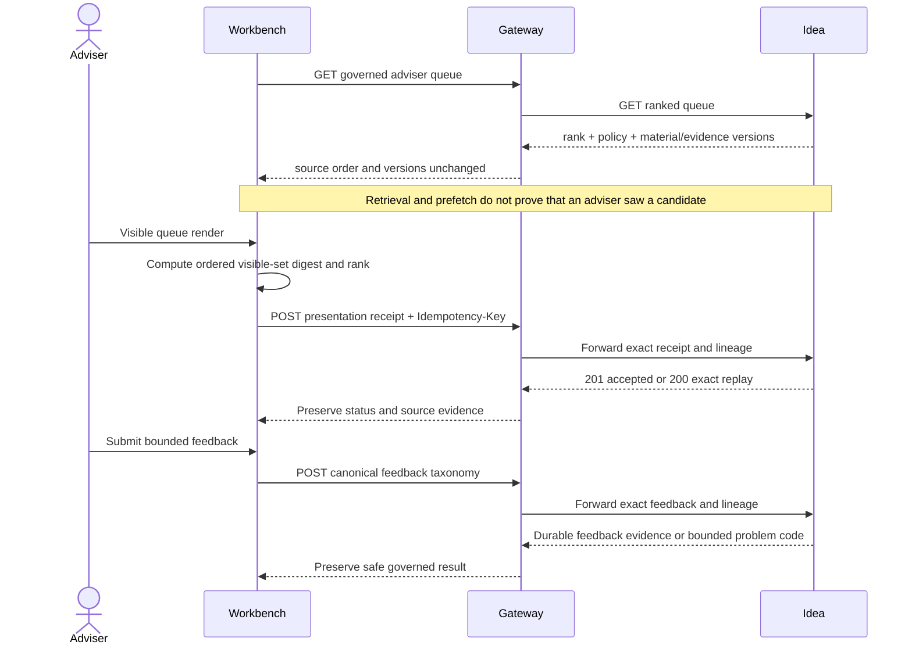

# Idea opportunity action transport

This runbook explains the governed Gateway boundary for adviser feedback and visible-presentation
evidence. It supports RFC-0002 slices 11 and 15 without claiming that the complete Workbench
journey or effectiveness measurement is certified.

## Audience and decision guide

| Reader | Use this page to |
| --- | --- |
| Adviser-product owner | Understand which adviser interactions become durable evidence and which do not. |
| Workbench engineer | Build feedback and visible-render calls without inventing source facts. |
| Gateway or Idea engineer | Reconcile transport fields, statuses, and ownership across services. |
| Operations or control reviewer | Diagnose rejected evidence without exposing client or persistence internals. |

## Evidence boundary



The Gateway is a validating transport boundary. It does not rerank candidates, infer what was
visible, translate feedback, authorize a downstream transaction, or calculate effectiveness.

## Canonical feedback taxonomy

The request must declare `taxonomyVersion=idea-feedback-taxonomy-v1`.

| Outcome | Allowed source-owned reason |
| --- | --- |
| `useful` | `relevant` |
| `not_useful` | `not_relevant`, `already_known`, `wrong_timing`, `insufficient_evidence`, `wrong_priority`, `duplicate`, or `client_specific_constraint` |

Gateway validates the closed vocabulary but does not duplicate the outcome/reason combination
policy. Lotus Idea remains authoritative for that business rule and returns
`feedback_taxonomy_combination_invalid` for a disallowed combination. Legacy `reasonCodes` and
historical outcome aliases are rejected rather than translated.

## Presentation receipt ownership

| Field | Authority | Gateway posture |
| --- | --- | --- |
| `candidateId` | Lotus Idea | Preserved in the route; never accepted as a competing body value. |
| `tenantId` | Trusted Workbench context, verified by Idea | Forwarded unchanged. |
| `presentedAtUtc` | Workbench visible-render event | Must be UTC; never derived from queue retrieval time. |
| `rankAtPresentation`, `visibleCandidateCount` | Workbench visible ordered set | Validated for internal consistency and forwarded unchanged. |
| `queueSnapshotDigest` | Workbench canonical visible ordered set | Must be a SHA-256 digest; Gateway does not recalculate it. |
| `queuePolicyVersion` | Lotus Idea queue response | Preserved by Workbench and forwarded unchanged. |
| `rankingPolicyVersion` | Candidate ranking evidence | Preserved by Workbench and forwarded unchanged. |
| `candidateMaterialVersion`, `candidateEvidenceVersion` | Lotus Idea candidate identity | Required on queue entries and returned to Workbench unchanged. |
| `Idempotency-Key` | Workbench receipt identity | Required, non-blank, and forwarded unchanged. |
| `X-Causation-Id` | Calling journey lineage | Optional and forwarded unchanged. |

Only a visible-render event may produce a receipt. Queue reads, server rendering, cache warming,
prefetch, retries before visibility, and diagnostic probes must not emit one.

## Success and failure semantics

| HTTP status | Meaning |
| --- | --- |
| `201` | Lotus Idea durably accepted a new immutable receipt. |
| `200` | Lotus Idea replayed the exact receipt associated with the idempotency key. |
| `400` | The bounded request or governed feedback combination is invalid. |
| `403` | The caller cannot record the requested evidence. |
| `404` | The candidate does not exist in the source authority. |
| `409` | Immutable receipt, candidate version, chronology, or idempotency evidence conflicts. |
| `422` | Gateway rejected malformed transport before upstream fanout. |
| `502` | Upstream response shape/status was unsafe or contradicted the feature posture. |
| `503` | Lotus Idea durable receipt persistence is unavailable or not writable. |

Gateway returns only allowlisted source codes with fixed product-safe messages. Raw source details,
database diagnostics, candidate facts, tenant facts, and client facts must not escape through error
payloads or logs.

## Certification boundary

The transport is implementation-backed, but presentation-effectiveness measurement remains
`not_certified` and `supportedFeaturePromoted=false` until Workbench independently proves that:

1. a receipt is emitted only after the candidate is visibly rendered,
2. the digest represents the exact ordered visible set,
3. the rank and candidate versions came from the same rendered queue snapshot,
4. accepted and replayed responses are handled without duplicate adviser telemetry, and
5. the canonical cross-repository runtime journey passes.

## Validation

Run the focused contract and integration proof before the repository-native merge gate:

```powershell
.\.venv\Scripts\python.exe -m pytest `
  tests/contract/test_idea_feedback_taxonomy_contract.py `
  tests/contract/test_idea_presentation_receipt_contract.py `
  tests/integration/test_idea_feedback_presentation_router.py -q
make check
```

The versioned reconciliation artifacts are:

- `contracts/upstream/lotus-idea-feedback-taxonomy.v1.json`
- `contracts/upstream/lotus-idea-presentation-receipt.v1.json`
- `contracts/upstream/lotus-idea-reason-codes.v1.json` for review/conversion actions only

