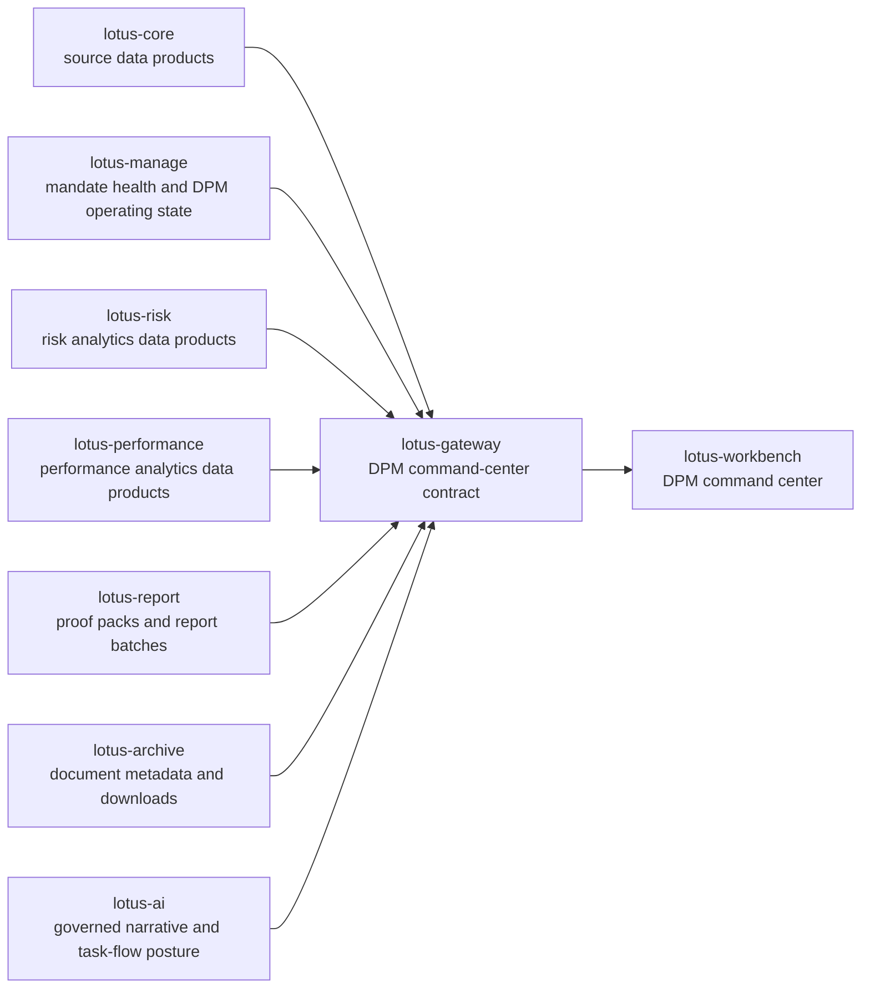

# RFC-0098: DPM Command Center Composition Contract

| Metadata | Details |
| --- | --- |
| **Status** | PROPOSED |
| **Created** | 2026-05-03 |
| **Owner** | lotus-gateway |
| **Primary Consumers** | lotus-workbench, future client demo and operations surfaces |
| **Depends On** | lotus-manage RFC-0037, lotus-manage RFC-0038, lotus-core RFC-0087, Gateway RFC-0082, Gateway RFC-0108, Workbench RFC-0098 |
| **Doc Location** | `docs/rfcs/RFC-0098-dpm-command-center-composition-contract.md` |

---

## 0. Executive Summary

`lotus-manage` RFC-0038 delivered the backend foundation for mandate digital twin, mandate health,
and DPM command-center readiness. The full business outcome is not realized until the front-office
experience can see the full mandate picture: source readiness from `lotus-core`, DPM operating
state from `lotus-manage`, risk posture from `lotus-risk`, performance posture from
`lotus-performance`, report/proof-pack posture from `lotus-report`, archived evidence from
`lotus-archive`, and governed narrative support from `lotus-ai`.

This RFC defines the Gateway composition contract that makes that outcome possible without turning
`lotus-manage` into a mega-orchestrator and without making `lotus-workbench` call every domain
service directly. Gateway owns the product-facing experience API. Domain apps remain authoritative
for their own data products.

The target is a private-banking-grade DPM command-center contract that a portfolio manager, CIO
desk, investment control team, operations team, and client-demo team can trust.

---

## 1. Business Outcomes

The RFC must deliver these business outcomes:

1. **Single command-center contract for discretionary mandates**
   Workbench receives one governed Gateway payload for the DPM command center instead of stitching
   multiple raw service contracts in the browser.
2. **Daily book-control readiness**
   Portfolio managers can see which mandates are ready, which are drifting, which are blocked by
   data or policy, and which require PM, CIO, compliance, or operations action.
3. **Faster diagnosis of mandate issues**
   The contract explains whether the issue comes from source data, mandate drift, risk, performance,
   liquidity, tax, restrictions, workflow, or proof-pack readiness.
4. **Clear accountability by domain**
   Each figure and state carries source ownership so business users and operations know which
   service is authoritative and where remediation belongs.
5. **Client-demo-grade story**
   The same contract supports demo and pre-sales material showing how Lotus turns source data,
   analytics, risk, and DPM workflow into a coherent discretionary management cockpit.
6. **Enterprise data mesh posture**
   Every domain input keeps provenance, freshness, supportability, degradation reason, and bounded
   observability metadata.

---

## 2. Problem Statement

RFC-0038 made `lotus-manage` capable of exposing DPM mandate health and command-center primitives.
However, a business-grade DPM command center needs more than manage-side health:

1. `lotus-core` owns source-of-record portfolio, holdings, model binding, tax lots, eligibility,
   market data readiness, and source lineage.
2. `lotus-manage` owns DPM operating posture, mandate digital twin, rebalance readiness, drift,
   constraints, action recommendations, and workflow state.
3. `lotus-risk` owns risk analytics such as concentration, drawdown, active risk, stress, and
   risk attribution.
4. `lotus-performance` owns performance analytics such as return path, contribution, attribution,
   benchmark-relative underperformance, and horizon trends.
5. `lotus-report` owns proof-pack and report-batch materialization.
6. `lotus-archive` owns immutable generated-document metadata and controlled downloads.
7. `lotus-ai` owns governed narrative generation and task-flow posture when AI support is used.
8. `lotus-workbench` owns the user experience, not domain authority.

If Workbench calls each service directly, the product surface becomes brittle, inconsistent, and
hard to certify. If `lotus-manage` calls every analytics service directly, manage becomes
over-coupled and starts owning analytics it should not own. Gateway is the correct composition
boundary.

---

## 3. Architecture Direction

### 3.1 Target Architecture



### 3.2 Ownership Principles

1. Gateway composes and shapes product-facing contracts.
2. Gateway does not compute domain analytics that belong to upstream apps.
3. Gateway does not hide upstream degradation. It normalizes it into product-safe supportability.
4. Gateway preserves source lineage and calculation supportability where upstream provides it.
5. Gateway keeps bounded audit, metrics, and diagnostic posture under RFC-0108 rules.
6. Gateway should replace pre-live endpoint clutter with one strategic DPM command-center family.

### 3.3 Runtime Boundary

Workbench should consume Gateway only for this command center. Workbench must not call raw
`lotus-core`, `lotus-manage`, `lotus-risk`, `lotus-performance`, `lotus-report`, `lotus-archive`,
or `lotus-ai` APIs for this workflow.

---

## 4. App-by-App Responsibilities

| App | Responsibility in command center | Must provide | Must not do |
| --- | --- | --- | --- |
| `lotus-core` | Source-of-record portfolio data product owner | portfolio snapshot, holdings, model binding, tax lots, market data coverage, eligibility, source readiness, lineage | DPM health scoring or UI composition |
| `lotus-manage` | DPM mandate operating layer | mandate digital twin, health score, drift, constraints, execution readiness, action queue, rebalance/run posture | risk/performance calculation ownership |
| `lotus-risk` | Certified risk analytics owner | concentration, drawdown, stress, liquidity risk, active risk, risk attribution, supportability | DPM action recommendation ownership |
| `lotus-performance` | Certified performance analytics owner | return path, contribution, attribution, benchmark-relative performance, horizon trend, calculation supportability | risk or DPM workflow ownership |
| `lotus-report` | Proof-pack and report-batch owner | latest proof-pack readiness, batch status, report generation posture, materialization history | command-center composition |
| `lotus-archive` | Evidence archive owner | immutable document metadata, controlled download refs, retention posture | analytics or workflow decisioning |
| `lotus-ai` | Governed narrative and task-flow owner | optional PM narrative, explanation draft, task-flow posture, handoff refs | source-of-truth analytics |
| `lotus-gateway` | Product-facing composition boundary | stable DPM command-center API, degraded-state normalization, source attribution, bounded observability | domain calculation ownership |
| `lotus-workbench` | User experience owner | command-center UI, workflow affordances, drill-down, evidence trail, demo screens | raw service stitching or fake data |

---

## 5. Strategic API Contract

### 5.1 Endpoint Family

Gateway should expose one strategic DPM command-center family:

| Endpoint | Purpose |
| --- | --- |
| `GET /api/v1/dpm/command-center` | PM book-level command-center summary across mandates. |
| `GET /api/v1/dpm/command-center/mandates/{portfolio_id}` | Single mandate command-center detail for Workbench route entry. |
| `GET /api/v1/dpm/command-center/mandates/{portfolio_id}/evidence` | Evidence/provenance bundle for support drawer and proof-pack handoff. |
| `POST /api/v1/dpm/command-center/mandates/{portfolio_id}/actions/simulate` | Gateway-shaped handoff into `lotus-manage` rebalance simulation when user acts from the command center. |

No duplicate legacy DPM command-center endpoints should be added. Any old downstream consumer should
move to this family because Lotus is still pre-live for this app surface.

### 5.2 Query Parameters

All read endpoints should support:

| Parameter | Type | Required | Description | Example |
| --- | --- | --- | --- | --- |
| `as_of_date` | date | no | Business date for source and analytics posture. Defaults to canonical date in demo proof or latest supported business date in runtime. | `2026-04-10` |
| `region` | string | no | Front-office region or booking center context. | `SG` |
| `relationship_manager_id` | string | no | Optional filter for book ownership. | `RM-PRIVATEBANK-01` |
| `mandate_state` | string | no | Filter by `ready`, `attention_required`, `blocked`, `stale`, `degraded`. | `attention_required` |
| `include` | array | no | Optional modules: `core`, `manage`, `risk`, `performance`, `reporting`, `ai`, `evidence`. | `core,manage,risk,performance` |

### 5.3 Book-Level Response Shape

The book-level response should be product-facing, not a raw merge of upstream payloads.

```json
{
  "portfolio_book": {
    "book_id": "DPM-SG-GLOBAL-BALANCED",
    "as_of_date": "2026-04-10",
    "currency": "USD",
    "mandate_count": 126,
    "ready_count": 91,
    "attention_required_count": 27,
    "blocked_count": 8
  },
  "summary": {
    "overall_state": "attention_required",
    "primary_reason": "27 mandates require review; 8 are blocked by source-data or policy readiness.",
    "highest_priority_dimension": "mandate_drift",
    "next_best_operating_action": "Review attention-required mandates by severity and rebalance readiness."
  },
  "mandates": [
    {
      "portfolio_id": "PB_SG_GLOBAL_BAL_001",
      "client_segment": "Private Banking",
      "mandate_name": "Singapore Global Balanced DPM",
      "mandate_state": "attention_required",
      "health_score": 82.4,
      "health_band": "watch",
      "primary_exception": "equity_overweight_drift",
      "rebalance_readiness": "ready_for_simulation",
      "risk_state": "within_limits",
      "performance_state": "underperforming_benchmark",
      "source_readiness": "ready",
      "latest_action": "simulate_rebalance"
    }
  ],
  "supportability": {
    "state": "ready",
    "degraded_sources": [],
    "blocked_sources": [],
    "freshness": {
      "core": "ready",
      "manage": "ready",
      "risk": "ready",
      "performance": "ready",
      "report": "ready"
    }
  },
  "lineage": {
    "contract": "DpmCommandCenter:v1",
    "source_systems": ["lotus-core", "lotus-manage", "lotus-risk", "lotus-performance", "lotus-report"],
    "correlation_id": "dpm-command-center-20260410-001"
  }
}
```

### 5.4 Single-Mandate Detail Shape

The single mandate response should contain these sections:

1. `mandate_identity`
   portfolio id, mandate id, model portfolio id, policy version, review cadence, PM ownership,
   booking center, currency, benchmark, client segment.
2. `command_summary`
   overall state, business explanation, health score, priority action, severity, due date.
3. `core_source_state`
   holdings readiness, market data coverage, eligibility, tax lots, model binding, freshness.
4. `dpm_operating_state`
   digital twin status, drift, constraints, cash needs, restrictions, rebalance readiness, workflow
   gates, active run refs.
5. `risk_posture`
   risk state, concentration, drawdown, liquidity, stress, active-risk signal, unavailable/degraded
   reasons.
6. `performance_posture`
   return path, contribution, attribution, benchmark-relative signal, horizon trend,
   unavailable/degraded reasons.
7. `proof_and_reporting`
   latest proof pack, report batch state, archive refs.
8. `recommended_actions`
   review, simulate, approve, defer, investigate source data, investigate risk, investigate
   performance, generate proof pack.
9. `evidence_refs`
   source system refs, data product ids, calculation supportability, generated document refs.
10. `observability`
   bounded support reference, route, panel, upstream status class, degraded source labels.

---

## 6. Supportability and Degradation Model

Gateway must return a useful payload even when some upstreams are degraded. It should use a common
state taxonomy:

| State | Meaning | Workbench behavior |
| --- | --- | --- |
| `ready` | Required data and calculations are available. | Render the module as actionable. |
| `attention_required` | Data is available but business posture requires PM review. | Promote the exception and next action. |
| `degraded` | Optional or secondary input is unavailable, but the core command-center view is usable. | Render the module with explanation and no fake values. |
| `blocked` | Required input is missing or invalid. | Block dependent actions and show remediation owner. |
| `stale` | Input is outside freshness tolerance. | Mark stale and prevent time-sensitive actions. |
| `not_supported` | Capability is intentionally unavailable for the mandate or region. | Render a truthful unavailable state. |

Supportability must identify:

1. affected module,
2. upstream owner,
3. reason code,
4. business impact,
5. blocked action, if any,
6. remediation route.

---

## 7. Data Mesh and Enterprise Requirements

Every composed response must carry:

1. domain product identity where available,
2. source system,
3. as-of date,
4. freshness timestamp,
5. calculation supportability,
6. source lineage,
7. contract version,
8. support reference,
9. bounded audit event,
10. metrics labels limited to approved low-cardinality values.

Forbidden in logs, metrics, or diagnostics:

1. client name,
2. raw holdings list,
3. transaction details,
4. prompt text,
5. model output,
6. raw entitlement state,
7. request or response body,
8. trace ids exposed to unauthorized users.

---

## 8. OpenAPI and Certification Requirements

All new Gateway endpoints must be certified before they can be called by Workbench:

1. grouped under `DPM Command Center`,
2. endpoint description explains what, when, why, and how to use it,
3. request parameters include type, description, allowed values, and examples,
4. every response attribute has description, type, and example,
5. full ready, degraded, blocked, and stale examples,
6. error examples for upstream timeout, authorization failure, missing portfolio, and unsupported
   mandate,
7. response schemas avoid `Any` and untyped dictionaries,
8. endpoint tests prove examples remain valid,
9. no duplicate aliases or compatibility routes,
10. vocabulary aligns with Lotus API vocabulary governance.

---

## 9. Implementation Slices

### Slice 0: RFC and Contract Alignment

1. Finalize this RFC with Workbench RFC-0098.
2. Confirm exact upstream endpoints and supported modules.
3. Validate that `lotus-manage` RFC-0038 outputs are sufficient for manage-side health.
4. Identify missing risk/performance/report fields as upstream issues, not local Gateway hacks.

Acceptance:

1. RFC has app-by-app responsibility map.
2. Workbench RFC references this RFC as its only command-center data source.
3. Missing upstream fields are listed with owner and required reason.

### Slice 1: Composition Models and Client Boundaries

1. Add typed Gateway models for command-center summary, mandate detail, evidence refs, and
   supportability.
2. Add dedicated upstream client methods for only the required service endpoints.
3. Keep fan-out bounded and timeout-governed.
4. Preserve upstream supportability without recomputation.

Acceptance:

1. Unit tests prove model parsing and degraded states.
2. Contract tests prove no raw upstream payload leak.
3. Typecheck and lint pass.

### Slice 2: Book-Level Command Center Endpoint

1. Implement `GET /api/v1/dpm/command-center`.
2. Compose book-level mandate posture from manage plus source supportability from core.
3. Add optional risk/performance/report modules when requested.
4. Return partial-ready payloads with source-level degradation.

Acceptance:

1. Ready, degraded, blocked, and stale cases tested.
2. Empty book and unauthorized book cases tested.
3. OpenAPI examples validate.

### Slice 3: Single-Mandate Detail Endpoint

1. Implement `GET /api/v1/dpm/command-center/mandates/{portfolio_id}`.
2. Compose mandate identity, manage state, risk, performance, reporting, and evidence refs.
3. Preserve domain ownership labels per section.
4. Add action affordances based on manage readiness and supportability.

Acceptance:

1. Canonical portfolio `PB_SG_GLOBAL_BAL_001` returns a complete detail contract in live proof.
2. Missing optional analytics degrade cleanly.
3. Blocked source readiness prevents simulate action.

### Slice 4: Evidence Endpoint and Proof-Pack Handoff

1. Implement `GET /api/v1/dpm/command-center/mandates/{portfolio_id}/evidence`.
2. Include source refs, calculation supportability, generated report refs, archive refs, and
   support references.
3. Do not expose raw holdings, raw report content, raw prompts, or model outputs.

Acceptance:

1. Evidence contract supports Workbench drawer and sales/demo explanation.
2. Archive links are controlled Gateway links.
3. Audit tests prove protected fields are absent.

### Slice 5: Simulate Action Handoff

1. Implement `POST /api/v1/dpm/command-center/mandates/{portfolio_id}/actions/simulate`.
2. Route to `lotus-manage` stateful rebalance simulation.
3. Require Gateway to verify source readiness and mandate action eligibility before handoff.
4. Return a product-friendly action result with run refs and next action.

Acceptance:

1. Ready state calls manage and returns run refs.
2. Blocked state does not call manage.
3. Idempotency and replay posture are tested where manage supports it.

### Slice 6: Observability, Security, and Governance

1. Add RFC-0108-aligned fan-out logs and metrics.
2. Add bounded audit events for allowed reads, denied reads, protected diagnostics, and action
   handoff.
3. Add security and entitlement checks consistent with existing Gateway contracts.
4. Add diagnostics lookup without leaking raw payloads.

Acceptance:

1. Metrics labels are low-cardinality.
2. Audit records exclude forbidden fields.
3. Unauthorized users receive product-safe errors.

### Slice 7: Canonical Proof and Test Pyramid

1. Add unit tests for model mapping and supportability.
2. Add integration tests for composed Gateway behavior.
3. Add contract tests for Workbench-facing payload stability.
4. Add live canonical validation for `PB_SG_GLOBAL_BAL_001`.
5. Capture request/response evidence in non-git tracked output.

Acceptance:

1. Feature lane and PR merge gate pass.
2. Canonical live stack proves core, manage, risk, performance, report, and archive composition or
   truthful degradation.
3. No unsupported Workbench panel claim is made from backend-only proof.

### Slice 8: Documentation, Wiki, and Closure

1. Update README, repository context, RFC index, and wiki.
2. Add business-facing documentation with diagrams.
3. Add operator runbook for troubleshooting degraded command-center sources.
4. Record supported features only after implementation proof.

Acceptance:

1. Wiki is useful to business, engineering, sales, marketing, and operations.
2. `Sync-RepoWikis.ps1 -CheckOnly -Repository lotus-gateway` passes before merge.
3. Post-merge wiki publish is completed.

---

## 10. Testing Strategy

| Layer | Coverage |
| --- | --- |
| Unit | model normalization, supportability mapping, action affordance logic, upstream error mapping |
| Contract | response schema stability, OpenAPI examples, forbidden-field checks, vocabulary checks |
| Integration | composed route behavior with mocked upstreams, partial readiness, blocked action flows |
| E2E/live | canonical core/manage/risk/performance/report/archive composition for `PB_SG_GLOBAL_BAL_001` |
| Observability | audit events, metrics labels, diagnostics lookup, denied-read posture |

Tests must validate figures and states, not only status codes.

---

## 11. Risks and Controls

| Risk | Control |
| --- | --- |
| Gateway becomes a domain calculation layer | Preserve upstream ownership and only compose product state. |
| Workbench bypasses Gateway | Workbench RFC-0098 requires Gateway-only consumption. |
| Partial upstream outages create misleading UI | Use explicit degraded, blocked, stale, and not-supported states. |
| Sensitive data leaks into diagnostics | Apply RFC-0108 audit and metrics restrictions. |
| API sprawl | Create one strategic endpoint family and remove/avoid duplicates. |
| Demo claims exceed implementation truth | Promote supported features only after live evidence. |

---

## 12. Definition of Done

This RFC is complete only when:

1. all strategic Gateway DPM command-center endpoints are implemented and certified,
2. OpenAPI is complete with examples and attribute descriptions,
3. Workbench consumes this Gateway contract without direct raw service calls,
4. canonical live proof passes for `PB_SG_GLOBAL_BAL_001`,
5. source degradation is truthful and action-blocking where required,
6. audit, metrics, diagnostics, and entitlement checks meet Gateway standards,
7. README, wiki, RFC index, and supported-features material are updated,
8. all CI lanes pass,
9. post-merge wiki publication is complete,
10. no duplicate command-center endpoints remain.

---

## 13. Relationship to Workbench RFC-0098

This RFC defines the backend composition contract. Workbench RFC-0098 defines the user experience.
The two RFCs must be implemented as a coordinated delivery program:

1. Gateway owns the certified payload.
2. Workbench owns layout, workflow, interaction, and evidence presentation.
3. Domain apps own their respective source products.
4. Platform canonical automation owns repeatable proof and demo seed posture.

The business outcome is not complete until both RFCs are implemented and validated together.
