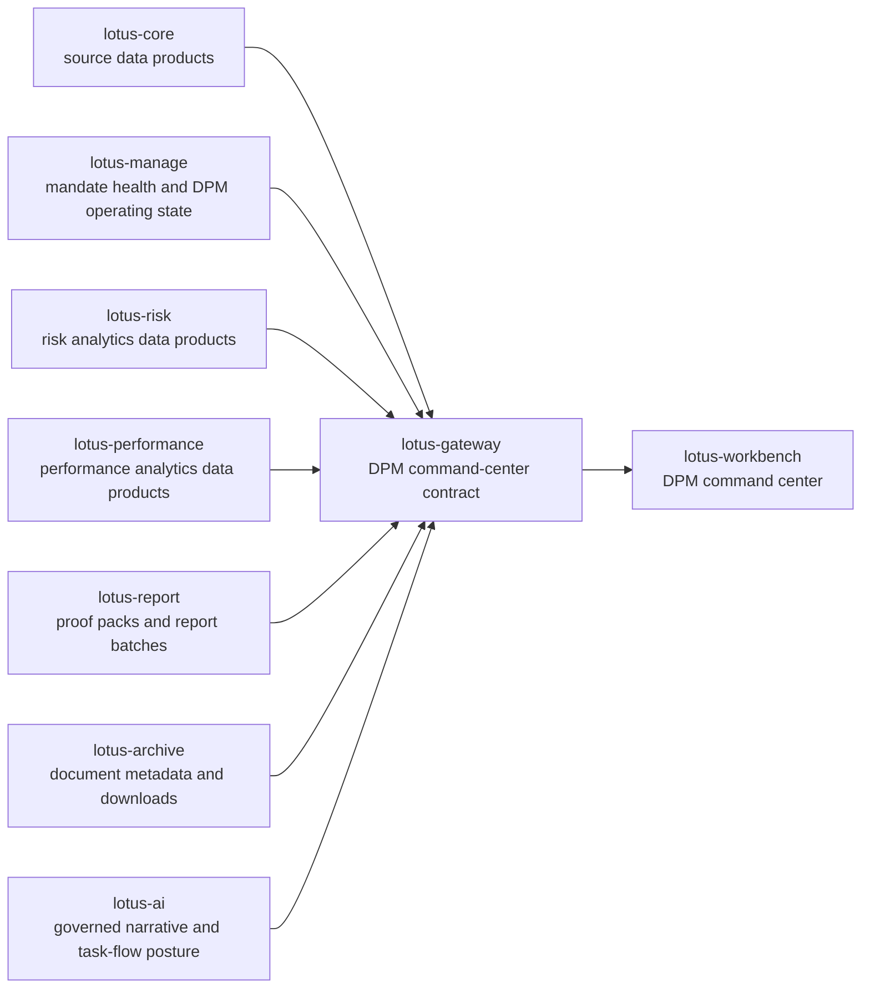

# RFC-0098: DPM Command Center Composition Contract

| Metadata | Details |
| --- | --- |
| **Status** | PROPOSED - IMPLEMENTATION READY |
| **Created** | 2026-05-03 |
| **Last Tightened** | 2026-05-03 |
| **Owner** | `lotus-gateway` |
| **Primary Consumer** | `lotus-workbench` DPM mandate command center |
| **Business Sponsor Persona** | DPM head, portfolio manager, CIO desk, investment control, operations, sales/pre-sales |
| **Depends On** | `lotus-manage` RFC-0037, `lotus-manage` RFC-0038, `lotus-core` RFC-0087, Gateway RFC-0082, Gateway RFC-0108, Workbench RFC-0098 |
| **Doc Location** | `docs/rfcs/RFC-0098-dpm-command-center-composition-contract.md` |
| **Implementation Branch** | TBD when implementation begins |

---

## 0. Executive Summary

`lotus-manage` RFC-0038 delivered the backend foundation for mandate digital twin, mandate health,
source-data-aware stateful management, and DPM operating posture. That does not by itself realize
the business outcome of a DPM command center. A portfolio manager needs one front-office contract
that brings together:

1. source-of-record mandate and portfolio readiness from `lotus-core`,
2. mandate health, drift, constraints, action posture, and rebalance readiness from `lotus-manage`,
3. risk posture from `lotus-risk`,
4. performance posture from `lotus-performance`,
5. proof-pack and reporting posture from `lotus-report`,
6. archived evidence metadata and controlled document access from `lotus-archive`,
7. governed narrative and task-flow posture from `lotus-ai` where AI support is enabled.

This RFC makes `lotus-gateway` the certified composition boundary for that business view.
`lotus-manage` must not become a mega-orchestrator for risk and performance, and
`lotus-workbench` must not stitch raw domain services in the browser. Gateway composes
domain-authoritative products into one stable, supportability-aware, Workbench-facing command-center
contract.

The result should be an enterprise-grade private-banking DPM command-center API that supports daily
portfolio-manager book control, operations triage, CIO oversight, client-demo storytelling, and
future automation.

---

## 1. Gold-Standard Tightening Review

This section records the critical review performed before implementation. It is intentionally kept
inside the RFC so future implementers understand why the final shape is stricter than the first
draft.

| Area | First-draft weakness | Tightened requirement |
| --- | --- | --- |
| Business outcome | Correct direction but not measurable enough. | Added explicit PM, CIO, operations, and demo outcomes plus definition of done. |
| Scope | Endpoint list was useful but not sequenced against upstream readiness. | Added minimum viable contract, upstream readiness matrix, and missing-field escalation rules. |
| Architecture | Correctly kept Gateway as composition boundary. | Added anti-corruption rules, fan-out discipline, no domain recomputation rule, and no direct Workbench raw-service calls. |
| API contract | Example response was helpful but not enough for implementation. | Added canonical endpoint family, module taxonomy, action contract, supportability taxonomy, and attribute-level certification expectations. |
| Slices | Missing the full delivery-standard slices requested for RFC execution. | Added platform/scaffolding, cleanup, implementation proof, hardening, and closure slices. |
| Evidence | Live proof was mentioned but not concrete. | Added canonical proof package with request/response evidence, source matrix, degraded-state evidence, and Workbench handoff proof boundary. |
| Data mesh | Mentioned lineage but not certification gates. | Added domain-product provenance, trust posture, low-cardinality observability, audit restrictions, and mesh certification expectations. |
| Documentation | Wiki update was present but not audience-specific. | Added business/sales/ops/dev documentation outputs and demo narrative requirements. |

Implementation must not begin until this RFC and Workbench RFC-0098 agree on the same Gateway
contract family, route names, supportability states, and proof expectations.

---

## 2. Business Outcomes

The RFC must deliver the following business outcomes.

1. **Daily DPM book control**
   A portfolio manager can open one command-center view and know which discretionary mandates are
   ready, drifting, blocked, stale, degraded, or action-ready.
2. **Faster exception triage**
   The API explains whether a mandate problem is caused by source data, model drift, risk,
   performance, liquidity, tax, restrictions, workflow state, or proof-pack readiness.
3. **Clear domain accountability**
   Every module identifies the authoritative app and the remediation owner. Gateway never hides
   whether the problem belongs to core, manage, risk, performance, reporting, archive, AI, or
   entitlement.
4. **Safer portfolio actions**
   Workbench can only enable management actions that Gateway marks eligible based on manage
   readiness, source readiness, entitlement, and supportability.
5. **Client-demo-grade story**
   Sales and pre-sales can explain how Lotus connects source data, risk, performance, mandate
   controls, and workflow into one discretionary management cockpit.
6. **Operations-grade supportability**
   Operations can inspect support reference, degraded source, blocked source, freshness, and
   remediation route without reading raw payloads or logs.
7. **Enterprise data mesh posture**
   Gateway preserves product identity, lineage, calculation supportability, freshness, and trust
   posture without becoming the domain product authority.

---

## 3. Problem Statement

`lotus-manage` RFC-0038 created DPM mandate health and command-center primitives, but a business
command center requires the full front-office context:

1. `lotus-core` owns source-of-record portfolio identity, holdings, model binding, market data,
   tax-lot, eligibility, source readiness, and source lineage.
2. `lotus-manage` owns DPM mandate interpretation, digital twin, health, drift, constraints,
   action posture, simulation readiness, and workflow state.
3. `lotus-risk` owns concentration, drawdown, active risk, liquidity risk, stress, and risk
   attribution.
4. `lotus-performance` owns returns, contribution, attribution, benchmark-relative posture, and
   performance methodology supportability.
5. `lotus-report` owns proof-pack and reporting batch lifecycle.
6. `lotus-archive` owns generated-document metadata, controlled download, retention, legal-hold,
   and access audit.
7. `lotus-ai` owns optional governed narrative generation and task-flow posture.
8. `lotus-workbench` owns the product experience and must render Gateway truth.

If Workbench stitches every service directly, the product becomes brittle and uncertifiable. If
`lotus-manage` calls risk/performance/report/archive/AI directly for the command-center screen,
manage becomes over-coupled and starts to own analytics and evidence domains it should not own.
Gateway is the correct experience API and composition boundary.

---

## 4. Goals and Non-Goals

### 4.1 Goals

1. Define one strategic Gateway DPM command-center API family.
2. Compose core, manage, risk, performance, report, archive, and optional AI posture into a
   product-facing contract.
3. Preserve upstream domain authority and calculation supportability.
4. Provide Workbench with stable book-level, mandate-detail, evidence, and action-handoff
   contracts.
5. Make degradation explicit and action-blocking where needed.
6. Certify OpenAPI, examples, vocabulary, error handling, observability, and test coverage.
7. Support canonical live proof for `PB_SG_GLOBAL_BAL_001`.
8. Produce business-grade README/wiki/demo documentation after implementation.

### 4.2 Non-Goals

1. Gateway does not calculate mandate health. That belongs to `lotus-manage`.
2. Gateway does not calculate risk. That belongs to `lotus-risk`.
3. Gateway does not calculate performance. That belongs to `lotus-performance`.
4. Gateway does not own source portfolio data. That belongs to `lotus-core`.
5. Gateway does not generate proof packs. That belongs to `lotus-report`.
6. Gateway does not own archived documents. That belongs to `lotus-archive`.
7. Gateway does not generate investment narratives. That belongs to `lotus-ai`.
8. Gateway does not implement the UI. That belongs to `lotus-workbench`.
9. Gateway does not create compatibility aliases for pre-live DPM command-center contracts.

---

## 5. Architecture Direction

### 5.1 Target Architecture



### 5.2 Composition Rules

1. Gateway composes product state and preserves domain truth.
2. Gateway may rank or group product states for the user journey, but must not recompute
   upstream domain figures.
3. Gateway must surface partial readiness. It must not flatten all upstream problems into a single
   generic error.
4. Gateway must keep each module independently supportable so Workbench can render ready, degraded,
   stale, blocked, or not-supported states per module.
5. Gateway must use explicit upstream clients and typed models, not ad hoc JSON pass-through.
6. Gateway must keep fan-out bounded, timeout-governed, observable, and testable.
7. Gateway must use strategic route names and avoid duplicate aliases.

### 5.3 Anti-Corruption Boundary

Gateway must normalize upstream service language into product-facing language without changing
meaning.

| Upstream concern | Gateway product language |
| --- | --- |
| Core source readiness | Source Data Readiness |
| Manage health/action state | Mandate Operating State |
| Risk calculations | Risk Posture |
| Performance calculations | Performance Posture |
| Report batches/proof packs | Proof and Reporting |
| Archive records | Evidence Archive |
| AI workflow/task flow | Narrative Support |

Gateway must retain source ownership in evidence and operations sections.

---

## 6. App-by-App Responsibility Map

| App | Responsibility in command center | Required contribution | Gateway handling | Must not do |
| --- | --- | --- | --- | --- |
| `lotus-core` | Source-of-record portfolio data products | portfolio snapshot, mandate binding, model target, eligibility, tax lots, market data coverage, DPM source readiness, lineage | source readiness, mandate identity, source evidence | DPM health scoring or UI composition |
| `lotus-manage` | DPM mandate operating layer | digital twin, health score, health dimensions, exceptions, action eligibility, rebalance readiness, simulation handoff refs | DPM operating state and action affordances | risk/performance calculation ownership |
| `lotus-risk` | Certified risk analytics | concentration, drawdown, liquidity/stress where available, active risk, risk attribution, calculation supportability | risk posture and degraded risk state | DPM workflow ownership |
| `lotus-performance` | Certified performance analytics | return path, contribution, attribution, benchmark-relative performance, horizon trend, calculation supportability | performance posture and degraded performance state | DPM workflow ownership |
| `lotus-report` | Proof pack and report lifecycle | latest proof pack, report batch status, materialization status, recovery state | proof/reporting module | command-center composition |
| `lotus-archive` | Generated-document archive | document metadata, controlled download links, retention/access posture | evidence archive refs only | analytics or workflow decisioning |
| `lotus-ai` | Governed narrative support | optional PM narrative, task-flow posture, handoff refs | optional narrative support module | source-of-truth analytics or action authority |
| `lotus-gateway` | Experience API | stable DPM command-center contract, supportability normalization, audit, metrics, diagnostics | owns product contract | domain calculation ownership |
| `lotus-workbench` | Product UI | command-center rendering, workflow affordances, drilldown, evidence trail | consumes Gateway only | raw service stitching |

---

## 7. Upstream Readiness Matrix

Implementation must validate the exact source route family before writing Gateway code. The initial
implementation should use existing certified endpoints where available and create upstream issues
for missing fields rather than inventing local synthetic truth.

| Domain | Required data | Expected source | Required for MVP | Missing-data behavior |
| --- | --- | --- | --- | --- |
| Portfolio identity | portfolio id, name, book, region, base/reference currency, benchmark | `lotus-core` | yes | mandate detail blocked if identity unavailable |
| Mandate binding | mandate id, model id, policy version, review cadence | `lotus-core` + `lotus-manage` twin | yes | DPM operating module blocked |
| Holdings/source readiness | holdings state, price/FX freshness, tax-lot readiness, eligibility | `lotus-core` RFC-0087 endpoints | yes | source readiness degraded or blocked by dependency |
| DPM health | health score, dimensions, exceptions, recommended action | `lotus-manage` RFC-0038 | yes | command center blocked for DPM action, but source panel may render |
| Rebalance readiness | simulation eligibility, blocked reasons, active run refs | `lotus-manage` | yes | simulate action disabled |
| Risk posture | concentration, drawdown, liquidity/stress if available, risk attribution | `lotus-risk` | no for first route availability, yes for gold business proof | risk module degraded/not-supported |
| Performance posture | return path, contribution, attribution, benchmark-relative signals | `lotus-performance` | no for first route availability, yes for gold business proof | performance module degraded/not-supported |
| Proof/reporting | proof pack readiness, report batch status, latest report refs | `lotus-report` | no for first route availability, yes before demo claim | proof module degraded/not-supported |
| Archive evidence | generated document metadata, controlled download refs | `lotus-archive` | no for first route availability, yes when proof refs exist | archive refs omitted with reason |
| Narrative support | bounded PM summary, AI task-flow posture | `lotus-ai` | no | narrative module omitted unless requested and available |

---

## 8. Strategic API Contract

### 8.0 Construction Alternatives Module Addendum

RFC-0098 must also realize `lotus-manage` RFC-0039 construction alternatives after the manage
contract is hardened and live-proven. This is intentionally included in the command-center
composition RFC so Gateway does not create a second, disconnected DPM construction API family.

Business outcome:

1. portfolio managers compare disciplined construction choices before action,
2. CIO and investment-control users see trade-off evidence before approval,
3. tax specialists and operations can inspect turnover, tax, source-readiness, and supportability,
4. sales/pre-sales can demonstrate that Lotus does not emit one black-box trade list.

Gateway responsibility:

1. expose a Workbench-facing construction-alternatives module within the DPM command-center
   experience contract,
2. consume `lotus-manage` `POST /api/v1/construction/alternative-sets/generate`,
   `GET /api/v1/construction/alternative-sets/{alternative_set_id}`, and
   `POST /api/v1/construction/alternative-sets/{alternative_set_id}/selections`,
3. preserve manage method identifiers, method statuses, objective traces, constraint traces,
   comparison metrics, source supportability, selected alternative, actor, reason code, comment,
   and correlation id,
4. add entitlement, tenant, channel, and Workbench action posture without recomputing alternatives,
5. keep risk and performance figures domain-authoritative; if `lotus-risk` or
   `lotus-performance` enrichment is unavailable, Gateway surfaces degraded or not-supported state
   rather than fabricating values.

The initial construction module must support the manage first-wave methods:

| Method | Gateway product treatment |
| --- | --- |
| `DO_NOTHING_BASELINE` | Always visible as the governed comparator for accepting current drift. |
| `HEURISTIC_EXPLAINABLE` | Primary explainable rebalance comparator. |
| `MIN_TURNOVER` | Low-turnover comparator; may be `PENDING_REVIEW` when turnover budget suppresses intents. |
| `TAX_AWARE` | Tax-aware posture; must preserve degraded reason codes when authoritative tax/cost/risk/performance enrichment is partial. |

Gateway must not flatten manage statuses into generic success/failure.

| Manage status | Gateway handling |
| --- | --- |
| `READY` | Enable Workbench selection if entitlement and downstream preconditions pass. |
| `PENDING_REVIEW` | Display as review-required; downstream automation remains gated unless explicitly approved by later workflow contract. |
| `DEGRADED` | Display with supportability and reason codes. |
| `BLOCKED` | Disable action and show remediation owner. |
| `INFEASIBLE` | Keep as a rejected alternative with constraint evidence, not as a transport failure. |

Gateway proof must use the manage evidence package from RFC-0039:

1. `output/rfc0039-proof/20260503-172059/04-comparison-matrix.json`,
2. `output/rfc0039-proof/20260503-173624-canonical-postgres/summary.json`,
3. validator probe `construction_alternatives_first_wave`.

Gateway implementation must not begin until it validates the current manage OpenAPI for the
construction endpoint family and confirms whether additional downstream action fields are required
for Workbench. Missing fields should be raised against `lotus-manage`; Gateway must not infer them.

### 8.1 Endpoint Family

Gateway must expose one strategic route family:

| Endpoint | Purpose | Workbench use |
| --- | --- | --- |
| `GET /api/v1/dpm/command-center` | Book-level command-center summary across mandates. | `/dpm` book view |
| `GET /api/v1/dpm/command-center/mandates/{portfolio_id}` | Single mandate command-center detail. | `/dpm/mandates/[portfolioId]` |
| `GET /api/v1/dpm/command-center/mandates/{portfolio_id}/evidence` | Evidence/provenance bundle for support drawer and proof-pack handoff. | evidence drawer/deep link |
| `POST /api/v1/dpm/command-center/mandates/{portfolio_id}/actions/simulate` | Gateway-shaped action handoff into `lotus-manage` stateful rebalance simulation. | action rail |

No route aliases should be added. If implementation discovers duplicate legacy DPM command-center
routes, remove them before promoting the feature because the surface is pre-live.

### 8.2 Query Parameters

| Parameter | Type | Required | Applies to | Description | Example |
| --- | --- | --- | --- | --- | --- |
| `as_of_date` | date | no | read routes | Business date for source and analytics posture. Defaults to latest supported date or canonical proof date. | `2026-04-10` |
| `region` | string | no | book route | Front-office region or booking center. | `SG` |
| `book_id` | string | no | book route | DPM portfolio book identifier. | `DPM-SG-GLOBAL-BALANCED` |
| `relationship_manager_id` | string | no | book route | Optional relationship manager/book owner filter. | `RM-PRIVATEBANK-01` |
| `model_portfolio_id` | string | no | book route | Optional model portfolio filter. | `MODEL_PB_SG_GLOBAL_BAL_DPM` |
| `mandate_state` | enum | no | book route | Filter by `ready`, `attention_required`, `blocked`, `stale`, `degraded`, `not_supported`. | `attention_required` |
| `severity` | enum | no | book route | Filter by `critical`, `high`, `medium`, `low`. | `high` |
| `include` | CSV enum | no | all read routes | Optional modules: `core`, `manage`, `risk`, `performance`, `reporting`, `archive`, `ai`, `evidence`. | `core,manage,risk,performance` |

### 8.3 Command-Center Module Taxonomy

All responses must use these module identifiers consistently:

1. `source_data_readiness`
2. `mandate_operating_state`
3. `risk_posture`
4. `performance_posture`
5. `proof_and_reporting`
6. `evidence_archive`
7. `narrative_support`

Module state values:

1. `ready`
2. `attention_required`
3. `degraded`
4. `blocked`
5. `stale`
6. `not_supported`
7. `not_requested`
8. `unavailable`

### 8.4 Book-Level Response Shape

```json
{
  "contract": {
    "name": "DpmCommandCenter",
    "version": "v1",
    "as_of_date": "2026-04-10",
    "generated_at": "2026-05-03T08:00:00Z"
  },
  "portfolio_book": {
    "book_id": "DPM-SG-GLOBAL-BALANCED",
    "region": "SG",
    "currency": "USD",
    "mandate_count": 126,
    "ready_count": 91,
    "attention_required_count": 27,
    "blocked_count": 8,
    "stale_count": 0,
    "degraded_count": 4
  },
  "summary": {
    "overall_state": "attention_required",
    "primary_reason": "27 mandates require review; 8 are blocked by source-data or policy readiness.",
    "highest_priority_dimension": "mandate_drift",
    "next_best_operating_action": "Review attention-required mandates by severity and rebalance readiness."
  },
  "mandates": [
    {
      "portfolio_id": "PB_SG_GLOBAL_BAL_001",
      "mandate_id": "MANDATE_PB_SG_GLOBAL_BAL_001",
      "mandate_name": "Singapore Global Balanced DPM",
      "model_portfolio_id": "MODEL_PB_SG_GLOBAL_BAL_DPM",
      "portfolio_manager_id": "PM-SG-DPM-01",
      "mandate_state": "attention_required",
      "health_score": 82.4,
      "health_band": "watch",
      "primary_exception": {
        "code": "equity_overweight_drift",
        "severity": "high",
        "business_summary": "Equity allocation is outside the tactical tolerance band."
      },
      "rebalance_readiness": "ready_for_simulation",
      "module_states": {
        "source_data_readiness": "ready",
        "mandate_operating_state": "attention_required",
        "risk_posture": "ready",
        "performance_posture": "attention_required",
        "proof_and_reporting": "ready"
      },
      "recommended_actions": [
        {
          "action": "simulate_rebalance",
          "eligible": true,
          "reason": "Source data and mandate policy are ready."
        }
      ]
    }
  ],
  "supportability": {
    "state": "ready",
    "degraded_sources": [],
    "blocked_sources": [],
    "support_reference": "dpm-command-center-20260410-001"
  },
  "lineage": {
    "source_systems": ["lotus-core", "lotus-manage", "lotus-risk", "lotus-performance", "lotus-report"],
    "domain_products": [
      "DpmSourceReadiness:v1",
      "DpmMandateHealth:v1",
      "RiskConcentration:v1",
      "PerformanceAttribution:v1"
    ]
  }
}
```

### 8.5 Single-Mandate Detail Required Sections

| Section | Required fields |
| --- | --- |
| `mandate_identity` | portfolio id, mandate id, book id, model id, benchmark id, region, currency, PM owner, policy version, review cadence |
| `command_summary` | overall state, health score, health band, primary reason, top exception, recommended next action |
| `source_data_readiness` | holdings readiness, market data coverage, tax lot readiness, eligibility readiness, source freshness, lineage bundle |
| `mandate_operating_state` | digital twin state, drift dimensions, constraints, restrictions, cash posture, rebalance readiness, workflow gates, active run refs |
| `risk_posture` | concentration state, drawdown state, liquidity/stress state where available, active risk, risk attribution, calculation supportability |
| `performance_posture` | return path state, contribution, attribution, benchmark-relative state, horizon trend, calculation supportability |
| `proof_and_reporting` | proof-pack readiness, report batch state, latest generated report refs, blocked/degraded report reasons |
| `evidence_archive` | archive refs, document metadata refs, controlled download refs, retention/access posture |
| `narrative_support` | optional AI summary, task-flow posture, handoff refs, bounded supportability |
| `recommended_actions` | review, simulate, generate proof pack, investigate source, investigate risk, investigate performance, defer, escalate |
| `observability` | support reference, upstream source states, low-cardinality reason codes, correlation scope |

### 8.6 Action Handoff Contract

`POST /api/v1/dpm/command-center/mandates/{portfolio_id}/actions/simulate` must:

1. verify the requested action is eligible from the latest command-center state,
2. verify source readiness and manage rebalance readiness,
3. route to `lotus-manage` stateful simulation,
4. preserve idempotency/replay posture where manage exposes it,
5. return product-safe run refs and next action,
6. not call risk or performance synchronously as part of the simulate action unless future manage
   or Gateway contract explicitly requires it.

Blocked action response example:

```json
{
  "action": "simulate_rebalance",
  "eligible": false,
  "state": "blocked",
  "blocked_reason": "source_data_readiness_blocked",
  "business_message": "Simulation is blocked because market data coverage is stale for required holdings.",
  "remediation_owner": "lotus-core",
  "support_reference": "dpm-command-center-action-20260410-001"
}
```

---

## 9. Supportability and Degradation

Gateway must use this common taxonomy.

| State | Meaning | Action behavior |
| --- | --- | --- |
| `ready` | Required data and calculations are available. | Dependent action may be enabled if entitlement allows. |
| `attention_required` | Data is available but business posture requires review. | Action may be enabled or gated by severity. |
| `degraded` | Optional or secondary input is unavailable; core command-center view remains usable. | Dependent action disabled only if the degraded source is required for that action. |
| `blocked` | Required input is missing, invalid, unauthorized, or failed. | Dependent action disabled. |
| `stale` | Input is outside freshness tolerance. | Time-sensitive action disabled unless policy allows stale read-only display. |
| `not_supported` | Capability is intentionally unavailable for mandate, product, or region. | Do not show as failure; hide or render unavailable module. |
| `not_requested` | Optional module was not requested. | Do not count as degraded. |
| `unavailable` | Upstream could not be contacted or returned unusable data. | Render with support reference and retry/remediation path. |

Every degraded or blocked module must include:

1. module id,
2. upstream owner,
3. reason code,
4. business impact,
5. blocked actions,
6. remediation owner,
7. support reference,
8. freshness or last-known-good timestamp when available.

---

## 10. Security, Entitlement, and Sensitive-Data Rules

Gateway must enforce front-office entitlement before returning command-center payloads.

Required controls:

1. portfolio/book access check,
2. action entitlement check,
3. protected diagnostics entitlement check,
4. archive/download entitlement pass-through,
5. AI narrative entitlement where AI module is requested,
6. product-safe error handling for unauthorized or forbidden reads.

Forbidden in logs, metrics, diagnostics, and audit records:

1. client name,
2. raw holdings list,
3. raw tax lots,
4. transaction details,
5. request body,
6. response body,
7. raw prompt,
8. model output,
9. raw entitlement details,
10. high-cardinality portfolio/client/holding identifiers in metric labels.

Portfolio id may appear in API response and test evidence where it is the requested resource, but
must not appear as an unbounded metric label.

---

## 11. Observability and Data Mesh Requirements

Every route must produce RFC-0108-aligned observability:

1. bounded fan-out metrics by `operation`, `upstream_service`, `status_class`, and degraded
   `reason`,
2. structured logs with support reference and low-cardinality route/operation state,
3. audit events for allowed reads, denied reads, protected diagnostics lookup, and action handoff,
4. diagnostics lookup that returns product-safe source state and never raw payloads,
5. trace correlation internally without leaking trace ids to unauthorized users.

Every successful response must carry:

1. contract name and version,
2. as-of date,
3. generated timestamp,
4. source systems,
5. domain products where available,
6. lineage refs,
7. freshness refs,
8. supportability summary,
9. calculation supportability for risk/performance modules where upstream provides it,
10. source support references.

Mesh certification must validate that Gateway is a consumer/composer and not a new authority for
upstream domain products.

---

## 12. OpenAPI and API Certification Requirements

All endpoints in this RFC must be certified before Workbench implementation begins.

Swagger requirements:

1. group under `DPM Command Center`,
2. explain what the endpoint is for,
3. explain when to use it,
4. explain how Workbench and operators should interpret degraded states,
5. include request parameter type, description, allowed values, and examples,
6. include every response attribute with description, type, and example,
7. include full examples for ready, attention-required, degraded, blocked, stale, and
   not-supported cases,
8. include error examples for missing portfolio, unauthorized, forbidden, upstream timeout,
   upstream malformed response, and unsupported mandate,
9. use typed schemas only; no `Any`-style response contracts,
10. avoid endpoint aliases and duplicate compatibility paths,
11. pass API vocabulary and no-alias governance,
12. include example validation tests that fail if Swagger examples drift from executable schemas.

---

## 13. Implementation Slices

### Slice 0: RFC, Contract, and Branch Readiness

Scope:

1. finalize this RFC and Workbench RFC-0098 together,
2. verify implementation branch and branch hygiene,
3. confirm no PR is opened until RFC readiness is accepted,
4. record upstream endpoint inventory and gaps,
5. create issues for upstream missing fields if required.

Acceptance:

1. Gateway and Workbench RFCs agree on endpoint family, module ids, states, and proof expectations.
2. Upstream matrix has owner, endpoint, required/optional status, and fallback behavior.
3. No implementation begins with unresolved route naming ambiguity.

### Slice 1: Platform Automation and Scaffolding Improvement Slice

Scope:

1. identify Gateway or platform scaffolding gaps that would affect this RFC,
2. check whether OpenAPI certification, Swagger examples, observability, health, structured
   logging, error handling, test scaffolding, CI defaults, wiki scaffolding, and governance hooks
   are already scaffolded for a new Gateway endpoint family,
3. improve platform automation when the gap is cross-cutting,
4. improve Gateway-local reusable endpoint scaffolding only when the gap is Gateway-specific.

Acceptance:

1. Cross-cutting gaps are fixed in `lotus-platform`, not locally duplicated, when applicable.
2. Gateway endpoint scaffolding supports typed schemas, example validation, supportability,
   observability, and contract tests.
3. Any no-change decision is explicit and evidence-backed.

### Slice 2: Cleanup and Structure Slice

Scope:

1. remove stale DPM command-center drafts or duplicate route ideas if found,
2. align RFC index, repo context, README, and wiki roadmap,
3. keep long-lived business/product material in wiki source where appropriate,
4. avoid duplicating full RFC detail in wiki,
5. keep Gateway domain boundary documentation aligned with RFC-0082.

Acceptance:

1. Documentation truth is not split across stale docs.
2. Wiki source has business-readable roadmap summary.
3. `Sync-RepoWikis.ps1 -CheckOnly -Repository lotus-gateway` passes before merge.

### Slice 3: Composition Models and Upstream Clients

Scope:

1. add typed command-center models,
2. add explicit upstream client methods,
3. implement bounded fan-out coordinator,
4. implement supportability normalization,
5. preserve upstream calculation supportability without recomputation.

Acceptance:

1. Unit tests cover ready, attention, degraded, blocked, stale, not-supported, unavailable, and
   not-requested states.
2. Client tests cover timeout, malformed response, 401/403, 404, and partial-readiness behavior.
3. Contract tests prove raw upstream payloads do not leak.

### Slice 4: Book-Level Command Center Endpoint

Scope:

1. implement `GET /api/v1/dpm/command-center`,
2. support filters and include modules,
3. return mandate queue and book-level counts,
4. preserve module states and supportability,
5. do not require optional risk/performance/report modules for base source/manage rendering.

Acceptance:

1. Book route returns canonical `PB_SG_GLOBAL_BAL_001` in local proof when seeded.
2. Empty book, unauthorized book, and degraded upstream cases are tested.
3. OpenAPI examples validate.

### Slice 5: Single-Mandate Detail Endpoint

Scope:

1. implement `GET /api/v1/dpm/command-center/mandates/{portfolio_id}`,
2. compose all required sections,
3. expose action eligibility from Gateway-shaped manage readiness,
4. preserve domain ownership labels and evidence refs.

Acceptance:

1. Canonical portfolio returns complete detail when upstreams are ready.
2. Optional modules degrade truthfully.
3. Blocked source readiness disables simulation.
4. Workbench contract test fixture is created from the schema, not hand-waved.

### Slice 6: Evidence Endpoint and Protected Diagnostics

Scope:

1. implement `GET /api/v1/dpm/command-center/mandates/{portfolio_id}/evidence`,
2. include source refs, lineage, calculation supportability, proof/report refs, archive refs, and
   support references,
3. implement protected diagnostics lookup if not already covered by RFC-0108 diagnostics,
4. exclude sensitive/raw fields.

Acceptance:

1. Evidence supports Workbench drawer and operations triage.
2. Audit tests prove forbidden fields are absent.
3. Archive links are Gateway-controlled links, not raw service links.

### Slice 7: Simulate Action Handoff

Scope:

1. implement `POST /api/v1/dpm/command-center/mandates/{portfolio_id}/actions/simulate`,
2. validate latest action eligibility,
3. call `lotus-manage` stateful simulation,
4. preserve idempotency/replay posture where available,
5. return product-safe run refs and next actions.

Acceptance:

1. Eligible state calls manage and returns run refs.
2. Ineligible state does not call manage.
3. Timeout, denied, malformed response, and manage-degraded cases are tested.
4. Audit event records action handoff without forbidden fields.

### Slice 8: Implementation Proof Slice

Scope:

1. prove all Gateway endpoints against mocked and live upstream behavior,
2. bring up canonical front-office stack,
3. validate core/manage integration and optional risk/performance/report/archive modules,
4. capture request/response evidence in non-git tracked output,
5. critically review evidence for gaps and iterate.

Acceptance:

1. Feature lane and PR merge gate pass.
2. Live canonical proof passes for `PB_SG_GLOBAL_BAL_001`.
3. Evidence includes at least one ready path and one degraded or blocked path.
4. Backend proof does not claim Workbench UI completion until Workbench RFC-0098 is implemented.

### Slice 9: Second-Last Hardening and Review Slice

Scope:

1. perform full code review of the implementation,
2. verify API certification pattern compliance,
3. verify platform governance and enterprise data mesh standards,
4. verify Swagger quality,
5. verify error handling and tests,
6. remove dead code and duplicate endpoints,
7. review latency and fan-out behavior.

Acceptance:

1. No duplicate DPM command-center endpoints remain.
2. All Swagger attributes have description, type, and example.
3. Error handling is complete and tested.
4. Fan-out latency and timeout behavior are measured or bounded.

### Slice 10: Final Closure Slice

Scope:

1. update README, repo context, RFC index, wiki, and supported-features material,
2. publish wiki after merge,
3. update agent context or skills if this creates reusable guidance,
4. verify branch hygiene,
5. record final gold-pass assessment in this RFC.

Acceptance:

1. Documentation is useful to business, engineering, sales, marketing, operations, and client-demo
   audiences.
2. Supported features are implementation-backed, not aspirational.
3. Wiki check-only passes before merge and publish succeeds after merge.
4. Final section records what was completed, debt removed, proof captured, and remaining work.

---

## 14. Test Pyramid

| Layer | Required proof |
| --- | --- |
| Unit | model normalization, state mapping, action eligibility, supportability, forbidden-field filtering |
| Client/unit | upstream success, timeout, 401/403, 404, malformed response, stale data, optional module omitted |
| Contract | Workbench-facing schema stability, OpenAPI examples, vocabulary/no-alias checks |
| Integration | composed route behavior with mocked upstreams and partial readiness |
| E2E/live | canonical core/manage/risk/performance/report/archive composition or truthful degradation |
| Observability | audit events, bounded metrics, diagnostics lookup, denied-read posture |
| Performance | bounded fan-out latency, timeout behavior, no serial calls where safe parallel calls are possible |

Tests must validate business states and returned figures where figures are present. Status-code-only
tests are not enough.

---

## 15. Canonical Evidence Package

Implementation proof must produce a non-git-tracked evidence folder, for example:

`output/live-demo/<timestamp>/dpm-command-center-gateway/`

Required artifacts:

1. book route request and response,
2. single mandate request and response for `PB_SG_GLOBAL_BAL_001`,
3. evidence route request and response,
4. simulate action eligible request/response,
5. simulate action blocked request/response,
6. OpenAPI excerpt or validation result,
7. supportability summary,
8. source matrix showing core/manage/risk/performance/report/archive/AI state,
9. latency/fan-out summary,
10. critical review notes explaining any degraded or deferred module.

---

## 16. Risks and Controls

| Risk | Control |
| --- | --- |
| Gateway becomes a domain calculation layer | Preserve upstream ownership and do only product composition. |
| Workbench bypasses Gateway | Workbench RFC-0098 requires Gateway-only consumption. |
| Optional upstream degradation blocks the whole command center | Module-level supportability and include semantics. |
| Sensitive data leaks into diagnostics | RFC-0108 forbidden-field tests and protected diagnostics. |
| API sprawl | One strategic endpoint family, no aliases. |
| Demo claims exceed implementation | Supported-features promotion only after live evidence. |
| Latency grows due cross-service fan-out | Bounded fan-out, timeouts, parallel upstream calls where safe, latency evidence. |
| Upstream fields missing | Create upstream issues with owner and field-level requirement; do not fabricate local truth. |

---

## 17. Definition of Done

This RFC is complete only when:

1. all strategic DPM command-center endpoints are implemented,
2. all endpoints are API-certified,
3. OpenAPI has grouped endpoints, full examples, and attribute-level descriptions,
4. Gateway composes core, manage, risk, performance, report, archive, and optional AI posture or
   truthfully reports unavailable/degraded modules,
5. action eligibility prevents unsafe simulate handoff,
6. Workbench RFC-0098 has a stable contract to consume,
7. canonical live proof passes for `PB_SG_GLOBAL_BAL_001`,
8. request/response evidence is captured and critically reviewed,
9. audit, metrics, diagnostics, entitlement, and security tests pass,
10. latency/fan-out behavior is bounded and documented,
11. README, repo context, RFC index, wiki, and supported-features material are updated,
12. CI is green,
13. wiki is published after merge,
14. branch and remote hygiene are clean.

---

## 18. Gold-Pass Assessment Template

To be completed during the final closure slice:

| Assessment Area | Final Result |
| --- | --- |
| What was truly completed | TBD |
| Quality improvements made | TBD |
| Debt removed | TBD |
| Tests and live evidence captured | TBD |
| API certification result | TBD |
| Data mesh and observability result | TBD |
| Documentation/wiki result | TBD |
| Remaining governed follow-up | TBD |
| Gold-standard conclusion | TBD |

---

## 19. Relationship to Workbench RFC-0098

Gateway RFC-0098 is the backend composition contract. Workbench RFC-0098 is the product experience
that renders this contract into a DPM mandate command center.

The business outcome is not complete until both RFCs are implemented and validated:

1. Gateway composes certified domain products.
2. Workbench renders the PM workflow.
3. Domain apps remain authoritative.
4. Platform canonical automation proves the integrated stack.
5. README/wiki/demo material explains the feature for business, engineering, operations,
   sales/pre-sales, marketing, and clients.
