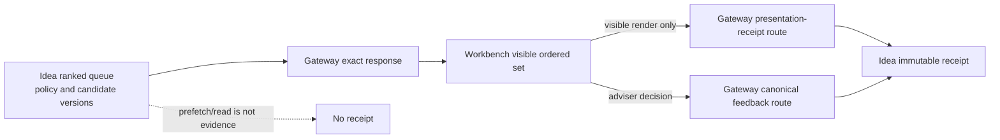

# Idea opportunity transport

The Idea opportunity boundary records two distinct adviser-journey facts:

1. bounded adviser feedback using `idea-feedback-taxonomy-v1`, and
2. evidence that a specific candidate was part of the ordered set visibly rendered in Workbench.

It does not certify suitability, authorize execution, contact a client, or prove that a queue read
was visible to an adviser.

## Runtime flow

## Product rules

- Gateway preserves Idea rank, policy version, material version, and evidence version.
- Idea owns the global queue rank; Workbench preserves it from the rendered item and independently
  owns the exact visible-set digest, visible count, and render time.
- Gateway forwards those values and request lineage without deriving or translating them.
- Idea owns candidate/version validation, feedback combination rules, immutable persistence,
  idempotency, audit evidence, and effectiveness methodology.
- A new receipt returns `201`; an exact replay returns `200`.
- Missing or contradictory source evidence fails closed. No compatibility aliases are accepted.
- `supportedFeaturePromoted` remains `false` until the Workbench visible-render journey and
  cross-repository runtime are independently certified.

## Feedback vocabulary

`useful` is paired with `relevant`. `not_useful` uses one of `not_relevant`, `already_known`,
`wrong_timing`, `insufficient_evidence`, `wrong_priority`, `duplicate`, or
`client_specific_constraint`. Gateway validates the vocabulary; Idea validates the combination.

## Detailed engineering and operations guide

See
[Idea opportunity action transport](https://github.com/sgajbi/lotus-gateway/blob/main/docs/operations/idea-opportunity-action-transport.md)
for field ownership, status semantics, privacy controls, certification criteria, and validation
commands.

