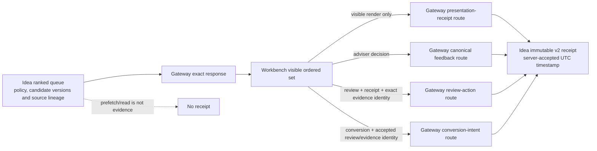

# Idea opportunity transport

The Idea opportunity boundary records four distinct adviser-journey facts:

1. bounded adviser feedback using `idea-feedback-taxonomy-v1`, and
2. evidence that a specific candidate was part of the ordered set visibly rendered in Workbench,
3. an adviser review bound to that presentation and the exact current candidate evidence, and
4. a conversion intent bound to the accepted review and the same candidate evidence identity.

It does not certify suitability, authorize execution, contact a client, or prove that a queue read
was visible to an adviser.

The boundary also carries the governed AI-explanation transport: Workbench requests a candidate
explanation through `POST /api/v1/ideas/candidates/{candidate_id}/ai-explanations` (request id,
one of three bounded generation purposes, timezone-aware request time) and reads posture through
`GET /api/v1/ideas/ai-explanations/readiness`. Lotus Idea owns generation, governed acceptance,
provenance, and lineage; Gateway preserves the outcome verbatim — including the explicit
`EXPLANATION_UNAVAILABLE` degraded shape with its disposition reason class — and fails closed as
a bounded 502 when a served explanation is contradicted by its own proof fields (disposition,
verdict, runtime confirmation and run id, posture, verifier outcome, fallback flags,
execution provenance class, AI lineage, text), its evidence identity mismatches the request,
or transit attempts an authority escalation.

## Runtime flow

## Product rules

- Gateway preserves Idea rank, policy version, material version, and evidence version.
- Each ranked candidate must declare `sourceRevisionVectorDigest` and `sourceCutPosture`.
  Workbench preserves the displayed queue item's values in its visible-render request;
  Gateway forwards them unchanged and rejects missing, malformed, or undeclared spellings.
- Idea owns the global queue rank; Workbench preserves it from the rendered item and independently
  owns the exact visible-set digest, visible count, and render time.
- Gateway forwards those values and request lineage without deriving or translating them.
- Idea owns candidate/version validation, feedback combination rules, immutable persistence,
  idempotency, audit evidence, and effectiveness methodology.
- A new receipt returns `201`; an exact replay returns `200`.
- The `lotus-idea.candidate-presentation-receipt.v2` response must echo the submitted
  lineage and carry Idea-owned `acceptedAtUtc` with `acceptanceTimeSource=server_accepted`.
  This aware-UTC acceptance time is distinct from Workbench's `presentedAtUtc` render time.
- Missing or contradictory source evidence fails closed. No compatibility aliases are accepted.
- Review and conversion requests carry Idea-owned material/evidence versions, evidence packet and
  content hash, source revision-vector digest, and source-cut posture. Reviews additionally carry
  the explicit channel and Workbench presentation receipt; conversions carry the accepted review
  id. Gateway never invents these fields and acknowledges success only when Idea echoes the exact
  submitted authority tuple.
- Review and conversion responses preserve Idea's server-accepted timestamp and policy/receipt
  evidence; caller event time remains distinct from source acceptance time.
- `supportedFeaturePromoted` remains `false` until the Workbench visible-render journey and
  cross-repository runtime are independently certified.

## Feedback vocabulary

`useful` is paired with `relevant`. `not_useful` uses one of `not_relevant`, `already_known`,
`wrong_timing`, `insufficient_evidence`, `wrong_priority`, `duplicate`, or
`client_specific_constraint`. Gateway validates the vocabulary; Idea validates the combination.

## Detailed engineering and operations guide

See
[Idea opportunity action transport](https://github.com/sgajbi/lotus-gateway/blob/main/docs/operations/idea-opportunity-action-transport.md)
for field ownership, status semantics, privacy controls, certification criteria, and validation
commands.

