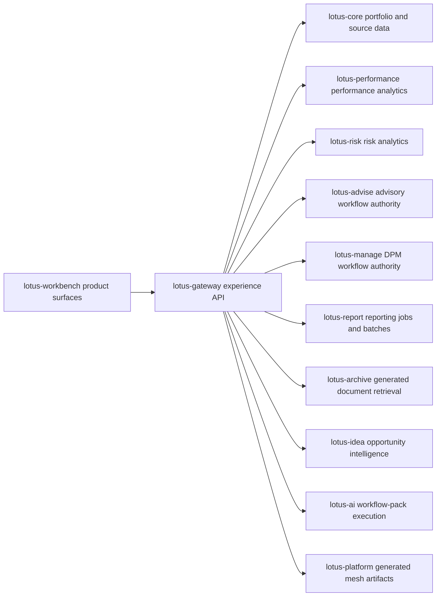

# Overview

## Business role

`lotus-gateway` is the governed experience API for Lotus product clients, primarily
`lotus-workbench`.

It shapes product-facing contracts from upstream domain services without becoming the authority for
their business truth.

## Ownership boundaries

This repo owns:

1. product-facing API composition
2. partial-readiness-aware aggregation
3. gateway-level routing and contract governance
4. experience-oriented payload shaping and degraded-state handling

This repo does not own:

1. portfolio source truth, which belongs to `lotus-core`
2. performance methodology, which belongs to `lotus-performance`
3. risk methodology, which belongs to `lotus-risk`
4. reporting methodology, which belongs to `lotus-report`
5. advisory and management workflow truth, which belong upstream

## Current posture

- primary backend contract for `lotus-workbench`
- canonical local service identity is `gateway.dev.lotus`
- live integration boundary where Docker parity matters
- high drift risk because gateway changes directly affect the product UI

## Experience-API Flow

Gateway is the client contract and composition layer in this flow. It can aggregate, reshape, and
annotate upstream results for product use, but it must preserve upstream authority, lineage,
supportability, and degraded-state posture.

## Functional Capability Matrix

| Surface | Business Use | Implementation-Backed Gateway Posture | Source Authority |
| --- | --- | --- | --- |
| Foundation and platform capabilities | Workbench shell bootstrap, navigation gating, and product readiness checks | Active route families for foundation workspace entry, platform capability aggregation, and feature supportability posture | Gateway composes; upstream capability truth remains in the owning services |
| Portfolio and Workbench overview | Portfolio landing, portfolio 360, readiness, operations snapshot, and first-paint analytics context | Active Gateway contracts with partial-readiness handling and bounded DPM operations posture | `lotus-core`, `lotus-performance`, `lotus-risk`, and `lotus-manage` |
| Performance and risk workspaces | Front-office analytics review, evidence, supportability, and degraded-state display | Active Workbench-facing route families that preserve source calculation supportability and methodology boundaries | `lotus-performance` and `lotus-risk` |
| Advisory proposals, policy, cockpit, and bank-demo proof | Advisor proposal lifecycle, suitability/policy review, action cockpit, and proof-backed demo material | Active Gateway publication over implemented Advise routes, with client-ready and external-communication boundaries preserved | `lotus-advise` |
| DPM command center | Mandate health, construction alternatives, proof packs, waves, outcome reviews, portfolio memory, and PM quality | Active Gateway BFF route families over implemented Manage APIs, including governed AI handoffs where source evidence exists | `lotus-manage` plus `lotus-ai` for workflow-pack execution |
| Reporting, archive, and batch operations | Portfolio-review report jobs, batch materialization, scheduler operations, metadata lookup, and controlled download | Active Gateway operator/product boundary for reporting and document retrieval without owning rendering, archive storage, or retention truth | `lotus-report`, `lotus-render`, and `lotus-archive` |
| Ideas | Advisor opportunity review and evidence drill-down | Active read-only Gateway publication for advisor review queue and source-safe candidate detail with entitlement-scope forwarding; no local idea generation, ranking, enrichment, or promotion | `lotus-idea` |
| Domain-product discovery | Self-serve mesh catalog, dependency graph, and trust certification discovery | Active read-only facade over generated platform artifacts with explicit unavailable/degraded posture | `lotus-platform` generated evidence and producer repo declarations |

## Non-Functional Capability Matrix

| Capability | Current Implementation-Backed Posture | Why It Matters |
| --- | --- | --- |
| Contract governance | OpenAPI/Workbench contract proof, RFC-0082 upstream-family map, no-alias/vocabulary posture, and route-specific request convention documentation are active | Keeps Workbench, demos, and downstream agents aligned to the supported API rather than historical route shapes |
| Validation and release quality | `make check`, `make ci`, and `make ci-local-docker` map to the Lotus lane model; Docker parity matters because Gateway is a live integration boundary | Reduces integration drift across Workbench and upstream services |
| Correlation and audit posture | Gateway propagates correlation context and preserves source-owned audit, lineage, idempotency, supportability, and reason-code fields where the upstream contract exposes them | Gives operations and support teams traceable evidence without leaking sensitive portfolio/client payloads into metrics or labels |
| Observability | RFC-0108 analytics UI observability is active for selected Workbench analytics reads and expanded fan-out seams, with bounded metrics and protected diagnostics | Supports production-style triage while avoiding portfolio, client, prompt, response-body, trace, and correlation values in metric labels |
| Security and sensitive data handling | Caller-context requirements, archive retrieval boundaries, no-sensitive telemetry rules, monetary-float guard, dependency/security audit, and product-safe upstream errors are active | Prevents Gateway from becoming a sensitive data leakage point or an uncontrolled archive/reporting bypass |
| Performance and resilience | Gateway uses bounded pagination, source scan limits, selective caching, async fan-out, timeout-aware upstream clients, and partial-readiness responses where implemented | Keeps product screens responsive while exposing degraded upstream posture truthfully |

## Audience Guide

- Business users and advisors should start with [Supported Features](Supported-Features) to see
  implementation-backed workflows and explicit non-claims.
- Operations teams should use [Operations Runbook](Operations-Runbook), [Integrations](Integrations),
  and [Troubleshooting](Troubleshooting) to diagnose upstream readiness and degraded responses.
- Sales, client-demo, and presentation teams should use [Supported Features](Supported-Features)
  and [API Surface](API-Surface) for claim-controlled feature behavior, diagrams, and copy-paste
  examples.
- Engineers should use [Architecture](Architecture), [API Surface](API-Surface),
  [Validation and CI](Validation-and-CI), and [RFC Index](RFC-Index) before changing route or
  contract behavior.
