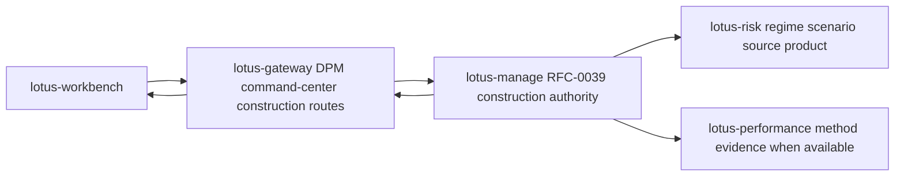
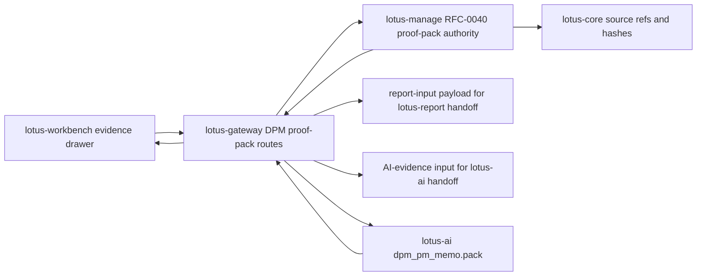
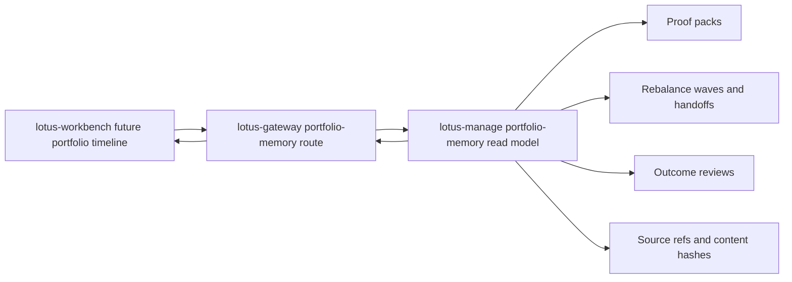
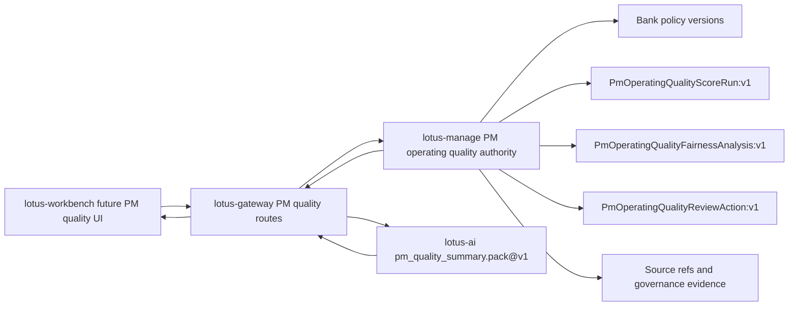
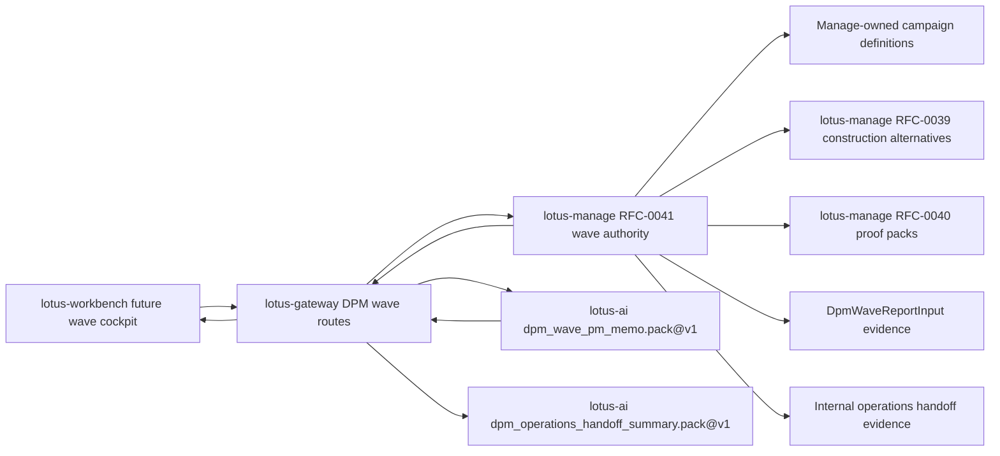
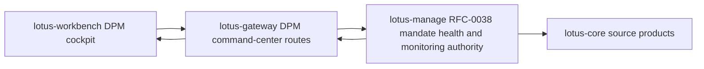
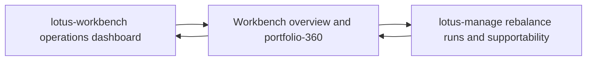
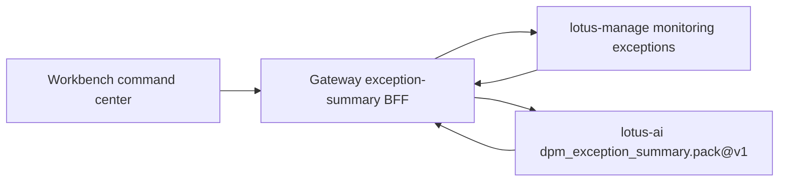

# Supported Features

This page lists implementation-backed `lotus-gateway` feature coverage. It is product material for
developers, business users, operations, sales/pre-sales, and client demos; it must not describe
future capability as supported until the owning service, Gateway contract, tests, and validation
evidence exist.

## DPM Command Center Construction Alternatives

Status: implementation-backed in Gateway for RFC39-WTBD-001.

Business outcome:

1. portfolio managers can request and compare disciplined rebalance construction alternatives,
2. CIO and investment-control users can inspect method status, diagnostics, supportability, and
   comparison evidence before approval,
3. Workbench can use Gateway as the product-facing contract instead of calling `lotus-manage`
   directly.

Supported routes:

1. `POST /api/v1/dpm/command-center/construction/alternative-sets/generate`
2. `GET /api/v1/dpm/command-center/construction/alternative-sets/{alternative_set_id}`
3. `POST /api/v1/dpm/command-center/construction/alternative-sets/{alternative_set_id}/selections`

Authority and integrations:

1. `lotus-manage` remains the RFC-0039 construction authority.
2. Gateway forwards request bodies, idempotency keys, and correlation context to manage.
3. Gateway preserves manage-owned alternative-set ids, method ids, method statuses, objective
   traces, constraint traces, comparison metrics, diagnostics, supportability, selected alternative
   state, and lineage.
4. Gateway does not optimize portfolios, recompute construction metrics, infer source readiness,
   select alternatives, execute orders, or fabricate degraded-source values.

Operational behavior:

1. degraded or rejected manage states are surfaced as product supportability, not hidden as generic
   success,
2. manage upstream errors are returned using product-safe Gateway error detail,
3. OpenAPI documents What/When/How guidance and request/response examples for each route.

## DPM Proof-Pack Evidence Composition

Status: implementation-backed in Gateway for RFC40-WTBD-001.

Business outcome:

1. portfolio managers can generate and inspect a source-backed pre-trade proof pack from the DPM
   command-center workflow,
2. compliance, audit, and operations users can inspect proof-pack identity, section posture,
   reason codes, content hashes, source hashes, Markdown, report-input evidence, and AI-evidence
   input through one Workbench-facing Gateway contract,
3. sales/pre-sales and client-demo teams can demonstrate proof-backed discretionary management
   governance without implying Gateway or Workbench computes proof-pack evidence.

Supported routes:

1. `POST /api/v1/dpm/command-center/proof-packs`
2. `GET /api/v1/dpm/command-center/proof-packs/{proof_pack_id}`
3. `GET /api/v1/dpm/command-center/proof-packs/{proof_pack_id}/summary.md`
4. `GET /api/v1/dpm/command-center/proof-packs/{proof_pack_id}/report-input`
5. `GET /api/v1/dpm/command-center/proof-packs/{proof_pack_id}/ai-evidence-input`
6. `POST /api/v1/dpm/command-center/proof-packs/{proof_pack_id}/ai-pm-memo`

Authority and integrations:

1. `lotus-manage` remains the RFC-0040 proof-pack authority.
2. Gateway forwards generation payloads, idempotency keys, proof-pack ids, and correlation context
   to manage.
3. Gateway preserves manage-owned `proof_pack_id`, section states, reason codes, `content_hash`,
   `source_hashes`, source refs, report refs, AI refs, deterministic Markdown, report-input
   payloads, and AI-evidence payloads.
4. Gateway reads manage-owned `DpmProofPackAiEvidenceInput` before requesting `lotus-ai`
   `dpm_pm_memo.pack@v1`, and preserves the resulting workflow-pack run posture for Workbench.
5. Gateway does not generate proof-pack sections, recalculate hashes, infer source readiness,
   render reports, archive documents, generate AI narrative or PM memos locally, score PMs,
   approve trades, contact clients, place orders, or treat `lotus-report` as proof-pack authority.

Operational behavior:

1. Gateway returns a product envelope for JSON, report-input, and AI-evidence-input payloads while
   preserving the authoritative manage payload under `data`,
2. deterministic Markdown is preserved as manage-rendered text in a Gateway envelope so Workbench
   can render it without owning proof-pack generation,
3. degraded or unavailable manage states are surfaced using product-safe Gateway error detail and
   must remain visible to Workbench supportability UI.
4. lotus-ai guardrail rejections are preserved as product-safe Gateway error detail with
   `AI_PROOF_PACK_PM_MEMO_UPSTREAM_ERROR`, so Workbench can show review/supportability posture
   without falling back to browser prompt construction.

## DPM Portfolio-Memory Composition

Status: implementation-backed in Gateway for the Gateway portion of RFC40-WTBD-010.

Business outcome:

1. portfolio managers can review a single portfolio timeline that links proof-pack, rebalance-wave,
   internal handoff, and outcome-review evidence without reconstructing source truth,
2. operations, compliance, and audit users can inspect source systems, source refs, artifact refs,
   event states, reason codes, and content hashes through one Workbench-facing Gateway contract,
3. sales/pre-sales and client-demo teams can describe portfolio memory as source-backed and
   implementation-backed at the Gateway/API layer while keeping Workbench UI and browser proof as
   the next owning-repository slice.

Supported route:

1. `GET /api/v1/dpm/command-center/portfolios/{portfolio_id}/memory`

Authority and integrations:

1. `lotus-manage` remains the RFC-0040/RFC-0041/RFC-0042 portfolio-memory authority.
2. Gateway forwards portfolio id, limit, and correlation context to
   `lotus-manage` `/api/v1/rebalance/portfolio-memory/{portfolio_id}`.
3. Gateway preserves manage-owned event order, event types, event counts, source systems, source
   refs, artifact refs, reason codes, supportability state, bounded metadata, and content hash.
4. Gateway does not reconstruct timeline nodes, infer mandate exceptions, calculate risk,
   performance, tax, cash, FX, execution, liquidity, transaction-cost, or source-owner
   methodology, or let Workbench call `lotus-manage` directly.

Operational behavior:

1. Gateway returns manage payloads under `data` and adds a supportability summary with state,
   event count, event-type counts, source systems, reason codes, and content hash,
2. upstream manage errors are surfaced as product-safe Gateway errors with
   `MANAGE_PORTFOLIO_MEMORY_UPSTREAM_ERROR`,
3. Workbench timeline rendering, canonical browser screenshots, mandate-monitoring exception
   timeline nodes, and cross-app retention/audit policy remain open RFC40-WTBD-010 follow-up
   slices before full product support is claimed.

## DPM PM Operating Quality Composition

Status: implementation-backed in Gateway for the Gateway portion of the PM operating quality
product path.

Business outcome:

1. portfolio managers, supervisors, and operations users can access PM operating quality policy,
   score-run lifecycle, fairness-analysis preview/create/list/get evidence, immutable
   review-action preview/create/list/get evidence, and review-gated support-only PM quality
   summaries through the Gateway command-center boundary,
2. Workbench can prepare PM quality product surfaces without calling `lotus-manage` directly,
3. sales/pre-sales and control users can describe the API layer as implementation-backed while
   preserving explicit non-claims around PM ranking, HR, compensation, conduct enforcement,
   autonomous decisions, client contact, and execution.

Supported routes:

1. `PUT /api/v1/dpm/command-center/pm-operating-quality/policies/{policy_id}/versions/{policy_version}`
2. `GET /api/v1/dpm/command-center/pm-operating-quality/policies`
3. `GET /api/v1/dpm/command-center/pm-operating-quality/policies/{policy_id}/versions/{policy_version}`
4. `POST /api/v1/dpm/command-center/pm-operating-quality/score-runs/preview`
5. `POST /api/v1/dpm/command-center/pm-operating-quality/score-runs`
6. `GET /api/v1/dpm/command-center/pm-operating-quality/score-runs`
7. `GET /api/v1/dpm/command-center/pm-operating-quality/score-runs/{score_run_id}`
8. `POST /api/v1/dpm/command-center/pm-operating-quality/fairness-analyses/preview`
9. `POST /api/v1/dpm/command-center/pm-operating-quality/fairness-analyses`
10. `GET /api/v1/dpm/command-center/pm-operating-quality/fairness-analyses`
11. `GET /api/v1/dpm/command-center/pm-operating-quality/fairness-analyses/{fairness_analysis_id}`
12. `POST /api/v1/dpm/command-center/pm-operating-quality/review-actions/preview`
13. `POST /api/v1/dpm/command-center/pm-operating-quality/review-actions`
14. `GET /api/v1/dpm/command-center/pm-operating-quality/review-actions`
15. `GET /api/v1/dpm/command-center/pm-operating-quality/review-actions/{review_action_id}`
16. `POST /api/v1/dpm/command-center/pm-operating-quality/score-runs/{score_run_id}/ai-summary`

Authority and integrations:

1. `lotus-manage` remains the PM operating quality policy, score-run, fairness-analysis, and
   review-action authority.
2. Gateway forwards policy list/get/upsert, score-run preview/create/list/get, and
   fairness-analysis preview/create/list/get, and review-action preview/create/list/get requests to
   `lotus-manage`.
3. Gateway executes `lotus-ai` `pm_quality_summary.pack@v1` only after reading Manage-owned
   `PmOperatingQualityScoreRun` evidence for the requested score-run id.
4. Gateway preserves manage-owned policy configuration, score-run state, fairness-analysis state,
   review-action state, bounded rationale, target content hashes, segment posture, governance
   evidence, source refs, reason codes, content hashes, and forbidden-use posture.
5. Gateway does not calculate scores, discover segments, calculate segment averages or fairness
   spread, infer protected classes, rank PMs, administer bank policy locally, create HR or
   compensation decisions, perform conduct enforcement, reinterpret review rationale, approve
   trades, contact clients, route orders, claim OMS/execution, or invent missing evidence.

Operational behavior:

1. Gateway returns manage payloads under `data` and adds a supportability summary with state,
   policy id/version, score-run id, fairness-analysis id, review-action id, reason codes, blocked
   actions, and list counts when available,
2. upstream manage errors are surfaced as product-safe Gateway errors with
   `MANAGE_PM_OPERATING_QUALITY_UPSTREAM_ERROR`,
3. upstream lotus-ai summary errors are surfaced as product-safe Gateway errors with
   `AI_PM_OPERATING_QUALITY_SUMMARY_UPSTREAM_ERROR`,
4. Workbench PM quality UI is a Gateway-backed owning-repository slice in `lotus-workbench`;
   end-to-end product support still depends on the corresponding Manage endpoint being available
   on its owning branch/main and validated through the governed Workbench/Gateway runtime path.

## DPM Rebalance-Wave Composition

Status: implementation-backed in Gateway for RFC41-WTBD-005.

Business outcome:

1. portfolio managers and CIO-office users can operate explicit portfolio-list rebalance waves
   through a stable Gateway contract instead of calling `lotus-manage` directly,
2. operations users can inspect item-level source readiness, simulation, selection, proof-pack,
   approval, staging, internal handoff, cancellation, report-input, AI memo support, and
   supportability posture from one product route family,
3. portfolio managers can discover and upsert manage-owned campaign definitions for tactical
   house-view, risk-event, and bulk-review waves without Gateway recomputing source-owned cohort
   facts,
4. sales/pre-sales and client-demo teams can describe wave orchestration as implementation-backed
   backend composition while keeping Workbench wave cockpit UI as the next owning-repository slice.

Supported routes:

1. `POST /api/v1/dpm/command-center/waves/preview`
2. `POST /api/v1/dpm/command-center/waves`
3. `GET /api/v1/dpm/command-center/waves`
4. `GET /api/v1/dpm/command-center/waves/campaign-definitions`
5. `GET /api/v1/dpm/command-center/waves/campaign-definitions/{campaign_id}/versions/{campaign_version}`
6. `GET /api/v1/dpm/command-center/waves/campaign-definitions/{campaign_id}/versions/{campaign_version}/lifecycle-events`
7. `GET /api/v1/dpm/command-center/waves/campaign-definitions/{campaign_id}/versions/{campaign_version}/preview-readiness`
8. `GET /api/v1/dpm/command-center/waves/campaign-definitions/{campaign_id}/versions/{campaign_version}/launch-history`
9. `GET /api/v1/dpm/command-center/waves/campaign-definitions/{campaign_id}/versions/{campaign_version}/launch-package`
10. `POST /api/v1/dpm/command-center/waves/campaign-definitions/{campaign_id}/versions/{campaign_version}/launch`
11. `GET /api/v1/dpm/command-center/waves/campaign-discovery`
12. `PUT /api/v1/dpm/command-center/waves/campaign-definitions/{campaign_id}/versions/{campaign_version}`
13. `GET /api/v1/dpm/command-center/waves/{wave_id}`
14. `GET /api/v1/dpm/command-center/waves/{wave_id}/items`
15. `POST /api/v1/dpm/command-center/waves/{wave_id}/source-check`
16. `POST /api/v1/dpm/command-center/waves/{wave_id}/simulate`
17. `POST /api/v1/dpm/command-center/waves/{wave_id}/items/{wave_item_id}/select`
18. `POST /api/v1/dpm/command-center/waves/{wave_id}/approve`
19. `POST /api/v1/dpm/command-center/waves/{wave_id}/stage`
20. `POST /api/v1/dpm/command-center/waves/{wave_id}/handoff`
21. `POST /api/v1/dpm/command-center/waves/{wave_id}/cancel`
22. `GET /api/v1/dpm/command-center/waves/{wave_id}/proof-pack`
23. `GET /api/v1/dpm/command-center/waves/{wave_id}/supportability`
24. `GET /api/v1/dpm/command-center/waves/{wave_id}/report-input`
25. `POST /api/v1/dpm/command-center/waves/{wave_id}/ai-pm-memo`
26. `POST /api/v1/dpm/command-center/waves/{wave_id}/operations-handoff-summary`

Authority and integrations:

1. `lotus-manage` remains the RFC-0041 rebalance-wave authority.
2. Gateway forwards preview, create, campaign-definition list/get/lifecycle-events/preview-readiness/
   paged launch-history/launch-package/launch/upsert, bounded campaign-discovery, source-check, simulate,
   select, approve, stage, handoff, cancel, proof-pack posture, supportability, and report-input
   requests to manage.
3. Gateway preserves `BulkReviewCampaignDefinitionPreviewReadiness:v1` supportability state,
   reason codes, blocked actions, source refs, requested as-of date, actor id, and operating
   boundaries exactly without inferring campaign membership, readiness, actor entitlement,
   maker-checker, trade approval, order generation, routing, fills, settlement, or OMS execution.
4. Gateway preserves `BulkReviewCampaignDefinitionLaunchHistory:v1` campaign id/version, launch
   records, count, total count, limit, offset, and `operating_boundaries` exactly without inferring
   maker-checker, trade approval, order generation, routing, fills, settlement, or OMS execution.
5. Gateway preserves manage-owned `wave_id`, lifecycle state, item states, reason codes,
   aggregate metrics, selected alternative refs, proof-pack refs, handoff refs, supportability
   issues, report-input evidence, remediation routes, and `external_execution_claimed=false`.
6. Gateway reads manage-owned wave report input before calling `lotus-ai`
   `dpm_wave_pm_memo.pack@v1` for review-required PM/control support text.
7. Gateway reads manage-owned wave report input with internal handoff refs before calling
   `lotus-ai` `dpm_operations_handoff_summary.pack@v1`.
8. Gateway does not calculate affected portfolios, classify source readiness, discover cohorts,
   recompute campaign membership, generate alternatives, select alternatives, approve items, stage
   items, create handoff evidence, rebuild proof packs, generate report evidence, generate AI
   narrative locally, score PMs, approve trades, contact clients, place orders, invent missing
   evidence, cancel external orders, or claim external execution.

Operational behavior:

1. Gateway wraps every manage response in a product envelope with manage-derived supportability,
2. unsupported transitions and missing waves return product-safe manage error details,
3. lotus-ai failures on the wave PM memo route return product-safe `lotus-ai` error details while
   preserving manage evidence boundaries,
4. lotus-ai failures on the operations-handoff summary route return product-safe `lotus-ai` error
   details while preserving manage evidence boundaries,
5. Gateway never turns generated operations handoff support text into order routing, external
   execution, trade approval, client contact, or PM scoring,
6. Workbench wave command-center UI, browser proof, and demo screenshots remain RFC41-WTBD-006 and
   are not claimed by this Gateway slice.

## DPM Mandate Command Center

Status: implementation-backed in Gateway for RFC38-WTBD-001.

Business outcome:

1. portfolio managers, supervision users, and operations teams can query mandate health,
   monitoring-run, active-exception, and mandate drill-down posture through Gateway,
2. Workbench can build the command-center cockpit without calling `lotus-manage` directly,
3. Gateway preserves manage source readiness, supportability, reason codes, recommended actions,
   and mandate lineage without becoming the mandate-health authority.

Supported routes:

1. `GET /api/v1/dpm/command-center`
2. `POST /api/v1/dpm/command-center/monitoring/run-once`
3. `GET /api/v1/dpm/command-center/monitoring/runs`
4. `GET /api/v1/dpm/command-center/monitoring/runs/{monitoring_run_id}`
5. `GET /api/v1/dpm/command-center/exceptions`
6. `POST /api/v1/dpm/command-center/exceptions/{exception_id}/resolve`
7. `GET /api/v1/dpm/command-center/mandates/by-portfolio/{portfolio_id}`
8. `GET /api/v1/dpm/command-center/mandates/{mandate_id}`
9. `GET /api/v1/dpm/command-center/mandates/{mandate_id}/health`
10. `GET /api/v1/dpm/command-center/mandates/{mandate_id}/diff`

Authority and integrations:

1. `lotus-manage` remains the RFC-0038 mandate digital twin, health, monitoring, exception, and
   command-center authority.
2. Gateway forwards filters, monitoring requests, and exception-resolution reasons to manage.
3. Gateway preserves health distribution, health dimensions, monitoring-run state, active
   exceptions, reason codes, recommended actions, source lineage, version diffs, and
   supportability.
4. Gateway does not discover PM-book membership, calculate health scores, reconstruct health
   dimensions, infer source readiness, merge exceptions across monitoring runs, or resolve
   exceptions locally.

Operational behavior:

1. empty and partial command-center states remain valid product states,
2. manage upstream errors are returned using product-safe Gateway error detail,
3. Workbench cockpit implementation and canonical UI proof remain separate owning-repository
   work under RFC38-WTBD-002.

## Portfolio-Level DPM Operations Posture

Status: implementation-backed in Gateway for RFC36-WTBD-003.

Business outcome:

1. portfolio managers and operations users can see recent stateful DPM execution posture from the
   Workbench overview without direct `lotus-manage` access,
2. Workbench can render supportability, last-run identity, recent run status, workflow posture, and
   bounded run issue codes from a governed Gateway envelope,
3. missing supportability or absent recent runs stay explicit instead of becoming fabricated zero
   activity.

Supported routes:

1. `GET /api/v1/workbench/{portfolio_id}/overview`
2. `GET /api/v1/workbench/{portfolio_id}/portfolio-360`

Authority and integrations:

1. `lotus-manage` remains the rebalance run and action-register supportability authority.
2. Gateway reads manage `/api/v1/rebalance/runs` for bounded recent run posture and
   `/api/v1/rebalance/supportability/summary` for manage-owned action-register supportability.
3. Gateway exposes up to five bounded recent run summaries with run id, status, timestamp,
   workflow posture, and error code.
4. Gateway does not compute supportability, workflow status, source readiness, execution outcomes,
   or error semantics locally.

Operational behavior:

1. Gateway returns partial failures and warnings if manage is unavailable,
2. recent run detail is bounded to keep the Workbench contract product-safe,
3. Workbench remains Gateway-first and must not call `lotus-manage` directly.

## DPM Command Center Outcome Reviews

Status: implementation-backed in Gateway for RFC42-WTBD-001 and RFC42-WTBD-005.

Gateway exposes outcome-review preview/create/search/detail/source-refresh/supportability,
report-input, AI-evidence, run lookup, wave lookup, and governed AI narrative handoff routes under
`/api/v1/dpm/command-center/outcome-reviews*`. The supportability, report-input, and AI-evidence
payloads preserve Manage-owned `client_communication_boundary` posture when Manage publishes it,
including fail-closed no-client-communication and no-client-approval projection flags.
`lotus-manage` remains outcome-review authority and `lotus-ai` remains AI workflow execution
authority; Gateway does not synthesize client communication truth.

## DPM Command Center Exception Summary

Status: implementation-backed in Gateway for RFC38/RFC43 exception-summary handoff.

Gateway exposes
`POST /api/v1/dpm/command-center/exceptions/{exception_id}/ai-summary` for internal PM,
investment-control, and operations triage. The route reads manage-owned monitoring-exception
evidence from the command-center exception queue, supports optional portfolio, mandate, and state
filters, builds a bounded no-raw-payload exception-summary input, and executes `lotus-ai`
`dpm_exception_summary.pack@v1` as `lotus-gateway`.

Operational boundaries:

1. `lotus-manage` remains exception evidence authority.
2. `lotus-ai` remains workflow-pack execution authority.
3. Gateway preserves source refs, content hashes, supportability, and product-safe upstream errors.
4. Gateway does not generate summaries locally, score PMs, approve trades, contact clients, route
   orders, or invent evidence.
