# Supported Features

This page lists implementation-backed `lotus-gateway` feature coverage. It is product material for
developers, business users, operations, sales/pre-sales, and client demos; it must not describe
future capability as supported until the owning service, Gateway contract, tests, and validation
evidence exist.

## Reader Map

| Reader | Start with | Current evidence boundary |
| --- | --- | --- |
| Business, demo, and support | The feature sections below | Claims are implementation-backed only; degraded and unavailable source posture stays visible. |
| Engineering and integration | The linked route, contract, and upstream authority notes | Gateway composes the client contract and does not replace domain calculation authority. |

## Workbench Snapshot Date Semantics

Status: implementation-backed for the Workbench overview and portfolio-360 routes.

Both routes accept an optional requested `as_of_date`. Gateway preserves that request separately
from the effective snapshot date and publishes `as_of_state`. When no date is requested, Core's
`/support/portfolios/{portfolio_id}/overview` `business_date` discovers the latest default-calendar
candidate. Gateway uses that date only for Core's required snapshot query; Core's top-level
`freshness_status=CURRENT` and matching top-level `as_of_date` remain the confirmation authority.
`source_evidence_current=false` cannot confirm the date. Nested `freshness.snapshot_timestamp`
and `snapshot_epoch` are snapshot lineage only and are never converted into a business date.
Legacy Core payloads with only the request-bound or discovered date remain `accepted_unverified`;
missing, invalid, conflicting, or non-current evidence yields `unavailable`. The legacy top-level
`as_of_date` is the effective date or `null`, never an invented host-today value. When Core
cannot return a latest resolvable business date, Gateway reports `unavailable` and withholds
date-dependent embedded enrichment. Mandate
identity and display-name enrichment remain tracked by #591, performance date semantics remain
tracked by #572, and Workbench rendering of the typed unavailable state remains downstream work
tracked by `lotus-workbench#814`. Composed performance workspace consumers fail closed with typed
`WORKBENCH_AS_OF_DATE_UNAVAILABLE` when neither an explicit report end nor a usable Workbench date
is available.

## Performance Summary Completion

Status: implementation-backed for deterministic cold and warm workspace-summary orchestration.

Business outcome:

1. an advisor receives the same caller-visible completion posture for the same portfolio review
   request regardless of whether the analytics result was already warm,
2. Gateway waits within a governed 30-second business-response budget and follows the source-owned
   minimum polling cadence before the first and subsequent result reads,
3. if the source calculation is still pending at the deadline, the screen receives explicit
   deadline-exhausted partial-readiness warnings before its connection closes rather than depending
   on a blind retry, and Gateway does not add execution or lineage evidence reads after expiry,
4. the complete submission and result-read awaits stay inside the elapsed budget even when a
   connection uses multiple transport phases or returns a slow trickle of response bytes; bounded
   transient transport failures can be retried by the polling loop without hiding source HTTP
   failures.

Authority and boundary:

1. `lotus-performance` owns the calculation, result, lineage, cache, and 30-second production
   completion objective,
2. Gateway preserves one calculation identity and the original caller correlation, trace,
   authorization, tenant, and portfolio scope through polling; it does not submit a replacement
   calculation after an identity conflict,
3. Gateway owns the elapsed deadline, remaining-budget request timeouts, caller-visible
   deadline-specific partial-readiness mapping, typed transport outcome handling, complete-await
   cancellation, and bounded reason-coded telemetry,
4. deadline exhaustion does not prove a calculation failure, permit duplicate financial work, or
   make a later warm response valid readiness evidence on its own; if the source has not published
   acceptance, Gateway omits calculation identity and result location instead of inventing them.

## Performance Attribution Aggregate Authority

Status: implementation-backed for preserving source-owned attribution level totals.

Gateway publishes `total_effect_pct` from `lotus-performance` without reconstructing the level
aggregate from its rows. Explicit numeric zero, positive, and negative totals are preserved;
missing or null source totals are returned as `null` so Workbench can distinguish unavailable
evidence from a legitimate zero. The attribution-trend cumulative total also remains `null` once
a contributing period total is unavailable. Attribution methodology and calculation authority
remain in `lotus-performance`.

## Performance Summary Review Controls

Status: implementation-backed for the Workbench performance summary, details, attribution-trend,
and advisor-brief routes.

`GET /api/v1/workbench/{portfolio_id}/performance/summary` accepts optional `as_of_date` and
`reporting_currency` query parameters. Gateway forwards the requested reporting currency to
`lotus-performance`, anchors the summary window to the requested as-of date when no explicit
`report_end_date` is supplied, and publishes the requested/effective date and currency values plus
`reporting_currency_state`. The top-level `as_of_date` is always the effective report-window date;
`requested_as_of_date` preserves a distinct caller request when supplied. A successful summary is
`accepted_unverified` until source-owned
applied-currency evidence exists; typed currency validation is `rejected`; other missing or failed
summary outcomes are `unavailable`. Non-success states use the portfolio base currency in the
existing effective field rather than echoing the requested currency, and rejection classification
uses typed validation locations rather than error text. An explicit report window remains
authoritative when both controls are supplied. The details route accepts the same controls and
publishes the same requested/effective date and currency context. Its outcome is classified from
the single parsed summary result, so empty or malformed requested-period summaries are
`unavailable` and use the portfolio base currency. The attribution-trend route accepts the same
controls, gives an explicit `report_end_date` precedence over `as_of_date`, forwards a requested
currency to each bounded period request, and publishes the same requested/effective context. It
reports `accepted_unverified` when at least one period has a usable source row, `rejected` for
typed currency validation failure, and `unavailable` when no usable period is returned; partial
period failures remain visible. These routes do not claim source-applied currency evidence. The
advisor-brief read and review-action routes accept the same controls, forward them to the shared
performance workspace, and publish requested/effective date and currency context plus
`reporting_currency_state`; source links retain the selected controls when supplied. Advisor brief
does not claim source-applied currency evidence or promote workspace capabilities. Currency-catalog
validation and as-of-after-last-observation mapping remain intentionally deferred under GitHub
issue #572; the broader workspace must not claim those controls as supported until their owning
routes and live evidence are complete.

## Performance Horizon Window Policy

Status: implementation-backed for Gateway performance workspace composition.

The summary, details, attribution-trend, advisor-brief, and portfolio performance-snapshot route
families accept `MTD`, `QTD`, `YTD`, `1Y`, `2Y`, `3Y`, `5Y`, `10Y`, `SI`, and `EXPLICIT`. `2Y` and
`10Y` use inclusive trailing boundaries. `SI` is resolved only from Core's source-owned
`PortfolioAnalyticsReference.portfolio_open_date`; Gateway never invents an inception date.
Missing, invalid, or future inception evidence fails closed with a typed `422`, and `EXPLICIT`
requires `report_start_date`. Unknown periods and malformed dates do not silently become YTD.

The compact horizon-comparison module intentionally supports only `MTD`, `QTD`, `YTD`, and
`EXPLICIT`, because it composes those three standard rows. Longer horizons belong to the summary
and details workspace family. Gateway reuses the resolved inclusive start and end for source
requests, the top-level response, and evidence; it does not own performance calculations or
portfolio source truth.

## Authenticated Advisor Book

Status: implementation-backed in Gateway for an authenticated advisor's own source-backed
portfolio book. Workbench portfolio-switcher completion and production principal resolution remain
separate owning slices.

Business outcome:

1. an advisor can retrieve, search, sort, and page the portfolios in their own supported book for
   an explicit business date,
2. portfolio membership comes from Core rather than browser filtering of the global portfolio
   catalogue,
3. the response distinguishes governed portfolio-role assignments from the bounded legacy advisor
   projection and makes missing tenant confirmation visible as degraded.

Supported route:

1. `GET /api/v1/advisor-book/portfolios`

Authority and boundary:

1. `lotus-core` owns `PortfolioManagerBookMembership:v1`, effective portfolio membership, source
   evidence, freshness, and lineage,
2. Gateway derives the portfolio manager only from trusted `X-Actor-Id`, requires an entitled
   advisor role and `advisor.book.read`, constrains the Core request to the trusted booking centre,
   and exposes no advisor-id override,
3. a non-null conflicting source tenant, booking centre, manager, business date, duplicate
   portfolio, or malformed contract fails closed,
4. null Core tenant scope is explicit degraded posture and is not tenant-isolation certification,
5. team, delegate, supervisor, household, assets-under-management, attention, suitability,
   recommendation, client communication, order, and execution coverage are not claimed.

## Proposal Risk And Impact Evidence

Status: implementation-backed in Gateway for one selected proposal. The Workbench decision
workspace and canonical browser proof remain owned by `lotus-workbench#748`.

Business outcome:

1. an advisor can inspect source-owned current and proposed allocation snapshots, risk posture,
   decision requirements, workflow gate, and immutable version lineage through one typed Gateway
   contract,
2. evidence absence and source-copy mismatches remain visible instead of being converted into a
   reassuring UI success state,
3. Workbench does not need to parse the general proposal-detail route's opaque artifact,
   simulation, or evidence dictionaries.

Supported route:

1. `GET /api/v1/proposals/{proposal_id}/risk-impact`

Authority and boundary:

1. `lotus-advise` owns proposal, version, decision, workflow-gate, and lineage truth,
2. the allocation calculator named by Advise owns before/proposed allocation values; the proposal
   risk-lens source, normally `lotus-risk`, owns risk meaning,
3. Gateway performs one selected-record Advise read, validates identity and typed values, preserves
   exact decimal strings, and reports ready, partial, unavailable, or not-supported evidence,
4. Gateway does not call Core/Risk directly, calculate allocation deltas or risk, infer approval,
   or treat lifecycle state as a recorded maker-checker decision. It validates decision-status,
   top-level-status, recommended-action, workflow-gate, and blocking-evidence relationships;
   contradictions fail closed and degraded decision evidence cannot publish executable-ready gate
   posture. Blocking gate evidence without source reasons remains explicit partial; Gateway does not
   invent a reason to promote it to ready,
5. benchmark/limit, scenario, and valuation effective-date evidence remain explicitly not
   supported in v1 because the current producer contract does not publish them.

Detailed source authority and failure behavior are documented in the
[repo contract](https://github.com/sgajbi/lotus-gateway/blob/main/docs/contracts/proposal-risk-impact-v1.md).

## Proposal Implementation Status Evidence

Status: implementation-backed in Gateway for one selected proposal. The Workbench implementation
workspace and canonical browser proof remain owned by `lotus-workbench#750`.
The response discriminator is `proposal-implementation-status.v1`.

Business outcome:

1. an advisor or operations user can distinguish not requested, pending, accepted, partially
   executed, executed, rejected, cancelled, and expired handoff states without lifecycle inference,
2. exception and partial-evidence posture remain explicit, with exact source observation time,
   immutable-version posture, provider/request references, and latest event lineage,
3. ownership remains truthful: Advise owns handoff/reconciliation posture and the downstream
   provider owns execution truth.

Supported route:

1. `GET /api/v1/proposals/{proposal_id}/execution-status`

Gateway does not expose or invent current owner, SLA, priority, order, quantity, fill, settlement,
or a universal execute action. Missing optional evidence is `partial`; malformed identity,
vocabulary, chronology, event correlation, or ownership fails closed. Detailed behavior is in the
[repo contract](https://github.com/sgajbi/lotus-gateway/blob/main/docs/contracts/proposal-implementation-status-v1.md).

## Proposal Discussion Pack Review Evidence

Status: implementation-backed in Gateway for one selected proposal and immutable version. The
Workbench client-conversation workspace and canonical browser proof remain owned by
`lotus-workbench#749`. The response discriminator is `proposal-discussion-pack-review.v1`.

Business outcome:

1. an advisor can review the source narrative, memo, disclosures, report-package posture, and
   current-version consent evidence in one request-bound view,
2. internal advisor-use review is visibly separate from client release, publication, communication,
   delivery, and consent,
3. restricted, unavailable, absent, historical-version, and malformed source evidence cannot be
   converted into a reassuring readiness state.

Supported route:

1. `GET /api/v1/proposals/{proposal_id}/discussion-pack-review?portfolio_id={portfolio_id}&version_no={version_no}`

Gateway performs five bounded concurrent reads for the selected record only. It does not fan out
across the worklist, generate narrative or memo content, infer suitability or discussion readiness,
publish or archive a document, contact a client, or treat a report artifact as client delivery.
Client-ready publication remains blocked and client-delivery capability remains not supported in
v1. Detailed authority and failure behavior are documented in the
[repo contract](https://github.com/sgajbi/lotus-gateway/blob/main/docs/contracts/proposal-discussion-pack-review-v1.md).

## Report Ordering Options

Status: implementation-backed in Gateway for source-backed configuration discovery and
selected-scope eligibility. Workbench UI completion, whole-book portfolio expansion, client
distribution, and canonical runtime proof remain separate owning slices.

Business outcome:

1. a client advisor or portfolio manager can discover the report families, sections, business
   configuration, and output formats currently available before starting an order,
2. the response distinguishes source catalogue availability from caller and selected-scope
   eligibility, so a temporarily unavailable PDF does not hide a ready structured-data option,
3. only implemented Gateway submission paths are returned, preventing the UI from presenting
   schedule or source-workflow actions that it cannot execute.

Supported route:

1. `GET /api/v1/report-ordering/options`

Authority and boundary:

1. `lotus-report` owns `report-ordering-catalogue.v1`, report family definitions, configuration,
   sections, output-format availability, and report lifecycle truth,
2. Gateway validates and projects that strict source contract, filters internal report families by
   trusted caller role, and applies explicit portfolio, client, or advisor-book scope eligibility,
3. client and advisor-book selections do not expand portfolio membership; explicit batch ordering
   remains partial until authoritative portfolio identifiers are supplied,
4. ordering eligibility does not authorize client distribution, prove render completion, prove
   archive completion, or make a report client-ready,
5. known Report ordering-validation codes remain actionable `422` responses; unknown upstream
   details fail closed behind a product-safe Gateway error.

## Idea Opportunity BFF

Status: implementation-backed in Gateway for bounded `lotus-idea` reads and candidate action
recording. This is not a Workbench UI completion claim or a supported-feature promotion from
`lotus-idea`.

What is supported:

1. advisors can read the Idea review queue through Gateway,
2. advisors and operators can read source-safe candidate detail through Gateway,
3. authorized callers can record a source-owned candidate review action, feedback event, or
   conversion intent through Gateway,
4. Gateway preserves `lotus-idea` ranking, source signal identifiers, redacted source references,
   durable-storage posture, accepted/replayed mutation posture, and `supportedFeaturePromoted=false`,
5. review, feedback, and conversion-intent requests expose one closed Lotus Idea reason vocabulary;
   unknown values fail with `422` at Gateway before source fan-out,
6. Gateway maps unsafe upstream failures to product-safe error detail.

Supported routes:

1. `GET /api/v1/ideas/review-queues/advisor`
2. `GET /api/v1/ideas/candidates/{candidate_id}`
3. `POST /api/v1/ideas/candidates/{candidate_id}/review-actions`
4. `POST /api/v1/ideas/candidates/{candidate_id}/feedback`
5. `POST /api/v1/ideas/candidates/{candidate_id}/conversion-intents`

Boundary:

1. The reason vocabulary is reconciled through
   `contracts/upstream/lotus-idea-reason-codes.v1.json` and published as `IdeaReasonCode` in Gateway
   OpenAPI. Gateway owns validation and documentation at its consumer boundary; Lotus Idea remains
   the semantic authority for every reason.
2. Gateway forwards `X-Caller-Subject`, `X-Caller-Roles`, `X-Caller-Capabilities`,
   `X-Caller-Tenant-Ids`, `X-Caller-Book-Ids`, `X-Caller-Portfolio-Ids`,
   `X-Caller-Client-Ids`, optional `X-Lotus-Trusted-Caller-Context`, and correlation/trace context
   to `lotus-idea` for entitlement-scope enforcement. Mutation routes additionally require and
   forward `Idempotency-Key` and forward optional `X-Causation-Id`.
3. Gateway does not generate ideas, rank candidates, enrich evidence, certify data-product posture,
   grant downstream authority, or promote `supportedFeaturePromoted`; a conversion intent does not
   create a downstream proposal, action, report evidence pack, rebalance, execution, or client
   communication.
4. Workbench idea UI, canonical runtime proof, data-product certification, and full
   supported-feature promotion remain separate proof scopes.

## Advisory Proposal Narrative Posture

Status: implementation-backed in Gateway for the RFC-0023 advisory narrative posture path.

Business outcome:

1. advisors, compliance reviewers, and investment-control users can record and inspect
   advisor-use narrative review posture without leaving the governed Gateway boundary,
2. Workbench can request report materialization with an approved, source-backed advisory narrative
   package without calling `lotus-advise` directly,
3. operations and audit users can inspect proposal delivery posture, report-request state, source
   hashes, and append-only delivery events through one product-facing API surface.

Supported routes:

1. `POST /api/v1/proposals/{proposal_id}/versions/{version_no}/narrative/review`
2. `POST /api/v1/proposals/{proposal_id}/report-requests`
3. `GET /api/v1/proposals/{proposal_id}/delivery-summary`
4. `GET /api/v1/proposals/{proposal_id}/delivery-events`

Authority and integrations:

1. `lotus-advise` remains the proposal workflow, narrative review, report-request, and delivery
   posture authority.
2. Gateway forwards proposal ids, version numbers, request bodies, correlation context, and
   optional narrative-review idempotency keys to `lotus-advise`.
3. Gateway preserves Advise-owned review state, policy version, guardrail/disclosure posture,
   `source_narrative_hash`, report narrative-package posture, source refs, and delivery events.
4. Gateway does not generate or edit narrative, infer client-ready publication, render reports,
   archive documents, contact clients, create orders, or recompute advisory delivery truth.

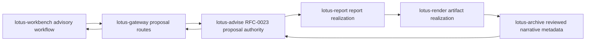

Operational behavior:

1. Gateway returns source payloads under `data` and keeps correlation ids visible for support,
2. unsupported review/report posture is blocked by `lotus-advise` and surfaced as product-safe
   Gateway error detail,
3. client-ready publication remains explicitly out of Gateway scope until the owning RFC slice
   proves the end-to-end release control path.

## Advisory Suitability And Best-Interest Policy Posture

Status: implementation-backed in Gateway for the RFC-0025 policy-pack and policy-evaluation BFF
surface. Workbench product realization and live browser proof remain separate RFC-0025 Slice 12
work.

Business outcome:

1. advisors can request policy evaluation for a proposal version without bypassing Gateway,
2. compliance, investment desk, operations, and supervisory users can inspect review queues,
   workflow posture, sign-off packages, source lineage, replay evidence, and report-package
   posture through one product-facing API surface,
3. support teams can see degraded, blocked, and AI-evidence-unavailable posture exactly as
   `lotus-advise` returned it.

Supported routes:

1. `GET /api/v1/advisory-policy-packs`
2. `GET /api/v1/advisory-policy-packs/{policy_pack_id}/versions/{policy_version}`
3. `POST /api/v1/advisory-policy-packs/{policy_pack_id}/versions/{policy_version}/validate`
4. `POST /api/v1/advisory-policy-packs/{policy_pack_id}/versions/{policy_version}/activate`
5. `POST /api/v1/proposals/{proposal_id}/versions/{proposal_version_id}/policy-evaluations`
6. `GET /api/v1/advisory-policy-evaluations/review-queue`
7. `GET /api/v1/advisory-policy-evaluations/{evaluation_id}`
8. `POST /api/v1/advisory-policy-evaluations/{evaluation_id}/replay`
9. `POST /api/v1/advisory-policy-evaluations/{evaluation_id}/events`
10. `GET /api/v1/advisory-policy-evaluations/{evaluation_id}/lineage`
11. `GET /api/v1/advisory-policy-evaluations/{evaluation_id}/sign-off-package`
12. `GET /api/v1/advisory-policy-evaluations/{evaluation_id}/workflow`
13. `POST /api/v1/advisory-policy-evaluations/{evaluation_id}/sign-off-decisions`
14. `POST /api/v1/advisory-policy-evaluations/{evaluation_id}/report-packages`
15. `POST /api/v1/advisory-policy-evaluations/{evaluation_id}/ai-evidence`

Authority and integrations:

1. `lotus-advise` remains the policy-pack, policy-evaluation, workflow, sign-off, report-package,
   lineage, replay, event, and AI-evidence authority.
2. Gateway forwards policy ids, proposal ids, proposal-version ids, evaluation ids, request bodies,
   idempotency keys, and correlation context to `lotus-advise`.
3. Gateway preserves Advise-owned supportability, degraded posture, blocked posture,
   maker-checker state, client-ready blockers, source hashes, AI non-authoritative posture, and
   report-package state.
4. Gateway does not evaluate suitability or best-interest rules, administer policy locally,
   generate AI evidence, infer supportability, override sign-off, or release blocked/degraded
   evaluations to client output.

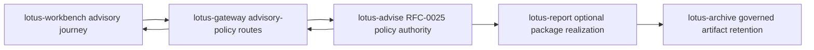

Operational behavior:

1. policy-pack validation, activation, and policy-evaluation creation require `Idempotency-Key`,
2. event, sign-off decision, report-package, and AI-evidence actions accept optional
   `Idempotency-Key`,
3. Gateway returns source payloads under `data`; clients must use Advise-owned posture fields
   rather than deriving readiness locally.

## Advisor Cockpit Operating Workflow

Status: implementation-backed in Gateway for the RFC-0026 API publication slice, with Workbench
canonical proof and Advise data-product promotion now recorded in the coordinated RFC-0026 program.
Full RFC-0028 demo readiness remains outside this Gateway capability claim.

Business outcome:

1. advisors and supervisory users can retrieve source-backed cockpit actions and operating
   snapshots through Gateway without calling `lotus-advise` directly,
2. operations and support teams can inspect supportability and unsupported-capability posture in
   one product-facing envelope,
3. advisors can retrieve Advise-owned meeting preparation packets with memo evidence, policy
   posture, follow-up posture, and lineage intact,
4. advisors can record replay-safe action acknowledgements while blocking policy, memo,
   supportability, owner-role, and client-ready posture remain Advise-owned. Client-ready
   publication remains blocked unless and until `lotus-advise` returns source-owned support for
   that posture.

Supported routes:

1. `GET /api/v1/advisor-cockpit/actions`
2. `GET /api/v1/advisor-cockpit/preparation-packets`
3. `GET /api/v1/advisor-cockpit/actions/{action_item_id}`
4. `GET /api/v1/advisor-cockpit/snapshot`
5. `GET /api/v1/advisor-cockpit/supportability`
6. `POST /api/v1/advisor-cockpit/actions/{action_item_id}/acknowledgements`
7. `POST /api/v1/advisor-cockpit/house-view-cohorts/evaluate`

Authority and integrations:

1. `lotus-advise` remains the advisor cockpit action, preparation-packet, tactical house-view
   cohort, snapshot, supportability, acknowledgement, evidence, and lineage authority.
2. Gateway derives advisor identity and role from trusted server-side caller context. It rejects
   public `advisor_id` and `role` authority parameters, authorizes an optional portfolio filter
   against `X-Authorized-Portfolio-Id`, binds the acknowledgement actor to `X-Actor-Id`, and
   forwards the exact principal contract required by `lotus-advise`.
3. Gateway preserves Advise-owned action status, priority, owner role, reason codes, SLA, source
   refs, evidence refs, lineage refs, unsupported capabilities, preparation-packet posture,
   tactical house-view cohort membership,
   supportability posture, and acknowledgement state.
4. Gateway does not reconstruct advisory policy results, proposal memo blockers, action
   prioritization, meeting preparation, SLA posture, supportability, client-ready publication,
   external client communication, OMS/order/fill/settlement posture, or demo-readiness claims.
5. The tactical house-view cohort command remains a separate Advise source-product route. Gateway
   does not manufacture a Cockpit house-view capability or apply Cockpit read authority to that
   command.

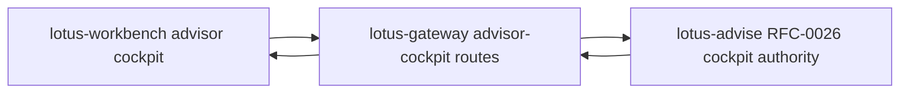

Operational behavior:

1. action and preparation-packet listing are paginated and bounded by Advise-owned cursor semantics,
2. acknowledgement writes require `Idempotency-Key`,
3. action lookup and acknowledgement require an explicitly entitled portfolio so object-level
   authorization does not depend on a prior list filter,
4. upstream validation, not-found, and idempotency-conflict outcomes are surfaced as product-safe
   Gateway errors without rewriting cockpit semantics.

## Advisory Copilot Evidence And Action Runs

Status: implementation-backed in Gateway for the canonical Workbench advisory-copilot proof path.
Gateway publishes the product-facing route family over Advise-owned copilot evidence packets,
action runs, review decisions, supportability, and proposal-version run lineage.

Business outcome:

1. Workbench can execute the advisory-copilot proof path through Gateway instead of calling
   `lotus-advise` directly,
2. advisors and support users can inspect Advise-owned evidence-packet identity, action-run
   posture, supportability, blocked capabilities, lineage, and review state in a stable
   product-facing envelope,
3. canonical front-office validation can prove the copilot surface without inventing
   browser-local recommendations or bypassing Gateway.

Supported routes:

1. `POST /api/v1/advisory-copilot/evidence-packets`
2. `POST /api/v1/advisory-copilot/evidence-packets/from-proposal-version`
3. `GET /api/v1/advisory-copilot/evidence-packets/{evidence_packet_id}`
4. `POST /api/v1/advisory-copilot/actions`
5. `GET /api/v1/advisory-copilot/actions/{run_id}`
6. `POST /api/v1/advisory-copilot/actions/{run_id}/reviews`
7. `GET /api/v1/advisory-copilot/supportability`
8. `GET /api/v1/advisory-copilot/proposals/{proposal_id}/versions/{version_id}/runs`

Authority and integrations:

1. `lotus-advise` remains the advisory-copilot evidence-packet, action-run, review, lineage, and
   supportability authority.
2. Gateway forwards request bodies, proposal/version identifiers, evidence packet identifiers,
   action run identifiers, review payloads, idempotency keys, and correlation context to
   `lotus-advise`.
3. Gateway preserves Advise-owned supportability, blocked capabilities, evidence refs, lineage
   refs, action-run state, and review state.
4. Gateway does not generate recommendations, score suitability, infer client-ready advice,
   approve reviews, expose prompts or model output, contact clients, create orders, or claim
   OMS/order/fill/settlement posture.

Operational behavior:

1. Workbench command envelopes are unwrapped before forwarding where the Advise route expects the
   business payload at the top level,
2. upstream validation and not-found outcomes are surfaced as product-safe Gateway error detail,
3. supportability is source-owned by `lotus-advise`; Gateway only publishes it for product
   consumers.

## Bank Demo Proof Publication

Status: implementation-backed in Gateway for the RFC-0028 API publication slice. This is the
Gateway contract for source-owned bank-demo proof material; Workbench product UI, browser proof,
demo screenshot packs, client-ready publication, RFP/security evidence, and external client
communication remain unclaimed until their owning implementation and live evidence are complete.

Business outcome:

1. advisors, operations users, and demo teams can retrieve the source-owned bank-demo scenario
   contract and supported-claim register through Gateway without calling `lotus-advise` directly,
2. automation can submit governed runtime evidence for backend proof-pack capture through the
   product-facing boundary,
3. sales/pre-sales can describe only implementation-backed claims because Advise-owned supported,
   blocked, unsupported, and material-review posture is preserved rather than rewritten by Gateway.

Supported routes:

1. `GET /api/v1/advisory/bank-demo-proof/scenario-contract`
2. `GET /api/v1/advisory/bank-demo-proof/supported-claim-register`
3. `POST /api/v1/advisory/bank-demo-proof/proof-packs`

Authority and integrations:

1. `lotus-advise` remains the RFC-0028 bank-demo scenario, supported-claim, material-review, and
   proof-pack authority.
2. Gateway forwards proof-capture request bodies and correlation context to `lotus-advise`.
3. Gateway preserves Advise-owned scenario identity, supported-claim classifications,
   material-review posture, proof markers, source refs, lineage refs, blocked/supportability
   posture, and sanitized proof-pack payloads.
4. Gateway does not reconstruct bank-demo proof, infer Workbench browser proof, promote screenshot
   readiness, claim RFP/security evidence completion, infer client-ready publication, contact
   clients, place orders, or claim OMS/order/fill/settlement posture.

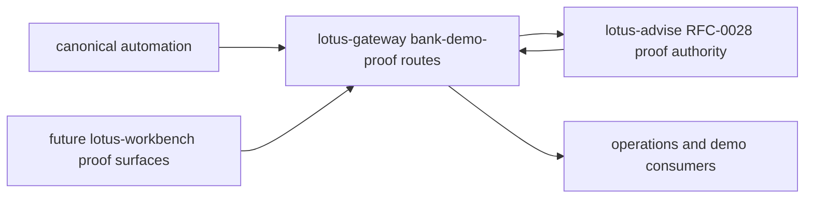

Operational behavior:

1. Gateway returns source-owned proof payloads under `data` in a product envelope,
2. `409 Conflict` material-review responses from `lotus-advise` remain visible to automation and
   operators as blocked proof posture,
3. this route family is a prerequisite for Workbench product proof but does not by itself certify
   the Workbench UI or demo screenshots.

## DPM Governed AI Workflow Execution Boundary

Status: implementation-backed in Gateway for the six DPM workflow-pack handoff families.

Business outcome:

1. portfolio managers, operations users, and supervisors receive one consistent execution-evidence
   contract for proof-pack PM memos, wave PM memos, operations handoff summaries, exception
   summaries, outcome-review narratives, and PM operating-quality summaries,
2. Workbench can distinguish workflow runtime, human-review, supportability, evidence, freshness,
   and replacement posture without treating request acceptance as output availability,
3. support teams receive stable source and correlation evidence without exposing raw prompts,
   ungoverned generated text, internal storage locations, or provider telemetry.

Supported routes:

1. `POST /api/v1/dpm/command-center/proof-packs/{proof_pack_id}/ai-pm-memo`
2. `POST /api/v1/dpm/command-center/waves/{wave_id}/ai-pm-memo`
3. `POST /api/v1/dpm/command-center/waves/{wave_id}/operations-handoff-summary`
4. `POST /api/v1/dpm/command-center/exceptions/{exception_id}/ai-summary`
5. `POST /api/v1/dpm/command-center/outcome-reviews/{outcome_review_id}/ai-narrative`
6. `POST /api/v1/dpm/command-center/pm-operating-quality/score-runs/{score_run_id}/ai-summary`

Authority and contract boundary:

1. `lotus-ai` remains workflow-pack eligibility, execution, run, review, evidence, artifact,
   provider, and recovery-lineage authority; `lotus-manage` remains consequence-bearing DPM
   workflow and source-evidence authority,
2. Gateway validates the canonical source envelope and returns the bounded
   `DpmAiWorkflowExecution` projection across all six routes,
3. Gateway preserves runtime state separately from review state and supportability, including
   review requirement, allowed review actions, source evidence descriptors, safe artifact
   metadata, completion/update timestamps, supersession, replacement, and retry/replay lineage,
4. Gateway verifies pack, version, registration, caller, authenticated caller binding,
   correlation id, workflow surface, workflow authority, the `explain.v1` task identity, and the
   `EXPLANATION_ONLY` output-use label for the requested DPM family,
5. malformed or cross-boundary source output fails closed with product-safe
   `AI_WORKFLOW_EXECUTION_CONTRACT_INVALID` detail and no raw upstream payload leakage.
6. provider provenance is validated against the closed `disabled|stub|openai|local_openai_compatible`
   vocabulary: deterministic modes require `stubbed=true`, live modes require `stubbed=false`,
   and missing, unknown, or contradictory mode/stub pairs fail closed at the Gateway boundary.

Production-readiness controls:

1. raw prompt selection, raw model message and output preview, evidence attributes, internal
   storage backend/reference, and creator/provider control narratives are excluded,
2. only the governed task `structured_output` is returned as generated content; Workbench must use
   a task-specific adapter and must not interpret arbitrary unknown keys,
3. eligibility, runtime completion, evidence availability, human review, freshness, and client-use
   suitability remain independent product decisions; no single state or badge implies all six,
4. missing or invalid source fields are an upstream-contract failure, not permission for Gateway
   or Workbench to invent a fallback result,
5. shared fixtures and contract tests pin the complete canonical envelope, live and stub provider
   posture, review-required and historical/superseded runs, safe projection, and malformed-source
   rejection. Completed Advisor Brief narratives use the same posture policy and downgrade
   unverifiable completion to source-backed partial output without returning the unverified AI
   payload.

## DPM Manage Request Authority

Status: implementation-backed across every registered Gateway DPM read and mutation route.

Business outcome:

1. portfolio managers and operations users can complete governed DPM actions through Workbench
   while Manage enterprise write authorization remains enabled,
2. Manage audit retains the authenticated actor, tenant, role, and available operating region,
3. product callers cannot promote themselves into a Gateway workload or select a broader Manage
   capability.

Authority boundary:

1. every registered DPM route requires trusted `X-Actor-Id`, `X-Tenant-Id`, and `X-Role`;
   `X-Region` is preserved when present and may be route-required,
2. Gateway strips caller-supplied actor/tenant/role/region duplicates and all supplied
   `X-Service-Identity` or `X-Capabilities` values before the Manage call,
3. DPM reads re-apply only validated caller audit identity and correlation, never service identity
   or capabilities,
4. DPM mutations additionally derive exactly `X-Service-Identity: lotus-gateway` plus
   `X-Capabilities: manage.write`; a mutation that escapes request scope fails closed,
5. correlation and idempotency evidence continue unchanged.

Failure and proof posture:

1. missing or malformed caller audit identity returns a stable product-safe Gateway error before
   Manage is called,
2. router registration tests cover every current DPM read and mutation family and publish caller
   audit headers in OpenAPI,
3. client tests prove exact workload authority, hostile-header replacement, least-privilege reads,
   request-scope cleanup, and preservation of correlation and idempotency evidence.

## DPM Command Center Construction Alternatives

Status: implementation-backed in Gateway for RFC39-WTBD-001.

Business outcome:

1. portfolio managers can request and compare disciplined rebalance construction alternatives,
2. CIO and investment-control users can inspect method status, diagnostics, supportability, and
   comparison evidence before approval,
3. Workbench can use Gateway as the product-facing contract instead of calling `lotus-manage`
   directly.

Supported routes:

1. `POST /api/v1/dpm/command-center/construction/alternative-sets/generate`
2. `GET /api/v1/dpm/command-center/construction/alternative-sets/{alternative_set_id}`
3. `POST /api/v1/dpm/command-center/construction/alternative-sets/{alternative_set_id}/selections`

Authority and integrations:

1. `lotus-manage` remains the RFC-0039 construction authority.
2. Gateway forwards request bodies, idempotency keys, and correlation context to manage.
3. Gateway preserves manage-owned alternative-set ids, method ids, method statuses, objective
   traces, constraint traces, comparison metrics, diagnostics, supportability, selected alternative
   state, and lineage.
4. Gateway does not optimize portfolios, recompute construction metrics, infer source readiness,
   select alternatives, execute orders, or fabricate degraded-source values.

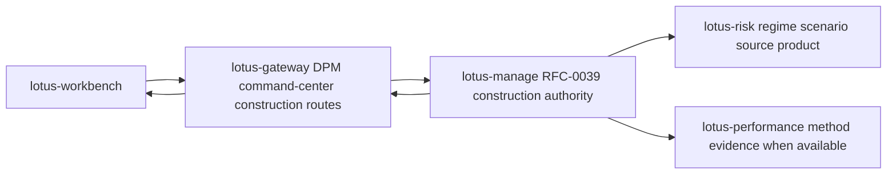

Operational behavior:

1. degraded or rejected manage states are surfaced as product supportability, not hidden as generic
   success,
2. manage upstream errors are returned using product-safe Gateway error detail,
3. response-envelope construction and product-safe upstream error shaping are shared service
   utilities, which keeps construction behavior consistent with other upstream-backed Gateway
   surfaces and reduces route-family drift,
4. OpenAPI documents What/When/How guidance and request/response examples for each route.

Production-readiness controls:

1. generation and selection remain idempotency-key governed,
2. Gateway exposes the upstream status and manage-owned supportability state for operator triage,
3. no order execution, trade approval, client communication, or source-readiness inference is
   performed in Gateway,
4. unit tests pin payload preservation, supportability derivation, product-safe error detail, and
   shared upstream-envelope behavior.

## DPM Proof-Pack Evidence Composition

Status: implementation-backed in Gateway for RFC40-WTBD-001.

Business outcome:

1. portfolio managers can generate and inspect a source-backed pre-trade proof pack from the DPM
   command-center workflow,
2. compliance, audit, and operations users can inspect proof-pack identity, section posture,
   reason codes, content hashes, source hashes, Markdown, report-input evidence, and AI-evidence
   input through one Workbench-facing Gateway contract,
3. sales/pre-sales and client-demo teams can demonstrate proof-backed discretionary management
   governance without implying Gateway or Workbench computes proof-pack evidence.

Supported routes:

1. `POST /api/v1/dpm/command-center/proof-packs`
2. `GET /api/v1/dpm/command-center/proof-packs/{proof_pack_id}`
3. `GET /api/v1/dpm/command-center/proof-packs/{proof_pack_id}/summary.md`
4. `GET /api/v1/dpm/command-center/proof-packs/{proof_pack_id}/report-input`
5. `GET /api/v1/dpm/command-center/proof-packs/{proof_pack_id}/ai-evidence-input`
6. `POST /api/v1/dpm/command-center/proof-packs/{proof_pack_id}/ai-pm-memo`

Authority and integrations:

1. `lotus-manage` remains the RFC-0040 proof-pack authority.
2. Gateway forwards generation payloads, idempotency keys, proof-pack ids, and correlation context
   to manage.
3. Gateway preserves manage-owned `proof_pack_id`, section states, reason codes, `content_hash`,
   `source_hashes`, source refs, report refs, AI refs, deterministic Markdown, report-input
   payloads, and AI-evidence payloads.
4. Gateway reads manage-owned `DpmProofPackAiEvidenceInput` before requesting `lotus-ai`
   `dpm_pm_memo.pack@v1`, and preserves the resulting workflow-pack run posture for Workbench.
5. Gateway does not generate proof-pack sections, recalculate hashes, infer source readiness,
   render reports, archive documents, generate AI narrative or PM memos locally, score PMs,
   approve trades, contact clients, place orders, or treat `lotus-report` as proof-pack authority.

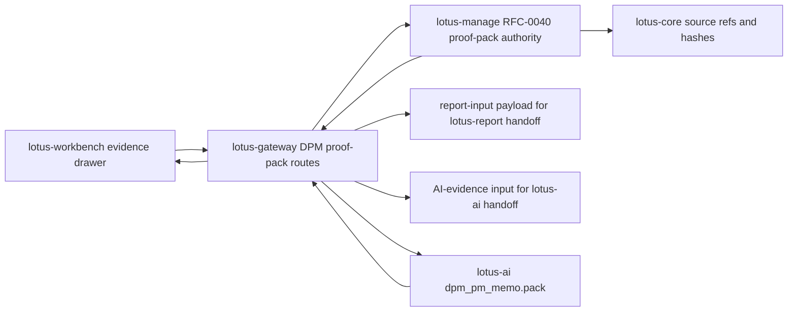

Operational behavior:

1. Gateway returns a product envelope for JSON, report-input, and AI-evidence-input payloads while
   preserving the authoritative manage payload under `data`,
2. deterministic Markdown is preserved as manage-rendered text in a Gateway envelope so Workbench
   can render it without owning proof-pack generation,
3. degraded or unavailable manage states are surfaced using product-safe Gateway error detail and
   must remain visible to Workbench supportability UI.
4. lotus-ai guardrail rejections are preserved as product-safe Gateway error detail with
   `AI_PROOF_PACK_PM_MEMO_UPSTREAM_ERROR`, so Workbench can show review/supportability posture
   without falling back to browser prompt construction.

Production-readiness controls:

1. proof-pack generation remains idempotency-key governed and source-owned by `lotus-manage`,
2. Gateway uses shared upstream-envelope utilities for JSON/report/AI-evidence payloads and
   product-safe manage errors, reducing duplicated service behavior across DPM route families,
3. AI PM memo execution is gated on manage-owned AI evidence input and uses `lotus-ai`
   workflow-pack execution instead of local prompt construction,
4. lotus-ai guardrail or workflow execution failures use the shared product-safe upstream error
   helper, preserving source service, upstream status, error code, and bounded detail without
   exposing prompts or model output,
5. missing lotus-ai workflow-pack configuration is handled through the shared Gateway guard,
   returning a consistent product-safe unavailable posture before any local prompt or fallback path
   can be attempted,
6. tests pin payload preservation, section-state supportability, deterministic Markdown, handoff
   input preservation, missing-AI-client failure behavior, lotus-ai guardrail errors, and
   product-safe manage error detail.

## DPM Portfolio-Memory Composition

Status: implementation-backed in Gateway for the Gateway portion of RFC40-WTBD-010.

Business outcome:

1. portfolio managers can review a single portfolio timeline that links proof-pack, rebalance-wave,
   internal handoff, and outcome-review evidence without reconstructing source truth,
2. operations, compliance, and audit users can inspect source systems, source refs, artifact refs,
   event states, reason codes, and content hashes through one Workbench-facing Gateway contract,
3. sales/pre-sales and client-demo teams can describe portfolio memory as source-backed and
   implementation-backed at the Gateway/API layer while keeping Workbench UI and browser proof as
   the next owning-repository slice.

Supported route:

1. `GET /api/v1/dpm/command-center/portfolios/{portfolio_id}/memory`
2. `GET /api/v1/dpm/command-center/portfolio-memory/search`

Authority and integrations:

1. `lotus-manage` remains the RFC-0040/RFC-0041/RFC-0042 portfolio-memory authority.
2. Gateway forwards portfolio id, event, supportability, source-system, source-type, pagination,
   source-scan-limit, and correlation context to `lotus-manage`
   `/api/v1/rebalance/portfolio-memory/{portfolio_id}` and
   `/api/v1/rebalance/portfolio-memory/search`.
3. Gateway preserves manage-owned event order, event types, event counts, source systems, source
   system/type counts, source refs, artifact refs, applied filters, reason codes, supportability
   state, support boundary, bounded metadata, and content hash.
4. Gateway does not reconstruct timeline nodes, infer mandate exceptions, calculate risk,
   performance, tax, cash, FX, execution, liquidity, transaction-cost, OMS, fills, settlement,
   client communication, global portfolio discovery, cross-app source-event search, or
   source-owner methodology, or let Workbench call `lotus-manage` directly.

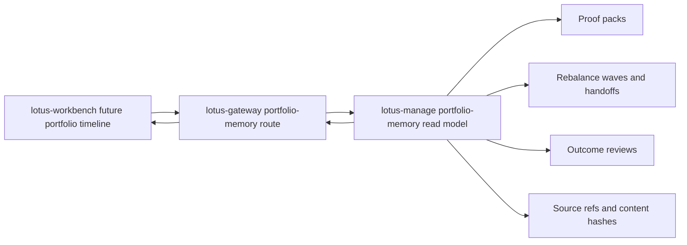

Operational behavior:

1. Gateway returns manage payloads under `data` and adds a supportability summary with state,
   event count, event-type counts, source systems, source-system/type counts, reason codes, and
   content hash,
2. upstream manage errors are surfaced as product-safe Gateway errors with
   `MANAGE_PORTFOLIO_MEMORY_UPSTREAM_ERROR`,
3. Workbench timeline rendering, canonical browser screenshots, mandate-monitoring exception
   timeline nodes, and cross-app retention/audit policy remain open RFC40-WTBD-010 follow-up
   slices before full product support is claimed.

## DPM PM Operating Quality Composition

Status: implementation-backed in Gateway for the Gateway portion of the PM operating quality
product path.

Business outcome:

1. portfolio managers, supervisors, and operations users can access PM operating quality policy,
   score-run lifecycle, fairness-analysis preview/create/list/get evidence, immutable
   review-action preview/create/list/get evidence, and review-gated support-only PM quality
   summaries through the Gateway command-center boundary,
2. Workbench can prepare PM quality product surfaces without calling `lotus-manage` directly,
3. sales/pre-sales and control users can describe the API layer as implementation-backed while
   preserving explicit non-claims around PM ranking, HR, compensation, conduct enforcement,
   autonomous decisions, client contact, and execution.

Supported routes:

1. `PUT /api/v1/dpm/command-center/pm-operating-quality/policies/{policy_id}/versions/{policy_version}`
2. `GET /api/v1/dpm/command-center/pm-operating-quality/policies`
3. `GET /api/v1/dpm/command-center/pm-operating-quality/policies/{policy_id}/versions/{policy_version}`
4. `POST /api/v1/dpm/command-center/pm-operating-quality/score-runs/preview`
5. `POST /api/v1/dpm/command-center/pm-operating-quality/score-runs`
6. `GET /api/v1/dpm/command-center/pm-operating-quality/score-runs`
7. `GET /api/v1/dpm/command-center/pm-operating-quality/score-runs/{score_run_id}`
8. `POST /api/v1/dpm/command-center/pm-operating-quality/fairness-analyses/preview`
9. `POST /api/v1/dpm/command-center/pm-operating-quality/fairness-analyses`
10. `GET /api/v1/dpm/command-center/pm-operating-quality/fairness-analyses`
11. `GET /api/v1/dpm/command-center/pm-operating-quality/fairness-analyses/{fairness_analysis_id}`
12. `POST /api/v1/dpm/command-center/pm-operating-quality/review-actions/preview`
13. `POST /api/v1/dpm/command-center/pm-operating-quality/review-actions`
14. `GET /api/v1/dpm/command-center/pm-operating-quality/review-actions`
15. `GET /api/v1/dpm/command-center/pm-operating-quality/review-actions/{review_action_id}`
16. `POST /api/v1/dpm/command-center/pm-operating-quality/summary-invocations/preview`
17. `POST /api/v1/dpm/command-center/pm-operating-quality/summary-invocations`
18. `GET /api/v1/dpm/command-center/pm-operating-quality/summary-invocations`
19. `GET /api/v1/dpm/command-center/pm-operating-quality/summary-invocations/{summary_invocation_id}`
20. `POST /api/v1/dpm/command-center/pm-operating-quality/score-runs/{score_run_id}/ai-summary`

Authority and integrations:

1. `lotus-manage` remains the PM operating quality policy, score-run, fairness-analysis, and
   review-action, and summary-invocation authority.
2. Gateway forwards policy list/get/upsert, score-run preview/create/list/get, and
   fairness-analysis preview/create/list/get, review-action preview/create/list/get, and
   summary-invocation preview/create/list/get requests to `lotus-manage`.
3. Gateway executes `lotus-ai` `pm_quality_summary.pack@v1` only after reading Manage-owned
   `PmOperatingQualityScoreRun` evidence for the requested score-run id.
4. Gateway preserves manage-owned policy configuration, score-run state, fairness-analysis state,
   review-action state, summary-invocation workflow refs, bounded rationale, target content hashes,
   segment posture, governance evidence, source refs, reason codes, content hashes, summary-text
   boundary evidence, and forbidden-use posture.
5. Gateway does not calculate scores, discover segments, calculate segment averages or fairness
   spread, infer protected classes, rank PMs, administer bank policy locally, create HR or
   compensation decisions, perform conduct enforcement, reinterpret review rationale, store or
   expose generated summary text, reconstruct prompts or model responses, approve trades, contact
   clients, route orders, claim OMS/execution, or invent missing evidence.

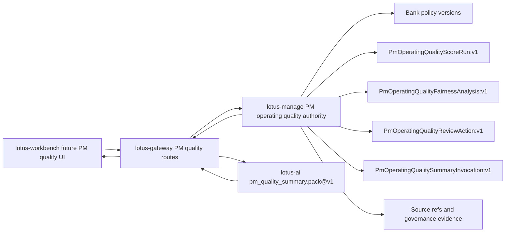

Operational behavior:

1. Gateway returns manage payloads under `data` and adds a supportability summary with state,
   policy id/version, score-run id, fairness-analysis id, review-action id, reason codes, blocked
   actions, summary-invocation id, and list counts when available,
2. upstream manage errors are surfaced as product-safe Gateway errors with
   `MANAGE_PM_OPERATING_QUALITY_UPSTREAM_ERROR`,
3. upstream lotus-ai summary errors are surfaced as product-safe Gateway errors with
   `AI_PM_OPERATING_QUALITY_SUMMARY_UPSTREAM_ERROR`,
4. Workbench PM quality UI is a Gateway-backed owning-repository slice in `lotus-workbench`;
   end-to-end product support still depends on the corresponding Manage endpoint being available
   on its owning branch/main and validated through the governed Workbench/Gateway runtime path.

## DPM Rebalance-Wave Composition

Status: implementation-backed in Gateway for RFC41-WTBD-005.

Business outcome:

1. portfolio managers and CIO-office users can operate explicit portfolio-list rebalance waves
   through a stable Gateway contract instead of calling `lotus-manage` directly,
2. operations users can inspect item-level source readiness, simulation, selection, proof-pack,
   approval, staging, internal handoff, cancellation, report-input, AI memo support, and
   supportability posture from one product route family,
3. portfolio managers can discover and upsert manage-owned campaign definitions for tactical
   house-view, risk-event, and bulk-review waves without Gateway recomputing source-owned cohort
   facts,
4. sales/pre-sales and client-demo teams can describe wave orchestration as implementation-backed
   backend composition while keeping Workbench wave cockpit UI as the next owning-repository slice.

Supported routes:

1. `POST /api/v1/dpm/command-center/waves/preview`
2. `POST /api/v1/dpm/command-center/waves`
3. `GET /api/v1/dpm/command-center/waves`
4. `GET /api/v1/dpm/command-center/waves/campaign-definitions`
5. `GET /api/v1/dpm/command-center/waves/campaign-definitions/{campaign_id}/versions/{campaign_version}`
6. `GET /api/v1/dpm/command-center/waves/campaign-definitions/{campaign_id}/versions/{campaign_version}/lifecycle-events`
7. `GET /api/v1/dpm/command-center/waves/campaign-definitions/{campaign_id}/versions/{campaign_version}/preview-readiness`
8. `GET /api/v1/dpm/command-center/waves/campaign-definitions/{campaign_id}/versions/{campaign_version}/launch-history`
9. `GET /api/v1/dpm/command-center/waves/campaign-definitions/{campaign_id}/versions/{campaign_version}/launch-package`
10. `POST /api/v1/dpm/command-center/waves/campaign-definitions/{campaign_id}/versions/{campaign_version}/launch`
11. `POST /api/v1/dpm/command-center/waves/campaign-definitions/{campaign_id}/versions/{campaign_version}/retire`
12. `POST /api/v1/dpm/command-center/waves/campaign-definitions/{campaign_id}/versions/{campaign_version}/supersede`
13. `GET /api/v1/dpm/command-center/waves/campaign-discovery`
14. `PUT /api/v1/dpm/command-center/waves/campaign-definitions/{campaign_id}/versions/{campaign_version}`
15. `GET /api/v1/dpm/command-center/waves/campaign-operating-queue`
16. `GET /api/v1/dpm/command-center/waves/campaign-approval-inbox`
17. `GET /api/v1/dpm/command-center/waves/campaign-workflow-board`
18. `GET /api/v1/dpm/command-center/waves/campaign-assignment-plan`
19. `GET /api/v1/dpm/command-center/waves/campaign-workflow-automation`
20. `GET /api/v1/dpm/command-center/waves/campaign-definitions/{campaign_id}/versions/{campaign_version}/approval-decisions`
21. `POST /api/v1/dpm/command-center/waves/campaign-definitions/{campaign_id}/versions/{campaign_version}/approval-decisions`
22. `GET /api/v1/dpm/command-center/waves/campaign-definitions/{campaign_id}/versions/{campaign_version}/assignment-actions`
23. `POST /api/v1/dpm/command-center/waves/campaign-definitions/{campaign_id}/versions/{campaign_version}/assignment-actions`
24. `GET /api/v1/dpm/command-center/waves/campaign-definitions/{campaign_id}/versions/{campaign_version}/assignment-tasks`
25. `POST /api/v1/dpm/command-center/waves/campaign-definitions/{campaign_id}/versions/{campaign_version}/assignment-tasks`
26. `POST /api/v1/dpm/command-center/waves/campaign-definitions/{campaign_id}/versions/{campaign_version}/assignment-tasks/{task_ref}/transitions`
27. `GET /api/v1/dpm/command-center/waves/campaign-definitions/{campaign_id}/versions/{campaign_version}/maker-checker-controls`
28. `POST /api/v1/dpm/command-center/waves/campaign-definitions/{campaign_id}/versions/{campaign_version}/maker-checker-controls`
29. `GET /api/v1/dpm/command-center/waves/{wave_id}`
30. `GET /api/v1/dpm/command-center/waves/{wave_id}/items`
31. `POST /api/v1/dpm/command-center/waves/{wave_id}/source-check`
32. `POST /api/v1/dpm/command-center/waves/{wave_id}/simulate`
33. `POST /api/v1/dpm/command-center/waves/{wave_id}/items/{wave_item_id}/select`
34. `POST /api/v1/dpm/command-center/waves/{wave_id}/approve`
35. `POST /api/v1/dpm/command-center/waves/{wave_id}/stage`
36. `POST /api/v1/dpm/command-center/waves/{wave_id}/handoff`
37. `POST /api/v1/dpm/command-center/waves/{wave_id}/cancel`
38. `GET /api/v1/dpm/command-center/waves/{wave_id}/proof-pack`
39. `GET /api/v1/dpm/command-center/waves/{wave_id}/supportability`
40. `GET /api/v1/dpm/command-center/waves/{wave_id}/report-input`
41. `POST /api/v1/dpm/command-center/waves/{wave_id}/ai-pm-memo`
42. `POST /api/v1/dpm/command-center/waves/{wave_id}/operations-handoff-summary`

Authority and integrations:

1. `lotus-manage` remains the RFC-0041 rebalance-wave authority.
2. Gateway forwards preview, create, campaign-definition list/get/lifecycle-events/preview-readiness/
   paged launch-history/launch-package/launch/retire/supersede/upsert, bounded campaign-discovery, source-check, simulate,
   select, approve, stage, handoff, cancel, proof-pack posture, supportability, and report-input
   requests to manage.
3. Gateway preserves `BulkReviewCampaignDefinitionPreviewReadiness:v1` supportability state,
   reason codes, blocked actions, source refs, requested as-of date, actor id, and operating
   boundaries exactly without inferring campaign membership, readiness, actor entitlement,
   maker-checker, trade approval, order generation, routing, fills, settlement, or OMS execution.
4. Gateway preserves `BulkReviewCampaignDefinitionLaunchHistory:v1` campaign id/version, launch
   records, count, total count, limit, offset, and `operating_boundaries` exactly without inferring
   maker-checker, trade approval, order generation, routing, fills, settlement, or OMS execution.
5. Gateway preserves campaign workflow/audit operating queue, approval inbox, workflow board,
   assignment plan, workflow automation, approval-decision, assignment-action, assignment-task,
   task-transition, and maker-checker evidence with Manage-owned count/page metadata,
   supportability, source refs, reason codes, operating boundaries, and hashes exactly.
6. Campaign launch, retirement, supersession, approval-decision, assignment-action,
   assignment-task, task-transition, and maker-checker writes use distinct closed request schemas.
   Gateway rejects stale fields and unsupported bounded values before upstream dispatch without
   reimplementing Manage command-eligibility or transition rules.
7. Gateway preserves manage-owned `wave_id`, lifecycle state, item states, reason codes,
   aggregate metrics, selected alternative refs, proof-pack refs, handoff refs, supportability
   issues, report-input evidence, remediation routes, and `external_execution_claimed=false`.
8. Gateway reads manage-owned wave report input before calling `lotus-ai`
   `dpm_wave_pm_memo.pack@v1` for review-required PM/control support text.
9. Gateway reads manage-owned wave report input with internal handoff refs before calling
   `lotus-ai` `dpm_operations_handoff_summary.pack@v1`.
10. Gateway does not calculate affected portfolios, classify source readiness, discover cohorts,
   recompute campaign membership, generate alternatives, select alternatives, approve items, stage
   items, create handoff evidence, rebuild proof packs, generate report evidence, generate AI
   narrative locally, calculate task state, approval state, maker-checker state, SLA posture,
   workflow orchestration, score PMs, approve trades, contact clients, place orders, invent missing
   evidence, cancel external orders, or claim external execution.

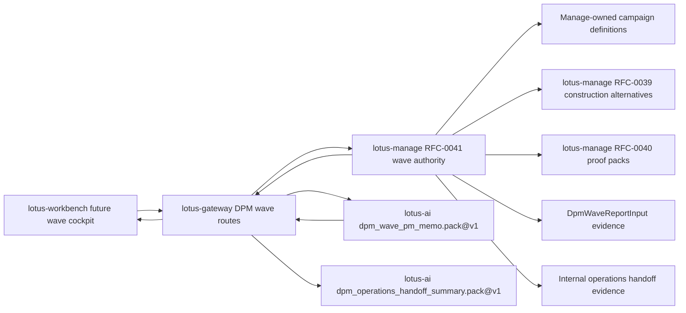

Operational behavior:

1. Gateway wraps every manage response in a product envelope with manage-derived supportability,
2. unsupported transitions and missing waves return product-safe manage error details,
3. lotus-ai failures on the wave PM memo route return product-safe `lotus-ai` error details while
   preserving manage evidence boundaries,
4. lotus-ai failures on the operations-handoff summary route return product-safe `lotus-ai` error
   details while preserving manage evidence boundaries,
5. Gateway never turns generated operations handoff support text into order routing, external
   execution, trade approval, client contact, or PM scoring,
6. Workbench wave command-center UI, browser proof, and demo screenshots remain RFC41-WTBD-006 and
   are not claimed by this Gateway slice.

Production-readiness controls:

1. wave creation, campaign launch, lifecycle commands, assignment workflow writes, selection,
   approval, staging, handoff, cancellation, PM memo, and operations handoff actions preserve
   caller correlation context and required idempotency behavior where manage requires it,
2. Gateway now uses shared upstream-envelope utilities for wave, campaign-definition, and campaign
   workflow responses plus product-safe manage error detail, reducing behavior drift across DPM
   construction, proof-pack, and wave route families,
3. AI PM memo and operations-handoff summary execution is gated on manage-owned wave report input
   and uses governed `lotus-ai` workflow-pack execution instead of local prompt construction,
4. lotus-ai PM memo and operations-handoff failures use the shared product-safe upstream error
   helper, preserving workflow-pack authority and supportability boundaries without exposing raw
   AI payload internals,
5. missing lotus-ai workflow-pack configuration is handled through the shared Gateway guard before
   PM memo or operations handoff execution begins,
6. unit and contract tests pin manage payload preservation, campaign lifecycle payloads,
   supportability derivation, invalid-transition error detail, report-input handoff evidence, AI
   workflow-pack calls, and guardrail error behavior.

## DPM Mandate Command Center

Status: implementation-backed in Gateway for RFC38-WTBD-001.

Business outcome:

1. portfolio managers, supervision users, and operations teams can query mandate health,
   monitoring-run, active-exception, and mandate drill-down posture through Gateway,
2. Workbench can build the command-center cockpit without calling `lotus-manage` directly,
3. Gateway preserves manage source readiness, supportability, reason codes, recommended actions,
   and mandate lineage without becoming the mandate-health authority.

Supported routes:

1. `GET /api/v1/dpm/command-center`
2. `POST /api/v1/dpm/command-center/monitoring/run-once`
3. `GET /api/v1/dpm/command-center/monitoring/runs`
4. `GET /api/v1/dpm/command-center/monitoring/runs/{monitoring_run_id}`
5. `GET /api/v1/dpm/command-center/exceptions`
6. `POST /api/v1/dpm/command-center/exceptions/{exception_id}/resolve`
7. `GET /api/v1/dpm/command-center/mandates/by-portfolio/{portfolio_id}`
8. `GET /api/v1/dpm/command-center/mandates/{mandate_id}`
9. `GET /api/v1/dpm/command-center/mandates/{mandate_id}/health`
10. `GET /api/v1/dpm/command-center/mandates/{mandate_id}/diff`

Authority and integrations:

1. `lotus-manage` remains the RFC-0038 mandate digital twin, health, monitoring, exception, and
   command-center authority.
2. Gateway forwards filters, monitoring requests, and exception-resolution reasons to manage.
3. Gateway preserves health distribution, health dimensions, monitoring-run state, active
   exceptions, reason codes, recommended actions, source lineage, version diffs, and
   supportability.
4. Gateway does not discover PM-book membership, calculate health scores, reconstruct health
   dimensions, infer source readiness, merge exceptions across monitoring runs, or resolve
   exceptions locally.

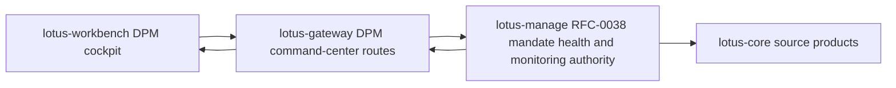

Operational behavior:

1. empty and partial command-center states remain valid product states,
2. manage upstream errors are returned using product-safe Gateway error detail,
3. Workbench cockpit implementation and canonical UI proof remain separate owning-repository
   work under RFC38-WTBD-002.

Production-readiness controls:

1. Gateway uses shared upstream-envelope utilities for mandate command-center, outcome-review,
   portfolio-memory, and PM operating-quality response envelopes while preserving each route
   family's supportability summary and error code,
2. monitoring, exception-resolution, mandate drill-down, outcome-review, portfolio-memory, and PM
   operating-quality surfaces expose upstream status and correlation context for operator triage,
3. command-center response composition remains payload-preserving; mandate health, outcome-review,
   portfolio-memory, and PM-quality truth stay in `lotus-manage`,
4. exception-summary, outcome-review narrative, and PM operating-quality summary failures from
   `lotus-ai` use the shared product-safe upstream error helper so downstream UIs and operators see
   consistent source service, upstream status, and error-code posture,
5. missing lotus-ai workflow-pack configuration is handled through the shared Gateway guard across
   command-center AI handoffs, keeping degraded configuration posture consistent for operators,
6. command-center supportability mapping is isolated in a dedicated tested mapper boundary so
   mandate readiness, outcome-review posture, portfolio-memory posture, and PM operating-quality
   posture can evolve without re-expanding the command-center service monolith,
7. command-center AI handoff context builders are isolated in a dedicated tested boundary for
   exception-summary inputs, workflow-pack task payloads, outcome-review evidence refs, and PM
   operating-quality source refs,
8. manage evidence-read failures use the shared product-safe upstream error raiser and shared
   bounded upstream-detail extractor, including structured `code` plus `message` details from
   upstream governance checks,
9. DPM route services use a shared Gateway factory for manage and lotus-ai clients, keeping
   timeout, retry, and service-identity wiring consistent across command-center, construction,
   proof-pack, and wave route families,
10. DPM OpenAPI upstream-error response maps use a shared helper so command-center, construction,
   proof-pack, and wave conflict, validation, not-found, and degraded-authority documentation stays
   consistent across route families,
11. repeated DPM workflow query parameters use a shared router helper, preserving multi-select
   filters for Manage without route-local parsing logic,
12. unit and contract tests pin product-safe manage errors, source-owned payload preservation,
   supportability derivation, AI handoff boundaries, and no-local-authority claims.

## Portfolio-Level DPM Operations Posture

Status: implementation-backed in Gateway for RFC36-WTBD-003.

Business outcome:

1. portfolio managers and operations users can see recent stateful DPM execution posture from the
   Workbench overview without direct `lotus-manage` access,
2. Workbench can render supportability, last-run identity, recent run status, workflow posture, and
   bounded run issue codes from a governed Gateway envelope,
3. missing supportability or absent recent runs stay explicit instead of becoming fabricated zero
   activity.

Supported routes:

1. `GET /api/v1/workbench/{portfolio_id}/overview`
2. `GET /api/v1/workbench/{portfolio_id}/portfolio-360`

Authority and integrations:

1. `lotus-manage` remains the rebalance run and action-register supportability authority.
2. Gateway reads manage `/api/v1/rebalance/runs` for bounded recent run posture and
   `/api/v1/rebalance/supportability/summary` for manage-owned action-register supportability.
3. Gateway exposes up to five bounded recent run summaries with run id, status, timestamp,
   workflow posture, and error code.
4. Gateway does not compute supportability, workflow status, source readiness, execution outcomes,
   or error semantics locally.

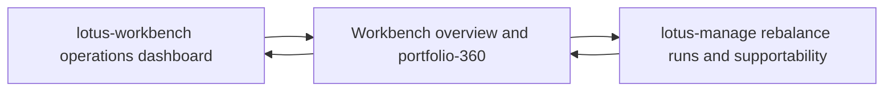

Operational behavior:

1. Gateway returns partial failures and warnings if manage is unavailable,
2. recent run detail is bounded to keep the Workbench contract product-safe,
3. Workbench remains Gateway-first and must not call `lotus-manage` directly.

## DPM Command Center Outcome Reviews

Status: implementation-backed in Gateway for RFC42-WTBD-001 and RFC42-WTBD-005.

Gateway exposes outcome-review preview/create/search/detail/source-refresh/supportability,
report-input, AI-evidence, run lookup, wave lookup, and governed AI narrative handoff routes under
`/api/v1/dpm/command-center/outcome-reviews*`. The supportability, report-input, and AI-evidence
payloads preserve Manage-owned `client_communication_boundary` posture when Manage publishes it,
including fail-closed no-client-communication and no-client-approval projection flags.
Outcome-review list filtering also forwards bounded source-system, source-type, and source-scan
filters to Manage and preserves Manage-published applied filters, source-owner counts,
source-type counts, and support boundary as persisted-lineage evidence only.
`lotus-manage` remains outcome-review authority and `lotus-ai` remains AI workflow execution
authority; Gateway does not synthesize client communication truth.

## DPM Command Center Exception Summary

Status: implementation-backed in Gateway for RFC38/RFC43 exception-summary handoff.

Gateway exposes
`POST /api/v1/dpm/command-center/exceptions/{exception_id}/ai-summary` for internal PM,
investment-control, and operations triage. The route reads manage-owned monitoring-exception
evidence from the command-center exception queue, supports optional portfolio, mandate, and state
filters, builds a bounded no-raw-payload exception-summary input, and executes `lotus-ai`
`dpm_exception_summary.pack@v1` as `lotus-gateway`.

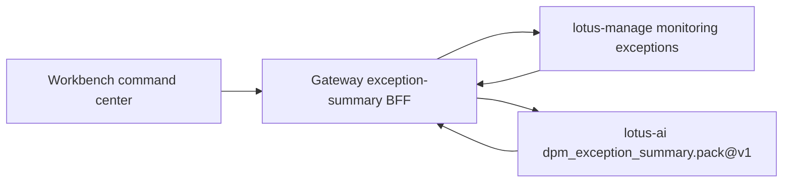

Operational boundaries:

1. `lotus-manage` remains exception evidence authority.
2. `lotus-ai` remains workflow-pack execution authority.
3. Gateway preserves source refs, content hashes, supportability, and product-safe upstream errors.
4. Gateway does not generate summaries locally, score PMs, approve trades, contact clients, route
   orders, or invent evidence.
