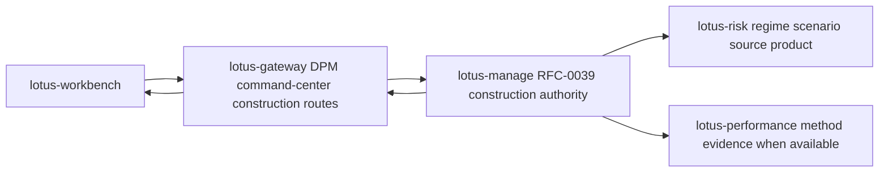
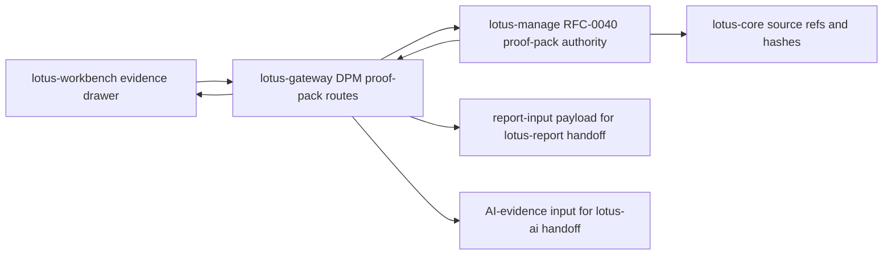
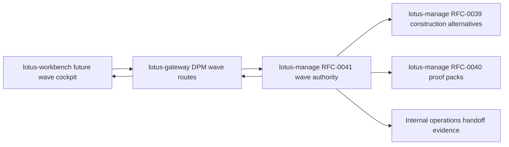
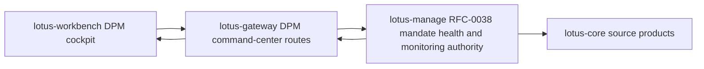
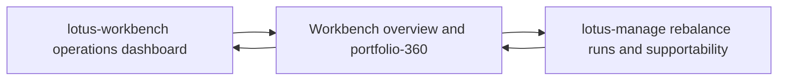

# Supported Features

This page lists implementation-backed `lotus-gateway` feature coverage. It is product material for
developers, business users, operations, sales/pre-sales, and client demos; it must not describe
future capability as supported until the owning service, Gateway contract, tests, and validation
evidence exist.

## DPM Command Center Construction Alternatives

Status: implementation-backed in Gateway for RFC39-WTBD-001.

Business outcome:

1. portfolio managers can request and compare disciplined rebalance construction alternatives,
2. CIO and investment-control users can inspect method status, diagnostics, supportability, and
   comparison evidence before approval,
3. Workbench can use Gateway as the product-facing contract instead of calling `lotus-manage`
   directly.

Supported routes:

1. `POST /api/v1/dpm/command-center/construction/alternative-sets/generate`
2. `GET /api/v1/dpm/command-center/construction/alternative-sets/{alternative_set_id}`
3. `POST /api/v1/dpm/command-center/construction/alternative-sets/{alternative_set_id}/selections`

Authority and integrations:

1. `lotus-manage` remains the RFC-0039 construction authority.
2. Gateway forwards request bodies, idempotency keys, and correlation context to manage.
3. Gateway preserves manage-owned alternative-set ids, method ids, method statuses, objective
   traces, constraint traces, comparison metrics, diagnostics, supportability, selected alternative
   state, and lineage.
4. Gateway does not optimize portfolios, recompute construction metrics, infer source readiness,
   select alternatives, execute orders, or fabricate degraded-source values.

Operational behavior:

1. degraded or rejected manage states are surfaced as product supportability, not hidden as generic
   success,
2. manage upstream errors are returned using product-safe Gateway error detail,
3. OpenAPI documents What/When/How guidance and request/response examples for each route.

## DPM Proof-Pack Evidence Composition

Status: implementation-backed in Gateway for RFC40-WTBD-001.

Business outcome:

1. portfolio managers can generate and inspect a source-backed pre-trade proof pack from the DPM
   command-center workflow,
2. compliance, audit, and operations users can inspect proof-pack identity, section posture,
   reason codes, content hashes, source hashes, Markdown, report-input evidence, and AI-evidence
   input through one Workbench-facing Gateway contract,
3. sales/pre-sales and client-demo teams can demonstrate proof-backed discretionary management
   governance without implying Gateway or Workbench computes proof-pack evidence.

Supported routes:

1. `POST /api/v1/dpm/command-center/proof-packs`
2. `GET /api/v1/dpm/command-center/proof-packs/{proof_pack_id}`
3. `GET /api/v1/dpm/command-center/proof-packs/{proof_pack_id}/summary.md`
4. `GET /api/v1/dpm/command-center/proof-packs/{proof_pack_id}/report-input`
5. `GET /api/v1/dpm/command-center/proof-packs/{proof_pack_id}/ai-evidence-input`

Authority and integrations:

1. `lotus-manage` remains the RFC-0040 proof-pack authority.
2. Gateway forwards generation payloads, idempotency keys, proof-pack ids, and correlation context
   to manage.
3. Gateway preserves manage-owned `proof_pack_id`, section states, reason codes, `content_hash`,
   `source_hashes`, source refs, report refs, AI refs, deterministic Markdown, report-input
   payloads, and AI-evidence payloads.
4. Gateway does not generate proof-pack sections, recalculate hashes, infer source readiness,
   render reports, archive documents, generate AI narrative, or treat `lotus-report` as
   proof-pack authority.

Operational behavior:

1. Gateway returns a product envelope for JSON, report-input, and AI-evidence-input payloads while
   preserving the authoritative manage payload under `data`,
2. deterministic Markdown is preserved as manage-rendered text in a Gateway envelope so Workbench
   can render it without owning proof-pack generation,
3. degraded or unavailable manage states are surfaced using product-safe Gateway error detail and
   must remain visible to Workbench supportability UI.

## DPM Rebalance-Wave Composition

Status: implementation-backed in Gateway for RFC41-WTBD-005.

Business outcome:

1. portfolio managers and CIO-office users can operate explicit portfolio-list rebalance waves
   through a stable Gateway contract instead of calling `lotus-manage` directly,
2. operations users can inspect item-level source readiness, simulation, selection, proof-pack,
   approval, staging, internal handoff, cancellation, and supportability posture from one product
   route family,
3. sales/pre-sales and client-demo teams can describe wave orchestration as implementation-backed
   backend composition while keeping Workbench wave cockpit UI as the next owning-repository slice.

Supported routes:

1. `POST /api/v1/dpm/command-center/waves/preview`
2. `POST /api/v1/dpm/command-center/waves`
3. `GET /api/v1/dpm/command-center/waves`
4. `GET /api/v1/dpm/command-center/waves/{wave_id}`
5. `GET /api/v1/dpm/command-center/waves/{wave_id}/items`
6. `POST /api/v1/dpm/command-center/waves/{wave_id}/source-check`
7. `POST /api/v1/dpm/command-center/waves/{wave_id}/simulate`
8. `POST /api/v1/dpm/command-center/waves/{wave_id}/items/{wave_item_id}/select`
9. `POST /api/v1/dpm/command-center/waves/{wave_id}/approve`
10. `POST /api/v1/dpm/command-center/waves/{wave_id}/stage`
11. `POST /api/v1/dpm/command-center/waves/{wave_id}/handoff`
12. `POST /api/v1/dpm/command-center/waves/{wave_id}/cancel`
13. `GET /api/v1/dpm/command-center/waves/{wave_id}/proof-pack`
14. `GET /api/v1/dpm/command-center/waves/{wave_id}/supportability`

Authority and integrations:

1. `lotus-manage` remains the RFC-0041 rebalance-wave authority.
2. Gateway forwards preview, create, source-check, simulate, select, approve, stage, handoff,
   cancel, proof-pack posture, and supportability requests to manage.
3. Gateway preserves manage-owned `wave_id`, lifecycle state, item states, reason codes,
   aggregate metrics, selected alternative refs, proof-pack refs, handoff refs, supportability
   issues, remediation routes, and `external_execution_claimed=false`.
4. Gateway does not calculate affected portfolios, classify source readiness, generate
   alternatives, select alternatives, approve items, stage items, create handoff evidence, rebuild
   proof packs, cancel external orders, or claim external execution.

Operational behavior:

1. Gateway wraps every manage response in a product envelope with manage-derived supportability,
2. unsupported transitions and missing waves return product-safe manage error details,
3. Workbench wave command-center UI, browser proof, and demo screenshots remain RFC41-WTBD-006 and
   are not claimed by this Gateway slice.

## DPM Mandate Command Center

Status: implementation-backed in Gateway for RFC38-WTBD-001.

Business outcome:

1. portfolio managers, supervision users, and operations teams can query mandate health,
   monitoring-run, active-exception, and mandate drill-down posture through Gateway,
2. Workbench can build the command-center cockpit without calling `lotus-manage` directly,
3. Gateway preserves manage source readiness, supportability, reason codes, recommended actions,
   and mandate lineage without becoming the mandate-health authority.

Supported routes:

1. `GET /api/v1/dpm/command-center`
2. `POST /api/v1/dpm/command-center/monitoring/run-once`
3. `GET /api/v1/dpm/command-center/monitoring/runs`
4. `GET /api/v1/dpm/command-center/monitoring/runs/{monitoring_run_id}`
5. `GET /api/v1/dpm/command-center/exceptions`
6. `POST /api/v1/dpm/command-center/exceptions/{exception_id}/resolve`
7. `GET /api/v1/dpm/command-center/mandates/by-portfolio/{portfolio_id}`
8. `GET /api/v1/dpm/command-center/mandates/{mandate_id}`
9. `GET /api/v1/dpm/command-center/mandates/{mandate_id}/health`
10. `GET /api/v1/dpm/command-center/mandates/{mandate_id}/diff`

Authority and integrations:

1. `lotus-manage` remains the RFC-0038 mandate digital twin, health, monitoring, exception, and
   command-center authority.
2. Gateway forwards filters, monitoring requests, and exception-resolution reasons to manage.
3. Gateway preserves health distribution, health dimensions, monitoring-run state, active
   exceptions, reason codes, recommended actions, source lineage, version diffs, and
   supportability.
4. Gateway does not discover PM-book membership, calculate health scores, reconstruct health
   dimensions, infer source readiness, merge exceptions across monitoring runs, or resolve
   exceptions locally.

Operational behavior:

1. empty and partial command-center states remain valid product states,
2. manage upstream errors are returned using product-safe Gateway error detail,
3. Workbench cockpit implementation and canonical UI proof remain separate owning-repository
   work under RFC38-WTBD-002.

## Portfolio-Level DPM Operations Posture

Status: implementation-backed in Gateway for RFC36-WTBD-003.

Business outcome:

1. portfolio managers and operations users can see recent stateful DPM execution posture from the
   Workbench overview without direct `lotus-manage` access,
2. Workbench can render supportability, last-run identity, recent run status, workflow posture, and
   bounded run issue codes from a governed Gateway envelope,
3. missing supportability or absent recent runs stay explicit instead of becoming fabricated zero
   activity.

Supported routes:

1. `GET /api/v1/workbench/{portfolio_id}/overview`
2. `GET /api/v1/workbench/{portfolio_id}/portfolio-360`

Authority and integrations:

1. `lotus-manage` remains the rebalance run and action-register supportability authority.
2. Gateway reads manage `/api/v1/rebalance/runs` for bounded recent run posture and
   `/api/v1/rebalance/supportability/summary` for manage-owned action-register supportability.
3. Gateway exposes up to five bounded recent run summaries with run id, status, timestamp,
   workflow posture, and error code.
4. Gateway does not compute supportability, workflow status, source readiness, execution outcomes,
   or error semantics locally.

Operational behavior:

1. Gateway returns partial failures and warnings if manage is unavailable,
2. recent run detail is bounded to keep the Workbench contract product-safe,
3. Workbench remains Gateway-first and must not call `lotus-manage` directly.

## DPM Command Center Outcome Reviews

Status: implementation-backed in Gateway for RFC42-WTBD-001 and RFC42-WTBD-005.

Gateway exposes outcome-review preview/create/search/detail/source-refresh/supportability,
report-input, AI-evidence, run lookup, wave lookup, and governed AI narrative handoff routes under
`/api/v1/dpm/command-center/outcome-reviews*`. `lotus-manage` remains outcome-review authority and
`lotus-ai` remains AI workflow execution authority.
