# Supported Features

This page lists implementation-backed `lotus-gateway` feature coverage. It is product material for
developers, business users, operations, sales/pre-sales, and client demos; it must not describe
future capability as supported until the owning service, Gateway contract, tests, and validation
evidence exist.

## Advisory Proposal Narrative Posture

Status: implementation-backed in Gateway for the RFC-0023 advisory narrative posture path.

Business outcome:

1. advisors, compliance reviewers, and investment-control users can record and inspect
   advisor-use narrative review posture without leaving the governed Gateway boundary,
2. Workbench can request report materialization with an approved, source-backed advisory narrative
   package without calling `lotus-advise` directly,
3. operations and audit users can inspect proposal delivery posture, report-request state, source
   hashes, and append-only delivery events through one product-facing API surface.

Supported routes:

1. `POST /api/v1/proposals/{proposal_id}/versions/{version_no}/narrative/review`
2. `POST /api/v1/proposals/{proposal_id}/report-requests`
3. `GET /api/v1/proposals/{proposal_id}/delivery-summary`
4. `GET /api/v1/proposals/{proposal_id}/delivery-events`

Authority and integrations:

1. `lotus-advise` remains the proposal workflow, narrative review, report-request, and delivery
   posture authority.
2. Gateway forwards proposal ids, version numbers, request bodies, correlation context, and
   optional narrative-review idempotency keys to `lotus-advise`.
3. Gateway preserves Advise-owned review state, policy version, guardrail/disclosure posture,
   `source_narrative_hash`, report narrative-package posture, source refs, and delivery events.
4. Gateway does not generate or edit narrative, infer client-ready publication, render reports,
   archive documents, contact clients, create orders, or recompute advisory delivery truth.

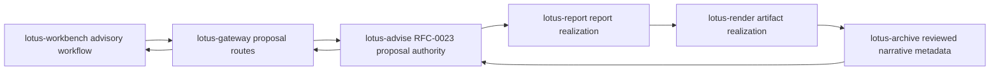

Operational behavior:

1. Gateway returns source payloads under `data` and keeps correlation ids visible for support,
2. unsupported review/report posture is blocked by `lotus-advise` and surfaced as product-safe
   Gateway error detail,
3. client-ready publication remains explicitly out of Gateway scope until the owning RFC slice
   proves the end-to-end release control path.

## Advisory Suitability And Best-Interest Policy Posture

Status: implementation-backed in Gateway for the RFC-0025 policy-pack and policy-evaluation BFF
surface. Workbench product realization and live browser proof remain separate RFC-0025 Slice 12
work.

Business outcome:

1. advisors can request policy evaluation for a proposal version without bypassing Gateway,
2. compliance, investment desk, operations, and supervisory users can inspect review queues,
   workflow posture, sign-off packages, source lineage, replay evidence, and report-package
   posture through one product-facing API surface,
3. support teams can see degraded, blocked, and AI-evidence-unavailable posture exactly as
   `lotus-advise` returned it.

Supported routes:

1. `GET /api/v1/advisory-policy-packs`
2. `GET /api/v1/advisory-policy-packs/{policy_pack_id}/versions/{policy_version}`
3. `POST /api/v1/advisory-policy-packs/{policy_pack_id}/versions/{policy_version}/validate`
4. `POST /api/v1/advisory-policy-packs/{policy_pack_id}/versions/{policy_version}/activate`
5. `POST /api/v1/proposals/{proposal_id}/versions/{proposal_version_id}/policy-evaluations`
6. `GET /api/v1/advisory-policy-evaluations/review-queue`
7. `GET /api/v1/advisory-policy-evaluations/{evaluation_id}`
8. `POST /api/v1/advisory-policy-evaluations/{evaluation_id}/replay`
9. `POST /api/v1/advisory-policy-evaluations/{evaluation_id}/events`
10. `GET /api/v1/advisory-policy-evaluations/{evaluation_id}/lineage`
11. `GET /api/v1/advisory-policy-evaluations/{evaluation_id}/sign-off-package`
12. `GET /api/v1/advisory-policy-evaluations/{evaluation_id}/workflow`
13. `POST /api/v1/advisory-policy-evaluations/{evaluation_id}/sign-off-decisions`
14. `POST /api/v1/advisory-policy-evaluations/{evaluation_id}/report-packages`
15. `POST /api/v1/advisory-policy-evaluations/{evaluation_id}/ai-evidence`

Authority and integrations:

1. `lotus-advise` remains the policy-pack, policy-evaluation, workflow, sign-off, report-package,
   lineage, replay, event, and AI-evidence authority.
2. Gateway forwards policy ids, proposal ids, proposal-version ids, evaluation ids, request bodies,
   idempotency keys, and correlation context to `lotus-advise`.
3. Gateway preserves Advise-owned supportability, degraded posture, blocked posture,
   maker-checker state, client-ready blockers, source hashes, AI non-authoritative posture, and
   report-package state.
4. Gateway does not evaluate suitability or best-interest rules, administer policy locally,
   generate AI evidence, infer supportability, override sign-off, or release blocked/degraded
   evaluations to client output.

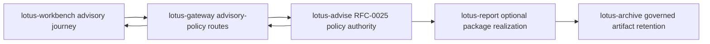

Operational behavior:

1. policy-pack validation, activation, and policy-evaluation creation require `Idempotency-Key`,
2. event, sign-off decision, report-package, and AI-evidence actions accept optional
   `Idempotency-Key`,
3. Gateway returns source payloads under `data`; clients must use Advise-owned posture fields
   rather than deriving readiness locally.

## Advisor Cockpit Operating Workflow

Status: implementation-backed in Gateway for the RFC-0026 API publication slice, with Workbench
canonical proof and Advise data-product promotion now recorded in the coordinated RFC-0026 program.
Full RFC-0028 demo readiness remains outside this Gateway capability claim.

Business outcome:

1. advisors and supervisory users can retrieve source-backed cockpit actions and operating
   snapshots through Gateway without calling `lotus-advise` directly,
2. operations and support teams can inspect supportability and unsupported-capability posture in
   one product-facing envelope,
3. advisors can retrieve Advise-owned meeting preparation packets with memo evidence, policy
   posture, follow-up posture, and lineage intact,
4. advisors can record replay-safe action acknowledgements while blocking policy, memo,
   supportability, owner-role, and client-ready posture remain Advise-owned. Client-ready
   publication remains blocked unless and until `lotus-advise` returns source-owned support for
   that posture.

Supported routes:

1. `GET /api/v1/advisor-cockpit/actions`
2. `GET /api/v1/advisor-cockpit/preparation-packets`
3. `GET /api/v1/advisor-cockpit/actions/{action_item_id}`
4. `GET /api/v1/advisor-cockpit/snapshot`
5. `GET /api/v1/advisor-cockpit/supportability`
6. `POST /api/v1/advisor-cockpit/actions/{action_item_id}/acknowledgements`
7. `POST /api/v1/advisor-cockpit/house-view-cohorts/evaluate`

Authority and integrations:

1. `lotus-advise` remains the advisor cockpit action, preparation-packet, tactical house-view
   cohort, snapshot, supportability, acknowledgement, evidence, and lineage authority.
2. Gateway forwards portfolio, advisor, caller role, pagination, action id, acknowledgement body,
   tactical house-view affected-cohort body, idempotency key, and correlation context to
   `lotus-advise`.
3. Gateway preserves Advise-owned action status, priority, owner role, reason codes, SLA, source
   refs, evidence refs, lineage refs, unsupported capabilities, preparation-packet posture,
   tactical house-view cohort membership,
   supportability posture, and acknowledgement state.
4. Gateway does not reconstruct advisory policy results, proposal memo blockers, action
   prioritization, meeting preparation, SLA posture, supportability, client-ready publication,
   external client communication, OMS/order/fill/settlement posture, or demo-readiness claims.

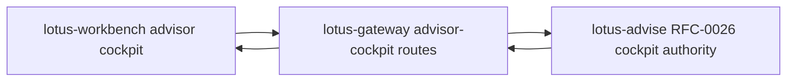

Operational behavior:

1. action and preparation-packet listing are paginated and bounded by Advise-owned cursor semantics,
2. acknowledgement writes require `Idempotency-Key`,
3. upstream validation, not-found, and idempotency-conflict outcomes are surfaced as product-safe
   Gateway errors without rewriting cockpit semantics.

## Bank Demo Proof Publication

Status: implementation-backed in Gateway for the RFC-0028 API publication slice. This is the
Gateway contract for source-owned bank-demo proof material; Workbench product UI, browser proof,
demo screenshot packs, client-ready publication, RFP/security evidence, and external client
communication remain unclaimed until their owning implementation and live evidence are complete.

Business outcome:

1. advisors, operations users, and demo teams can retrieve the source-owned bank-demo scenario
   contract and supported-claim register through Gateway without calling `lotus-advise` directly,
2. automation can submit governed runtime evidence for backend proof-pack capture through the
   product-facing boundary,
3. sales/pre-sales can describe only implementation-backed claims because Advise-owned supported,
   blocked, unsupported, and material-review posture is preserved rather than rewritten by Gateway.

Supported routes:

1. `GET /api/v1/advisory/bank-demo-proof/scenario-contract`
2. `GET /api/v1/advisory/bank-demo-proof/supported-claim-register`
3. `POST /api/v1/advisory/bank-demo-proof/proof-packs`

Authority and integrations:

1. `lotus-advise` remains the RFC-0028 bank-demo scenario, supported-claim, material-review, and
   proof-pack authority.
2. Gateway forwards proof-capture request bodies and correlation context to `lotus-advise`.
3. Gateway preserves Advise-owned scenario identity, supported-claim classifications,
   material-review posture, proof markers, source refs, lineage refs, blocked/supportability
   posture, and sanitized proof-pack payloads.
4. Gateway does not reconstruct bank-demo proof, infer Workbench browser proof, promote screenshot
   readiness, claim RFP/security evidence completion, infer client-ready publication, contact
   clients, place orders, or claim OMS/order/fill/settlement posture.

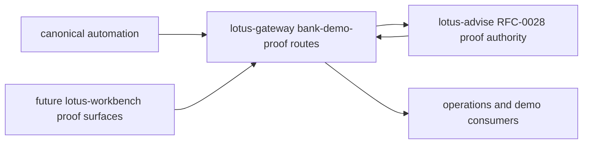

Operational behavior:

1. Gateway returns source-owned proof payloads under `data` in a product envelope,
2. `409 Conflict` material-review responses from `lotus-advise` remain visible to automation and
   operators as blocked proof posture,
3. this route family is a prerequisite for Workbench product proof but does not by itself certify
   the Workbench UI or demo screenshots.

## DPM Command Center Construction Alternatives

Status: implementation-backed in Gateway for RFC39-WTBD-001.

Business outcome:

1. portfolio managers can request and compare disciplined rebalance construction alternatives,
2. CIO and investment-control users can inspect method status, diagnostics, supportability, and
   comparison evidence before approval,
3. Workbench can use Gateway as the product-facing contract instead of calling `lotus-manage`
   directly.

Supported routes:

1. `POST /api/v1/dpm/command-center/construction/alternative-sets/generate`
2. `GET /api/v1/dpm/command-center/construction/alternative-sets/{alternative_set_id}`
3. `POST /api/v1/dpm/command-center/construction/alternative-sets/{alternative_set_id}/selections`

Authority and integrations:

1. `lotus-manage` remains the RFC-0039 construction authority.
2. Gateway forwards request bodies, idempotency keys, and correlation context to manage.
3. Gateway preserves manage-owned alternative-set ids, method ids, method statuses, objective
   traces, constraint traces, comparison metrics, diagnostics, supportability, selected alternative
   state, and lineage.
4. Gateway does not optimize portfolios, recompute construction metrics, infer source readiness,
   select alternatives, execute orders, or fabricate degraded-source values.

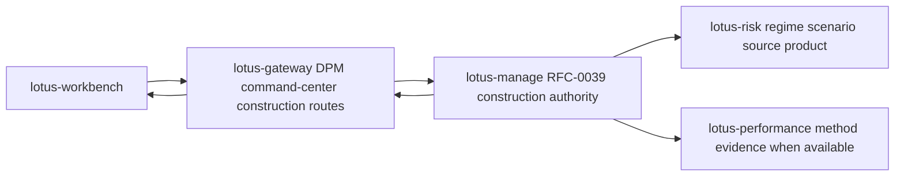

Operational behavior:

1. degraded or rejected manage states are surfaced as product supportability, not hidden as generic
   success,
2. manage upstream errors are returned using product-safe Gateway error detail,
3. response-envelope construction and product-safe upstream error shaping are shared service
   utilities, which keeps construction behavior consistent with other upstream-backed Gateway
   surfaces and reduces route-family drift,
4. OpenAPI documents What/When/How guidance and request/response examples for each route.

Production-readiness controls:

1. generation and selection remain idempotency-key governed,
2. Gateway exposes the upstream status and manage-owned supportability state for operator triage,
3. no order execution, trade approval, client communication, or source-readiness inference is
   performed in Gateway,
4. unit tests pin payload preservation, supportability derivation, product-safe error detail, and
   shared upstream-envelope behavior.

## DPM Proof-Pack Evidence Composition

Status: implementation-backed in Gateway for RFC40-WTBD-001.

Business outcome:

1. portfolio managers can generate and inspect a source-backed pre-trade proof pack from the DPM
   command-center workflow,
2. compliance, audit, and operations users can inspect proof-pack identity, section posture,
   reason codes, content hashes, source hashes, Markdown, report-input evidence, and AI-evidence
   input through one Workbench-facing Gateway contract,
3. sales/pre-sales and client-demo teams can demonstrate proof-backed discretionary management
   governance without implying Gateway or Workbench computes proof-pack evidence.

Supported routes:

1. `POST /api/v1/dpm/command-center/proof-packs`
2. `GET /api/v1/dpm/command-center/proof-packs/{proof_pack_id}`
3. `GET /api/v1/dpm/command-center/proof-packs/{proof_pack_id}/summary.md`
4. `GET /api/v1/dpm/command-center/proof-packs/{proof_pack_id}/report-input`
5. `GET /api/v1/dpm/command-center/proof-packs/{proof_pack_id}/ai-evidence-input`
6. `POST /api/v1/dpm/command-center/proof-packs/{proof_pack_id}/ai-pm-memo`

Authority and integrations:

1. `lotus-manage` remains the RFC-0040 proof-pack authority.
2. Gateway forwards generation payloads, idempotency keys, proof-pack ids, and correlation context
   to manage.
3. Gateway preserves manage-owned `proof_pack_id`, section states, reason codes, `content_hash`,
   `source_hashes`, source refs, report refs, AI refs, deterministic Markdown, report-input
   payloads, and AI-evidence payloads.
4. Gateway reads manage-owned `DpmProofPackAiEvidenceInput` before requesting `lotus-ai`
   `dpm_pm_memo.pack@v1`, and preserves the resulting workflow-pack run posture for Workbench.
5. Gateway does not generate proof-pack sections, recalculate hashes, infer source readiness,
   render reports, archive documents, generate AI narrative or PM memos locally, score PMs,
   approve trades, contact clients, place orders, or treat `lotus-report` as proof-pack authority.

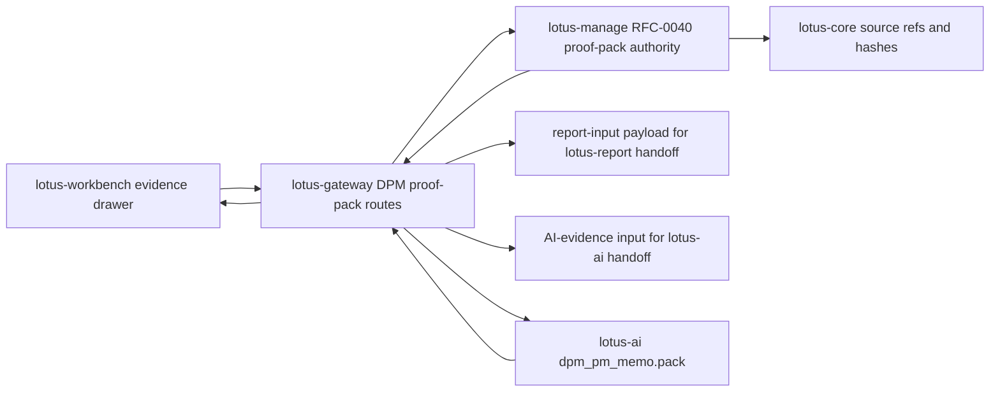

Operational behavior:

1. Gateway returns a product envelope for JSON, report-input, and AI-evidence-input payloads while
   preserving the authoritative manage payload under `data`,
2. deterministic Markdown is preserved as manage-rendered text in a Gateway envelope so Workbench
   can render it without owning proof-pack generation,
3. degraded or unavailable manage states are surfaced using product-safe Gateway error detail and
   must remain visible to Workbench supportability UI.
4. lotus-ai guardrail rejections are preserved as product-safe Gateway error detail with
   `AI_PROOF_PACK_PM_MEMO_UPSTREAM_ERROR`, so Workbench can show review/supportability posture
   without falling back to browser prompt construction.

Production-readiness controls:

1. proof-pack generation remains idempotency-key governed and source-owned by `lotus-manage`,
2. Gateway uses shared upstream-envelope utilities for JSON/report/AI-evidence payloads and
   product-safe manage errors, reducing duplicated service behavior across DPM route families,
3. AI PM memo execution is gated on manage-owned AI evidence input and uses `lotus-ai`
   workflow-pack execution instead of local prompt construction,
4. lotus-ai guardrail or workflow execution failures use the shared product-safe upstream error
   helper, preserving source service, upstream status, error code, and bounded detail without
   exposing prompts or model output,
5. missing lotus-ai workflow-pack configuration is handled through the shared Gateway guard,
   returning a consistent product-safe unavailable posture before any local prompt or fallback path
   can be attempted,
6. tests pin payload preservation, section-state supportability, deterministic Markdown, handoff
   input preservation, missing-AI-client failure behavior, lotus-ai guardrail errors, and
   product-safe manage error detail.

## DPM Portfolio-Memory Composition

Status: implementation-backed in Gateway for the Gateway portion of RFC40-WTBD-010.

Business outcome:

1. portfolio managers can review a single portfolio timeline that links proof-pack, rebalance-wave,
   internal handoff, and outcome-review evidence without reconstructing source truth,
2. operations, compliance, and audit users can inspect source systems, source refs, artifact refs,
   event states, reason codes, and content hashes through one Workbench-facing Gateway contract,
3. sales/pre-sales and client-demo teams can describe portfolio memory as source-backed and
   implementation-backed at the Gateway/API layer while keeping Workbench UI and browser proof as
   the next owning-repository slice.

Supported route:

1. `GET /api/v1/dpm/command-center/portfolios/{portfolio_id}/memory`
2. `GET /api/v1/dpm/command-center/portfolio-memory/search`

Authority and integrations:

1. `lotus-manage` remains the RFC-0040/RFC-0041/RFC-0042 portfolio-memory authority.
2. Gateway forwards portfolio id, event, supportability, source-system, source-type, pagination,
   source-scan-limit, and correlation context to `lotus-manage`
   `/api/v1/rebalance/portfolio-memory/{portfolio_id}` and
   `/api/v1/rebalance/portfolio-memory/search`.
3. Gateway preserves manage-owned event order, event types, event counts, source systems, source
   system/type counts, source refs, artifact refs, applied filters, reason codes, supportability
   state, support boundary, bounded metadata, and content hash.
4. Gateway does not reconstruct timeline nodes, infer mandate exceptions, calculate risk,
   performance, tax, cash, FX, execution, liquidity, transaction-cost, OMS, fills, settlement,
   client communication, global portfolio discovery, cross-app source-event search, or
   source-owner methodology, or let Workbench call `lotus-manage` directly.

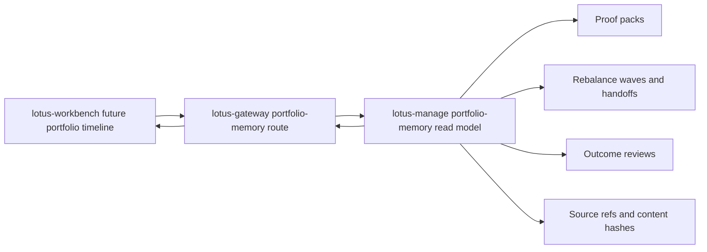

Operational behavior:

1. Gateway returns manage payloads under `data` and adds a supportability summary with state,
   event count, event-type counts, source systems, source-system/type counts, reason codes, and
   content hash,
2. upstream manage errors are surfaced as product-safe Gateway errors with
   `MANAGE_PORTFOLIO_MEMORY_UPSTREAM_ERROR`,
3. Workbench timeline rendering, canonical browser screenshots, mandate-monitoring exception
   timeline nodes, and cross-app retention/audit policy remain open RFC40-WTBD-010 follow-up
   slices before full product support is claimed.

## DPM PM Operating Quality Composition

Status: implementation-backed in Gateway for the Gateway portion of the PM operating quality
product path.

Business outcome:

1. portfolio managers, supervisors, and operations users can access PM operating quality policy,
   score-run lifecycle, fairness-analysis preview/create/list/get evidence, immutable
   review-action preview/create/list/get evidence, and review-gated support-only PM quality
   summaries through the Gateway command-center boundary,
2. Workbench can prepare PM quality product surfaces without calling `lotus-manage` directly,
3. sales/pre-sales and control users can describe the API layer as implementation-backed while
   preserving explicit non-claims around PM ranking, HR, compensation, conduct enforcement,
   autonomous decisions, client contact, and execution.

Supported routes:

1. `PUT /api/v1/dpm/command-center/pm-operating-quality/policies/{policy_id}/versions/{policy_version}`
2. `GET /api/v1/dpm/command-center/pm-operating-quality/policies`
3. `GET /api/v1/dpm/command-center/pm-operating-quality/policies/{policy_id}/versions/{policy_version}`
4. `POST /api/v1/dpm/command-center/pm-operating-quality/score-runs/preview`
5. `POST /api/v1/dpm/command-center/pm-operating-quality/score-runs`
6. `GET /api/v1/dpm/command-center/pm-operating-quality/score-runs`
7. `GET /api/v1/dpm/command-center/pm-operating-quality/score-runs/{score_run_id}`
8. `POST /api/v1/dpm/command-center/pm-operating-quality/fairness-analyses/preview`
9. `POST /api/v1/dpm/command-center/pm-operating-quality/fairness-analyses`
10. `GET /api/v1/dpm/command-center/pm-operating-quality/fairness-analyses`
11. `GET /api/v1/dpm/command-center/pm-operating-quality/fairness-analyses/{fairness_analysis_id}`
12. `POST /api/v1/dpm/command-center/pm-operating-quality/review-actions/preview`
13. `POST /api/v1/dpm/command-center/pm-operating-quality/review-actions`
14. `GET /api/v1/dpm/command-center/pm-operating-quality/review-actions`
15. `GET /api/v1/dpm/command-center/pm-operating-quality/review-actions/{review_action_id}`
16. `POST /api/v1/dpm/command-center/pm-operating-quality/summary-invocations/preview`
17. `POST /api/v1/dpm/command-center/pm-operating-quality/summary-invocations`
18. `GET /api/v1/dpm/command-center/pm-operating-quality/summary-invocations`
19. `GET /api/v1/dpm/command-center/pm-operating-quality/summary-invocations/{summary_invocation_id}`
20. `POST /api/v1/dpm/command-center/pm-operating-quality/score-runs/{score_run_id}/ai-summary`

Authority and integrations:

1. `lotus-manage` remains the PM operating quality policy, score-run, fairness-analysis, and
   review-action, and summary-invocation authority.
2. Gateway forwards policy list/get/upsert, score-run preview/create/list/get, and
   fairness-analysis preview/create/list/get, review-action preview/create/list/get, and
   summary-invocation preview/create/list/get requests to `lotus-manage`.
3. Gateway executes `lotus-ai` `pm_quality_summary.pack@v1` only after reading Manage-owned
   `PmOperatingQualityScoreRun` evidence for the requested score-run id.
4. Gateway preserves manage-owned policy configuration, score-run state, fairness-analysis state,
   review-action state, summary-invocation workflow refs, bounded rationale, target content hashes,
   segment posture, governance evidence, source refs, reason codes, content hashes, summary-text
   boundary evidence, and forbidden-use posture.
5. Gateway does not calculate scores, discover segments, calculate segment averages or fairness
   spread, infer protected classes, rank PMs, administer bank policy locally, create HR or
   compensation decisions, perform conduct enforcement, reinterpret review rationale, store or
   expose generated summary text, reconstruct prompts or model responses, approve trades, contact
   clients, route orders, claim OMS/execution, or invent missing evidence.

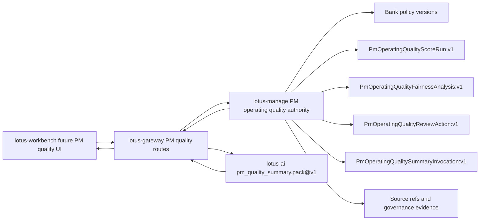

Operational behavior:

1. Gateway returns manage payloads under `data` and adds a supportability summary with state,
   policy id/version, score-run id, fairness-analysis id, review-action id, reason codes, blocked
   actions, summary-invocation id, and list counts when available,
2. upstream manage errors are surfaced as product-safe Gateway errors with
   `MANAGE_PM_OPERATING_QUALITY_UPSTREAM_ERROR`,
3. upstream lotus-ai summary errors are surfaced as product-safe Gateway errors with
   `AI_PM_OPERATING_QUALITY_SUMMARY_UPSTREAM_ERROR`,
4. Workbench PM quality UI is a Gateway-backed owning-repository slice in `lotus-workbench`;
   end-to-end product support still depends on the corresponding Manage endpoint being available
   on its owning branch/main and validated through the governed Workbench/Gateway runtime path.

## DPM Rebalance-Wave Composition

Status: implementation-backed in Gateway for RFC41-WTBD-005.

Business outcome:

1. portfolio managers and CIO-office users can operate explicit portfolio-list rebalance waves
   through a stable Gateway contract instead of calling `lotus-manage` directly,
2. operations users can inspect item-level source readiness, simulation, selection, proof-pack,
   approval, staging, internal handoff, cancellation, report-input, AI memo support, and
   supportability posture from one product route family,
3. portfolio managers can discover and upsert manage-owned campaign definitions for tactical
   house-view, risk-event, and bulk-review waves without Gateway recomputing source-owned cohort
   facts,
4. sales/pre-sales and client-demo teams can describe wave orchestration as implementation-backed
   backend composition while keeping Workbench wave cockpit UI as the next owning-repository slice.

Supported routes:

1. `POST /api/v1/dpm/command-center/waves/preview`
2. `POST /api/v1/dpm/command-center/waves`
3. `GET /api/v1/dpm/command-center/waves`
4. `GET /api/v1/dpm/command-center/waves/campaign-definitions`
5. `GET /api/v1/dpm/command-center/waves/campaign-definitions/{campaign_id}/versions/{campaign_version}`
6. `GET /api/v1/dpm/command-center/waves/campaign-definitions/{campaign_id}/versions/{campaign_version}/lifecycle-events`
7. `GET /api/v1/dpm/command-center/waves/campaign-definitions/{campaign_id}/versions/{campaign_version}/preview-readiness`
8. `GET /api/v1/dpm/command-center/waves/campaign-definitions/{campaign_id}/versions/{campaign_version}/launch-history`
9. `GET /api/v1/dpm/command-center/waves/campaign-definitions/{campaign_id}/versions/{campaign_version}/launch-package`
10. `POST /api/v1/dpm/command-center/waves/campaign-definitions/{campaign_id}/versions/{campaign_version}/launch`
11. `POST /api/v1/dpm/command-center/waves/campaign-definitions/{campaign_id}/versions/{campaign_version}/retire`
12. `POST /api/v1/dpm/command-center/waves/campaign-definitions/{campaign_id}/versions/{campaign_version}/supersede`
13. `GET /api/v1/dpm/command-center/waves/campaign-discovery`
14. `PUT /api/v1/dpm/command-center/waves/campaign-definitions/{campaign_id}/versions/{campaign_version}`
15. `GET /api/v1/dpm/command-center/waves/campaign-operating-queue`
16. `GET /api/v1/dpm/command-center/waves/campaign-approval-inbox`
17. `GET /api/v1/dpm/command-center/waves/campaign-workflow-board`
18. `GET /api/v1/dpm/command-center/waves/campaign-assignment-plan`
19. `GET /api/v1/dpm/command-center/waves/campaign-workflow-automation`
20. `GET /api/v1/dpm/command-center/waves/campaign-definitions/{campaign_id}/versions/{campaign_version}/approval-decisions`
21. `POST /api/v1/dpm/command-center/waves/campaign-definitions/{campaign_id}/versions/{campaign_version}/approval-decisions`
22. `GET /api/v1/dpm/command-center/waves/campaign-definitions/{campaign_id}/versions/{campaign_version}/assignment-actions`
23. `POST /api/v1/dpm/command-center/waves/campaign-definitions/{campaign_id}/versions/{campaign_version}/assignment-actions`
24. `GET /api/v1/dpm/command-center/waves/campaign-definitions/{campaign_id}/versions/{campaign_version}/assignment-tasks`
25. `POST /api/v1/dpm/command-center/waves/campaign-definitions/{campaign_id}/versions/{campaign_version}/assignment-tasks`
26. `POST /api/v1/dpm/command-center/waves/campaign-definitions/{campaign_id}/versions/{campaign_version}/assignment-tasks/{task_ref}/transitions`
27. `GET /api/v1/dpm/command-center/waves/campaign-definitions/{campaign_id}/versions/{campaign_version}/maker-checker-controls`
28. `POST /api/v1/dpm/command-center/waves/campaign-definitions/{campaign_id}/versions/{campaign_version}/maker-checker-controls`
29. `GET /api/v1/dpm/command-center/waves/{wave_id}`
30. `GET /api/v1/dpm/command-center/waves/{wave_id}/items`
31. `POST /api/v1/dpm/command-center/waves/{wave_id}/source-check`
32. `POST /api/v1/dpm/command-center/waves/{wave_id}/simulate`
33. `POST /api/v1/dpm/command-center/waves/{wave_id}/items/{wave_item_id}/select`
34. `POST /api/v1/dpm/command-center/waves/{wave_id}/approve`
35. `POST /api/v1/dpm/command-center/waves/{wave_id}/stage`
36. `POST /api/v1/dpm/command-center/waves/{wave_id}/handoff`
37. `POST /api/v1/dpm/command-center/waves/{wave_id}/cancel`
38. `GET /api/v1/dpm/command-center/waves/{wave_id}/proof-pack`
39. `GET /api/v1/dpm/command-center/waves/{wave_id}/supportability`
40. `GET /api/v1/dpm/command-center/waves/{wave_id}/report-input`
41. `POST /api/v1/dpm/command-center/waves/{wave_id}/ai-pm-memo`
42. `POST /api/v1/dpm/command-center/waves/{wave_id}/operations-handoff-summary`

Authority and integrations:

1. `lotus-manage` remains the RFC-0041 rebalance-wave authority.
2. Gateway forwards preview, create, campaign-definition list/get/lifecycle-events/preview-readiness/
   paged launch-history/launch-package/launch/retire/supersede/upsert, bounded campaign-discovery, source-check, simulate,
   select, approve, stage, handoff, cancel, proof-pack posture, supportability, and report-input
   requests to manage.
3. Gateway preserves `BulkReviewCampaignDefinitionPreviewReadiness:v1` supportability state,
   reason codes, blocked actions, source refs, requested as-of date, actor id, and operating
   boundaries exactly without inferring campaign membership, readiness, actor entitlement,
   maker-checker, trade approval, order generation, routing, fills, settlement, or OMS execution.
4. Gateway preserves `BulkReviewCampaignDefinitionLaunchHistory:v1` campaign id/version, launch
   records, count, total count, limit, offset, and `operating_boundaries` exactly without inferring
   maker-checker, trade approval, order generation, routing, fills, settlement, or OMS execution.
5. Gateway preserves campaign workflow/audit operating queue, approval inbox, workflow board,
   assignment plan, workflow automation, approval-decision, assignment-action, assignment-task,
   task-transition, and maker-checker evidence with Manage-owned count/page metadata,
   supportability, source refs, reason codes, operating boundaries, and hashes exactly.
6. Gateway preserves manage-owned `wave_id`, lifecycle state, item states, reason codes,
   aggregate metrics, selected alternative refs, proof-pack refs, handoff refs, supportability
   issues, report-input evidence, remediation routes, and `external_execution_claimed=false`.
7. Gateway reads manage-owned wave report input before calling `lotus-ai`
   `dpm_wave_pm_memo.pack@v1` for review-required PM/control support text.
8. Gateway reads manage-owned wave report input with internal handoff refs before calling
   `lotus-ai` `dpm_operations_handoff_summary.pack@v1`.
9. Gateway does not calculate affected portfolios, classify source readiness, discover cohorts,
   recompute campaign membership, generate alternatives, select alternatives, approve items, stage
   items, create handoff evidence, rebuild proof packs, generate report evidence, generate AI
   narrative locally, calculate task state, approval state, maker-checker state, SLA posture,
   workflow orchestration, score PMs, approve trades, contact clients, place orders, invent missing
   evidence, cancel external orders, or claim external execution.

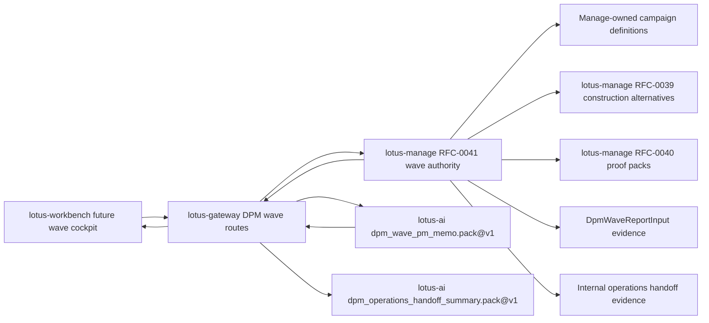

Operational behavior:

1. Gateway wraps every manage response in a product envelope with manage-derived supportability,
2. unsupported transitions and missing waves return product-safe manage error details,
3. lotus-ai failures on the wave PM memo route return product-safe `lotus-ai` error details while
   preserving manage evidence boundaries,
4. lotus-ai failures on the operations-handoff summary route return product-safe `lotus-ai` error
   details while preserving manage evidence boundaries,
5. Gateway never turns generated operations handoff support text into order routing, external
   execution, trade approval, client contact, or PM scoring,
6. Workbench wave command-center UI, browser proof, and demo screenshots remain RFC41-WTBD-006 and
   are not claimed by this Gateway slice.

Production-readiness controls:

1. wave creation, campaign launch, lifecycle commands, assignment workflow writes, selection,
   approval, staging, handoff, cancellation, PM memo, and operations handoff actions preserve
   caller correlation context and required idempotency behavior where manage requires it,
2. Gateway now uses shared upstream-envelope utilities for wave, campaign-definition, and campaign
   workflow responses plus product-safe manage error detail, reducing behavior drift across DPM
   construction, proof-pack, and wave route families,
3. AI PM memo and operations-handoff summary execution is gated on manage-owned wave report input
   and uses governed `lotus-ai` workflow-pack execution instead of local prompt construction,
4. lotus-ai PM memo and operations-handoff failures use the shared product-safe upstream error
   helper, preserving workflow-pack authority and supportability boundaries without exposing raw
   AI payload internals,
5. missing lotus-ai workflow-pack configuration is handled through the shared Gateway guard before
   PM memo or operations handoff execution begins,
6. unit and contract tests pin manage payload preservation, campaign lifecycle payloads,
   supportability derivation, invalid-transition error detail, report-input handoff evidence, AI
   workflow-pack calls, and guardrail error behavior.

## DPM Mandate Command Center

Status: implementation-backed in Gateway for RFC38-WTBD-001.

Business outcome:

1. portfolio managers, supervision users, and operations teams can query mandate health,
   monitoring-run, active-exception, and mandate drill-down posture through Gateway,
2. Workbench can build the command-center cockpit without calling `lotus-manage` directly,
3. Gateway preserves manage source readiness, supportability, reason codes, recommended actions,
   and mandate lineage without becoming the mandate-health authority.

Supported routes:

1. `GET /api/v1/dpm/command-center`
2. `POST /api/v1/dpm/command-center/monitoring/run-once`
3. `GET /api/v1/dpm/command-center/monitoring/runs`
4. `GET /api/v1/dpm/command-center/monitoring/runs/{monitoring_run_id}`
5. `GET /api/v1/dpm/command-center/exceptions`
6. `POST /api/v1/dpm/command-center/exceptions/{exception_id}/resolve`
7. `GET /api/v1/dpm/command-center/mandates/by-portfolio/{portfolio_id}`
8. `GET /api/v1/dpm/command-center/mandates/{mandate_id}`
9. `GET /api/v1/dpm/command-center/mandates/{mandate_id}/health`
10. `GET /api/v1/dpm/command-center/mandates/{mandate_id}/diff`

Authority and integrations:

1. `lotus-manage` remains the RFC-0038 mandate digital twin, health, monitoring, exception, and
   command-center authority.
2. Gateway forwards filters, monitoring requests, and exception-resolution reasons to manage.
3. Gateway preserves health distribution, health dimensions, monitoring-run state, active
   exceptions, reason codes, recommended actions, source lineage, version diffs, and
   supportability.
4. Gateway does not discover PM-book membership, calculate health scores, reconstruct health
   dimensions, infer source readiness, merge exceptions across monitoring runs, or resolve
   exceptions locally.

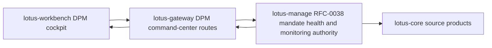

Operational behavior:

1. empty and partial command-center states remain valid product states,
2. manage upstream errors are returned using product-safe Gateway error detail,
3. Workbench cockpit implementation and canonical UI proof remain separate owning-repository
   work under RFC38-WTBD-002.

Production-readiness controls:

1. Gateway uses shared upstream-envelope utilities for mandate command-center, outcome-review,
   portfolio-memory, and PM operating-quality response envelopes while preserving each route
   family's supportability summary and error code,
2. monitoring, exception-resolution, mandate drill-down, outcome-review, portfolio-memory, and PM
   operating-quality surfaces expose upstream status and correlation context for operator triage,
3. command-center response composition remains payload-preserving; mandate health, outcome-review,
   portfolio-memory, and PM-quality truth stay in `lotus-manage`,
4. exception-summary, outcome-review narrative, and PM operating-quality summary failures from
   `lotus-ai` use the shared product-safe upstream error helper so downstream UIs and operators see
   consistent source service, upstream status, and error-code posture,
5. missing lotus-ai workflow-pack configuration is handled through the shared Gateway guard across
   command-center AI handoffs, keeping degraded configuration posture consistent for operators,
6. command-center supportability mapping is isolated in a dedicated tested mapper boundary so
   mandate readiness, outcome-review posture, portfolio-memory posture, and PM operating-quality
   posture can evolve without re-expanding the command-center service monolith,
7. command-center AI handoff context builders are isolated in a dedicated tested boundary for
   exception-summary inputs, outcome-review evidence refs, and PM operating-quality source refs,
8. manage evidence-read failures use the shared bounded upstream-detail extractor, including
   structured `code` plus `message` details from upstream governance checks,
9. unit and contract tests pin product-safe manage errors, source-owned payload preservation,
   supportability derivation, AI handoff boundaries, and no-local-authority claims.

## Portfolio-Level DPM Operations Posture

Status: implementation-backed in Gateway for RFC36-WTBD-003.

Business outcome:

1. portfolio managers and operations users can see recent stateful DPM execution posture from the
   Workbench overview without direct `lotus-manage` access,
2. Workbench can render supportability, last-run identity, recent run status, workflow posture, and
   bounded run issue codes from a governed Gateway envelope,
3. missing supportability or absent recent runs stay explicit instead of becoming fabricated zero
   activity.

Supported routes:

1. `GET /api/v1/workbench/{portfolio_id}/overview`
2. `GET /api/v1/workbench/{portfolio_id}/portfolio-360`

Authority and integrations:

1. `lotus-manage` remains the rebalance run and action-register supportability authority.
2. Gateway reads manage `/api/v1/rebalance/runs` for bounded recent run posture and
   `/api/v1/rebalance/supportability/summary` for manage-owned action-register supportability.
3. Gateway exposes up to five bounded recent run summaries with run id, status, timestamp,
   workflow posture, and error code.
4. Gateway does not compute supportability, workflow status, source readiness, execution outcomes,
   or error semantics locally.

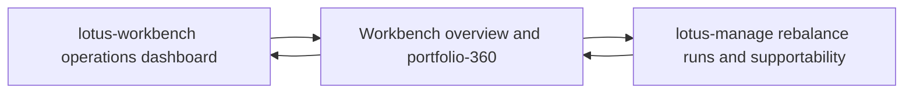

Operational behavior:

1. Gateway returns partial failures and warnings if manage is unavailable,
2. recent run detail is bounded to keep the Workbench contract product-safe,
3. Workbench remains Gateway-first and must not call `lotus-manage` directly.

## DPM Command Center Outcome Reviews

Status: implementation-backed in Gateway for RFC42-WTBD-001 and RFC42-WTBD-005.

Gateway exposes outcome-review preview/create/search/detail/source-refresh/supportability,
report-input, AI-evidence, run lookup, wave lookup, and governed AI narrative handoff routes under
`/api/v1/dpm/command-center/outcome-reviews*`. The supportability, report-input, and AI-evidence
payloads preserve Manage-owned `client_communication_boundary` posture when Manage publishes it,
including fail-closed no-client-communication and no-client-approval projection flags.
Outcome-review list filtering also forwards bounded source-system, source-type, and source-scan
filters to Manage and preserves Manage-published applied filters, source-owner counts,
source-type counts, and support boundary as persisted-lineage evidence only.
`lotus-manage` remains outcome-review authority and `lotus-ai` remains AI workflow execution
authority; Gateway does not synthesize client communication truth.

## DPM Command Center Exception Summary

Status: implementation-backed in Gateway for RFC38/RFC43 exception-summary handoff.

Gateway exposes
`POST /api/v1/dpm/command-center/exceptions/{exception_id}/ai-summary` for internal PM,
investment-control, and operations triage. The route reads manage-owned monitoring-exception
evidence from the command-center exception queue, supports optional portfolio, mandate, and state
filters, builds a bounded no-raw-payload exception-summary input, and executes `lotus-ai`
`dpm_exception_summary.pack@v1` as `lotus-gateway`.

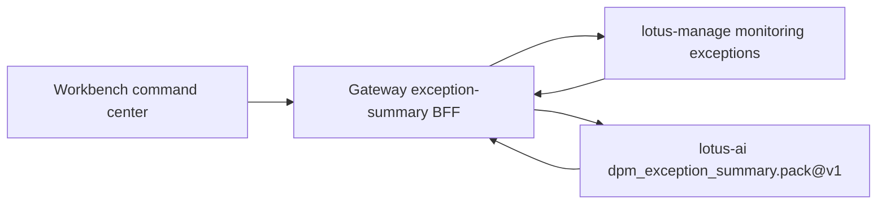

Operational boundaries:

1. `lotus-manage` remains exception evidence authority.
2. `lotus-ai` remains workflow-pack execution authority.
3. Gateway preserves source refs, content hashes, supportability, and product-safe upstream errors.
4. Gateway does not generate summaries locally, score PMs, approve trades, contact clients, route
   orders, or invent evidence.
