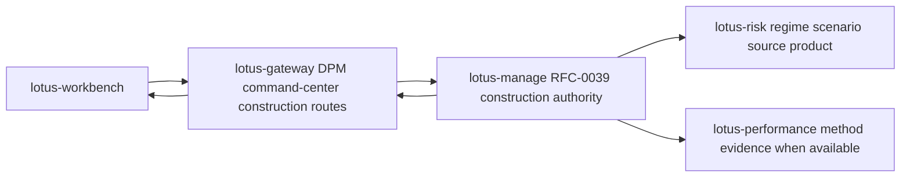

# Supported Features

This page lists implementation-backed `lotus-gateway` feature coverage. It is product material for
developers, business users, operations, sales/pre-sales, and client demos; it must not describe
future capability as supported until the owning service, Gateway contract, tests, and validation
evidence exist.

## DPM Command Center Construction Alternatives

Status: implementation-backed in Gateway for RFC39-WTBD-001.

Business outcome:

1. portfolio managers can request and compare disciplined rebalance construction alternatives,
2. CIO and investment-control users can inspect method status, diagnostics, supportability, and
   comparison evidence before approval,
3. Workbench can use Gateway as the product-facing contract instead of calling `lotus-manage`
   directly.

Supported routes:

1. `POST /api/v1/dpm/command-center/construction/alternative-sets/generate`
2. `GET /api/v1/dpm/command-center/construction/alternative-sets/{alternative_set_id}`
3. `POST /api/v1/dpm/command-center/construction/alternative-sets/{alternative_set_id}/selections`

Authority and integrations:

1. `lotus-manage` remains the RFC-0039 construction authority.
2. Gateway forwards request bodies, idempotency keys, and correlation context to manage.
3. Gateway preserves manage-owned alternative-set ids, method ids, method statuses, objective
   traces, constraint traces, comparison metrics, diagnostics, supportability, selected alternative
   state, and lineage.
4. Gateway does not optimize portfolios, recompute construction metrics, infer source readiness,
   select alternatives, execute orders, or fabricate degraded-source values.

Operational behavior:

1. degraded or rejected manage states are surfaced as product supportability, not hidden as generic
   success,
2. manage upstream errors are returned using product-safe Gateway error detail,
3. OpenAPI documents What/When/How guidance and request/response examples for each route.

## DPM Command Center Outcome Reviews

Status: implementation-backed in Gateway for RFC42-WTBD-001 and RFC42-WTBD-005.

Gateway exposes outcome-review preview/create/search/detail/source-refresh/supportability,
report-input, AI-evidence, run lookup, wave lookup, and governed AI narrative handoff routes under
`/api/v1/dpm/command-center/outcome-reviews*`. `lotus-manage` remains outcome-review authority and
`lotus-ai` remains AI workflow execution authority.
